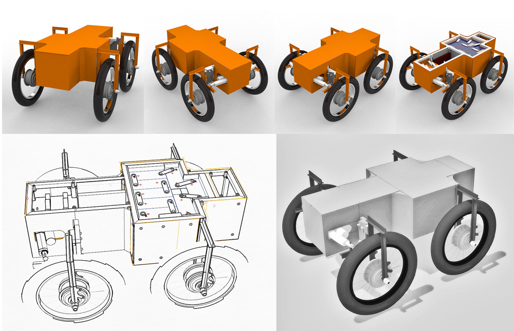

# Agrofelis

Energy dense, multipurpuse agile agricultural robot design plans and system source code repository. www.agrofelis.com

## The Problem 

The declining demographics in the West, economic disparity, energy cost inflation, and supply chain disruptions and security challenges have created a dangerous mix of factors for the world, also climate change has increased the probability of fires and floods. Agriculture and Public Safety  

Farmers are having increasing difficulties finding seasonal farm workers while also having to deal with considerable increases on the cultivation cost, which results in marginal profits, unpicked produce even to abandoned farms. The need of increasing a farm worker’s productivity with a platform that is affordable and can be amortized relatively fast is essential for small farmers in order to maintain existing plant capital. 

Fire Fighting Services face more frequent fires, the need of an affordable vehicle that can serve in an intergrated role with firefighting units in non-urban environments that reduces the work load and reduces the risk of exposure to heat due to proximity to the fire front has become essential. 

The above problems in agriculture and public safety both need a Base Vehicle that is low cost, has a small footprint, is energy dense and agile. The robotic vehicle system that is proposed, prototyped and open sourced, aims to offer an answer to those needs for a variety of applications.

## The Chosen Technology 

The majority of technical solutions proposed for agricultural robotic systems aim at high level of autonomy through the use of satellite positioning systems like RTK GNSS , Cameras and LIDAR sensors for achieving Simultaneous Localisation And Mapping (SLAM), and supplementary systems like Radars Odometers and Inertial Systems.   

In the case of RTK GNSS signal interruption due to foliage, weather or lack of ground stations makes it of limited use and in the case of LIDAR that can be combined with Odometers Cameras and IMUs add a considerable cost to the system that makes sense only for bigger heavier vehicles. On top of that repairing a vehicle of high technological complexity can be a challenge for the average person across the world.

The purpose here is to offer a technology accesible to a farmer or a volunteer fire fighter. A remote control system with the ability of automating certain functions can offer a cheaper alternative suitable for smaller platforms , offering a considerably cheaper increase in productivity. Also the availability of electrical components like motors and LiFePO4 batteries offer a simpler solution. 

## The Potential

The technologies that could be incorporated on an Agricultural Vehicle could include implements such as 
- Grass Cutter/lawn mower a frequent and necessary application in Orchards 
- Turbine Sprayers usefull both in orchards and veggetable cultivations for either pesticide or water soluble fertilizer
- Fog Sprayers for greater reach in dense folliage and also antifreeze protection with glycerin oil   
- Fertilizer Casting, a copious job that must be done in both orchards and vegetables 
- Sensor Suite for Plant disease diagnosis 
- Robotic Picking Arm Base & Power Hub, for low cultivations and also Green houses  
- Tethered Drone Base & Power Hub, fruit picking for trees (see Tevel as an example)

The technologies that could be incorporated on an Public Safety Vehicle could include applications like 
- Fire fighting Gear Carrier 
- Water Cannon Base
- Tethered Drone Base & Power Hub, for Survailance and Communications in large area fires

The potential of having the ability to produce an open soursed Base Robotic Vehicle for a variety of applications and tools has a significant 
value for our increasingly troubled agro-sector.

## The Project 

As stated above the purpose of the project is to create an open source programmable remote control system, however we have to clarify that the Vehicle's chassis design is not proposed as ideal for the use since it is assumed that different users might choose different chassis designs, it is rather the open source programmable remote control system that can migrate in various mechanical platforms either for motion control or for implement control while having programmable capability for automation and retaining the possibility for precision farming applications.

The robotic vehicle prototype is an iron bar welded chassis with detachable components, which is capable of carrying 250 kilos of payload, has energy autonomy of 8.8 Kwh and fits within a 1 sqm. A four wheel drive system is employed with energy efficient in-hub motors that are dynamically controlled using feadback sensors in real time. The steering system is composed of two independent linear actuators driven with mechanical and energy monitoring sensors. The power system is composed of 8 element LiFePO4 batteries of 320 amps, paired with an intelligent Battery Management System at 300 Amp max discharge rate capacity and a data link enabling the utilization of energy related indicators. 

The processing elements of the system are modularised systems composed of Arduino or ESP32 modules connected with their relevant sensors and actuators acting on real time adaptations while being orchestrated via a Jetson Nano GPU running on Linux and using the ROS2 protocols and implementation for interconnecting existing and future components. A high speed camera connected to the Jetso Nano enables the vision modality that is supported by a Coral AI accelerator, enabling machine vision tasks on edge. A high throughput disk (250 MB/s read/write) equips the system with 128GB of storage, enabling the robot to record and recall a sufficient amount of offline and online data. 

The system, in addition to its wire-full infrastructure, supports bluetooth connectivity for closeby wireless attachments, WiFi for nearby controllers, mobile phones and / or modules, as well as a 2km digital wireless transceiver. A long range digital remote control / transceiver is also developed powered by an esp32, a TFT monitor, joysticks and a lipo rechargeable battery. 

Additional sensors employed by the system include GPS, accelerometer, compass, temperature, distance, current, voltage, sensors as well as servos, stepper drivers and power modules. An underlying IOT service allows the deployment of new firmware for the system’s individual components and its behavioral functions, access to its real time and recorded data.
