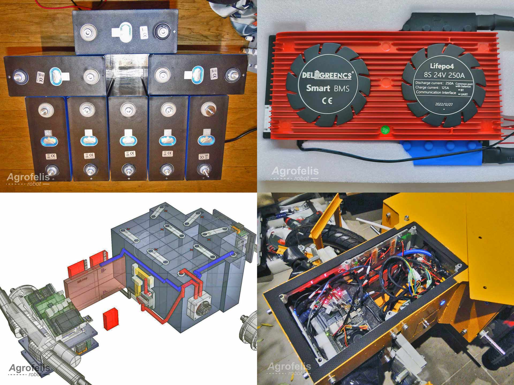

# Agrofelis Robot

### Multipurpose Energy-Dense, Implement Carrier Agricultural Robot.

### A Programmable, AI-Ready Precision Agriculture Base Vehicle.

Design plans and system source code repository.

## The Problem 

The convergence of declining demographics, economic disparities, rising energy costs and supply chain disruptions in the West and the looming specter of climate change has created a perilous confluence of issues particularly impacting agriculture and public safety.

In the agricultural sector, farmers are experiencing growing difficulty finding seasonal farm workers while also having to deal with the escalating costs of cultivation, which results in marginal profits, unharvested crops, and even abandoned farms. To combat these hurdles, there is an urgent need for an affordable and efficient platform that bridges the gap between traditional tractors and handheld tools and multiplies an unskilled farm worker's productivity. This imperative solution is crucial for small-scale farmers in order to safeguard their existing agricultural capital.

Moreover, the repercussions of climate change have increased the likelihood of wildfires. As fire departments confront more frequent fires, the necessity for an affordable vehicle that can serve in an integrated role with firefighting units in rural areas to reduce workloads and provide standoff safety from heat exposure is critical. A production line for firefighting robots could prove a real business challenge because of low utilization of the vehicles (typically under 100 hours/year), and a number of fire fighting departments have resorted to DIY solutions.  

Existing vehicles on the market that can serve as adaptable platforms for various tasks are either prohibitively expensive or just not available. So it is essential to offer the ability of manufacturing a low-cost base vehicle within local machine shops, in single units or small volumes, that has a small footprint, is energy dense and agile and holds the potential to tackle localized challenges in agriculture and public safety sectors. The proposed, prototyped and open-sourced robotic vehicle system attempts to address those needs through the variety of applications in those fields in the lowest possible cost and could be utilized and manufactured by individual farmers, agricultural cooperatives, fire departments, municipalities, and beyond.

## The Technology Considerations

The majority of technical solutions proposed for agricultural robotic systems aim for high levels of autonomy by using satellite positioning systems such as RTK GNSS (Real-Time Kinematic Global Navigation Satellite Systems), cameras and LIDAR sensors for achieving Simultaneous Localization And Mapping (SLAM), as well as supplementary systems like radars, odometers and inertial systems.

In the case of RTK GNSS, signal interruption due to foliage, weather conditions, or a lack of ground stations limits its usefulness. LIDAR, on the other hand, can be combined with odometers, cameras and IMUs, with no reliance on external signals. Additionally, the use of cheaper 2D LIDAR on a tilting mechanism allows 3D coverage with considerably lower cost. The strategic selection of LiFePO4 batteries offers endurance in high temperatures, in-combustibility, utilization of non-toxic materials, the ability to work unevenly charged and a slow rate of self-discharge.
Introducing a remote control system capable of automating certain operations through recording and replaying can offer an affordable alternative suitable for smaller platforms, while also having a broader applicability and offering a considerable boost in overall productivity.

## The Potential

Within the scope of an agricultural vehicle, a variety of technologies could be integrated, encompassing implements such as:
- Grass Cutter/Lawn Mower: A frequent and necessary application in orchards.
- Turbine Sprayers: Beneficial across orchards and vegetable cultivations for dispensing pesticides or water-soluble fertilizers.
- Fog Sprayers: Enabling extended reach amidst dense foliage and providing antifreeze protection with glycerin oil.
- Fertilizer Spreader: A copious job essential for both orchards and vegetable crops.
- Sensor Suite for Plant Data Collection: Facilitating comprehensive plant data acquisition, including diagnoses of plant diseases.
- Mechanized Weed Elimination: Using mechanical, laser or microwave mechanisms for weed control.
- Robotic Picking Arm Base & Power Hub: Applicable for low-lying plant cultivations and greenhouse environments.
- Power Hub for Fruit Picking Drones (e.g. similar to Tevel technology).

Similarly, the technologies that could be incorporated on a public safety vehicle could include applications like:
- Firefighting Gear Carrier.
- Standoff Fire Hose Base.
- Tethered Drone Base for Enhanced Situational Awareness (akin to Elistair technology).
- Sensor Suite for Patrolling and Surveillance.

The potential of having the ability to create an open-source base robotic vehicle, adaptable across a wide range of applications and tools offers significant versatility.

## The Project 

The chassis of the vehicle was designed with field agility, cost reduction and manufacturing simplicity in mind. The project recommends the particular chassis as a baseline, it is assumed though that users might opt for different chassis parameters like the addition of suspension or different wheels. The Robot vehicle's core is an open-source programmable system that could potentially migrate in various mechanical platforms either for motion control or for implement control, while also having programmable automation capability and retaining the capability for precision applications and AI readiness.

The chassis implemented for the project is a carrying bar welded chassis with detachable components. It boasts a maximum carrying capacity of 250 kilograms of payload and for cost efficiency eschews suspension. A four wheel drive system is employed with energy efficient in-hub motors that are dynamically regulated through real-time feedback sensors. The steering system is composed of two independent linear actuators driven with mechanical and energy monitoring sensors.

The power system boasts an energy autonomy of 8.0 kWh, conveniently fitting within a 1-square-meter space. It is composed of 8-element LiFePO4 batteries rated at 302 amps, paired with an intelligent battery management system at 250 amps discharge rate capacity and a data link enabling the utilization of energy-related indicators.

The processing elements of the system are modularized systems composed of Arduino or ESP32 modules connected with their relevant sensors and actuators acting on real-time adaptations, while being orchestrated via a Jetson Nano GPU running on Linux and using Web Sockets to allow implementation for interconnecting current and future components. A high-speed camera connected to the Jetson Nano enables the vision modality, augmented by a Coral AI accelerator, allowing machine vision tasks to be performed on the edge. A high-throughput drive (with read/write speeds of 250 MB/s) equips the system with 128GB of storage, enabling the robot to record and recall a substantial amount of offline and online data.

Furthermore, the project implements a two-degrees-of-freedom actuator rotating base, for attaching a thermal pulse jet fogger to the top of the robotic vehicle.

In addition to its wired infrastructure, the system supports a range of connectivity options, including Bluetooth for local wireless attachments, WiFi for nearby controllers, mobile phones and/or modules.

# Presentation video

# Specifications

The Agrofelis robot operation specs are described below.

## Dimensions

The Agrofelis Robot has been designed with narrow fields in mind.
The purpose is to navigate in narrow rows as well as under low tree canopy. 

| Vehicle size | Value |
|--------------|--------|
| Width | 785 mm |
| Length | 992 mm |
| Height | 497 mm |
| Ground clearance | 275 mm |
| Wheels diameter | 440 mm |
| Wheels width | 76 mm |
| Footprint | 0.78 sqm |

With the Rotating Implement Mount module and the thermal Fogger, the dimensions differentiate as follows.

| Sizes with Fogger | Value |
|--------------|--------|
| Length | 1615 mm |
| Height | 1044 mm |

## Mobility

The robot has adequate mobility to tackle most of the terrain in the agricultural fields. 
The loads that it can handle supersede what one would expect for its small size. 

| Mobility type | Value |
|--------------|--------|
| Ascension | 30 % grade |
| Descension | 40 % grade |
| Towing capacity | 1,225 kg |
| Carrying capacity | 250 kg max , 185 kg reccomended |
| Maximum tilt | 32 degrees |
| Minimum speed | 0.2 km/h |
| Maximum speed | 5 km/h | 
| Torque | 144 NM |
| Weight | 152 kg |
| Breaking | E-breaking and disc-brakes |
| Turning radius | 1.04 meters | 

## Thermal envelope

The thermal operating range that manufacturers give for each component of the robot is quite wide. Here are the numbers.

| Component | Min temperature Celsius | Max temperature Celsius |
|--------------|--------|-------|
| Batteries | -35 | 65 | 
| BMS | -20 | 70 |
| Motors | -20 | 70 |
| Esp32 Wroom | -40 | 105 |
| Arduino Mega | -40 | 85 |
| Jetson Nano | -25 | 80 |
| Google Coral | -40 | 85 |
| Lidar | -10 | 40 |
| Tires | -20 | 65 | 

## Electrical

Here are the capacities and consumption of the full electrical system.

| Component | Type | Value | 
|--------------|--------|-------|
| Battery | Min volt | 20 | 
| Battery | Max volt | 29.2 |
| Battery | Amp | 302  |
| Battery | Amp | 302 |
| Battery | Charge | 0.5 C |
| Battery | Charge | 1 C |
| BMS | Discharge | 250 Ah |
| Motors | Consumption | 1000 Watt |
| Steering System |Consumption | 20 Watt |
| Servo breaks | Consumption | 30 Watt |
| Jetson Nano | Consumption | 17 Watt |
| Google Coral | Consumption | 3 Watt | 
| Relays | Consumption | 8 Watt |

# Mobility tests video

# Documentation

In the following sections, the detailed documentation of all developed modules constituting the Agrofelis robot, are referenced along with their abstracts and figures highlights. The documents present the rational of each module, how they are decomposed into sub parts and sub-components, how to reproduce them by following step wise procedures using schematics and photos taken during their fabrication. The documents moreover provide indicative suppliers and total cost estimations.

## Agrofelis Chassis Frame Design and Fabrication

The [chassis frame design and fabrication](components/vehicle-frame) document focuses on the manufacturing details of the vehicle's frame. The frame houses and protects the 8 kw power module with its LiFePO4 batteries, the electronics, the sensors and actuators of the unmanned vehicle. The frame was implemented using a total of 7.35 meters of 20X20 mm regular square iron bars, it establishes key placeholders for mounting the detachable wheels, the protective covers and via its grid-like attachment points enables mounting anticipated tools, as well as future ones. The primary design considerations were footprint minimization, battery compartment protection, chassis rigidity, and ease of manufacture utilizing low-budget tools and readily available materials. 

The complete documentation of the Agrofelis chassis frame is provided below.

- [Chassis frame design and fabrication](components/vehicle-frame)

An indicative selection of figures from the Agrofelis chassis frame design and fabrication document, is summarized by the following figure. 

## Agrofelis Robot Wheels Fabrication

This [Agrofelis robot wheels fabrication](components/vehicle-wheels) document presents a comprehensive overview of the manufacturing process behind the four-wheel drive (4WD) system of the Agrofelis robotic vehicle. It begins by detailing the specific requirements and then progresses to the completed fabricated solution. The design plans, compilation procedures, assistance assets and images taken throughout development are presented in a step-by-step manner. The sub-components composing four Agrofelis wheels are indexed with their unit prices and overall cost, along with references to indicative suppliers.

The complete documentation of the Agrofelis robot wheels fabrication is referenced below.

- [Agrofelis robot wheels fabrication](components/vehicle-wheels)

In the figure below, we showcase a condensed compilation of the four most illustrative images extracted from the document, highlighting the process of manufacturing the four-wheel drive system.

## Agrofelis Robot Forks Design and Fabrication

The [wheels forks design and fabrication](components/vehicle-forks) document presents a progressive overview of the fabrication process for the forks mounting the four wheels of the Agrofelis vehicle. These forks are intentionally designed to be detachable, so that the wheels could be removed or replaced with alternative ones. The forks are responsible for securing the active wheels of the vehicle, establishing active brakes actuated via servos, enabling steering and installing feedback rotating mechanisms. Two types of forks are being employed, those installed in the front and those installed in the back. The majority of fork designs are similar, with the only differentiating factor being the mounting mechanism aimed for fixed or steering purposes. The forks installed on the left and right sides are arranged in a mirrored fashion. The forks are constructed from regular iron T-shaped rods that have been cut and welded. Additional sub-components elaborated are the vehicle's fork mounting mechanisms and the parrot-like (drop out) elements securing the wheels via the motor's hub shaft. The design schematics, plasma cut patterns, as well as images of the fabrication progression are all documented. The document concludes by providing a list of indicative suppliers from whom the raw materials were acquired, further enriched with bill and material details.

The complete documentation of the Agrofelis wheels forks is provided below.

- [Wheels forks design and fabrication](components/vehicle-forks)

An indicative selection of figures from the Agrofelis forks design and fabrication document, is provided by the consequent image. 

## Agrofelis Power System Design and Fabrication

The [power system design and fabrication](components/vehicle-power) document delves into the power-related components that classify the Agrofelis robot as an energy-dense solution. The battery technology employed, as well as the capacity, management, monitoring, and charging options, are elaborated. The battery arrangement for minimizing the vehicle's footprint, as well as its protective enclosure and cable connectivity schematics, are all documented. In addition, the power distribution, the different voltages energizing the various electronics, along with the protective mechanisms are documented. Furthermore, the document describes the WiFi relays and how to make them more robust. The documentation also lists all the utilised components, their prices, along with indicative suppliers facilitating the reproducibility of the system.

The complete documentation of the Agrofelis Power System is provided below.

- [Power system design and fabrication](components/vehicle-power)

A selection of figures from the Agrofelis Power System documentation, is presented by the following figure. 

## Agrofelis Protective Covers Design and Fabrication

The [protective covers design and fabrication](components/vehicle-covers) document builds on the Agrofelis frame design and fabrication documentation by detailing the protective covers of the vehicle, including their schematics and the source code files utilized for a CNC plasma cutter. Additionally, photographic material offers insights into the manufactured parts. A list of components and indicative suppliers that comprise the bill and material information for isolating the robot from its external environment, is documented. 

The complete documentation of the protective covers is provided below.

- [Agrofelis protective covers design and fabrication](components/vehicle-covers)

An indicative selection of figures from the Agrofelis protective covers design and fabrication document, is summarized by the following figure. 

## Agrofelis Steering System Design and Fabrication

The [Agrofelis steering system design and fabrication](components/vehicle-steering) document delves into the intricacies of the Agrofelis vehicle's steering system. The design rationale, structural elements, feedback mechanisms and the custom PCB board are all presented and documented in detail. The document encompasses source code files, key design metrics, schematics, 3D printed assets, laser-cut NC files and photographs, offering a view of the fabricated components and manufacturing steps in a progressive manner. The steering module of Agrofelis enables it to make a tight 1-meter turn radius and its design minimizes the overall footprint of the vehicle. The document also contains a list of components and indicative suppliers that comprise the bill and material information of the steering module. Finally, the documentation provides an overview of the implemented driver software, its classes, and their relations.

The complete documentation of the Agrofelis steering system design is provided below.

- [Steering system design and fabrication](components/vehicle-steering)

A cherry picked selection of figures from the Agrofelis steering system design and fabrication documentation, is presented by the following figure. 

## Agrofelis Motors Hub Driver Design and Fabrication

This [motors hub driver](components/mobility/motors_hub_driver) document delves into the manufacturing and functional intricacies of a composite module tailored for controlling and sensing a pair of in-wheel motor hubs digitally, over the air. The documentation decomposes the different elements involved into sub-modules, into their sub elements in an organized and progressive manner. A detailed exposition of each component's rationale and its seamless integration with counterparts is provided, bolstered by design plans and photographic evidence of the actual implementation. The document offers a roadmap through the Agrofelis repository, elucidating the source file locations and the production processes underpinning the manufacturing of the Agrofelis Motors Hub Driver. The document presents the structural elements of the unit, the three type of PCB sub-components, the software running on the micro-controller, key tools employed in the manufacturing process and ends with a compendium of indicative suppliers to purchase the different parts.

The complete documentation for the motors hub driver module is provided below.

- [Motors hub driver document](components/mobility/motors_hub_driver)

In a nutshell, the *Motors Hub Driver module* goes over the electronic sub-modules, which include the motors hub controller, power, and ADAC modules. The motors hub controller module processes signals, wirelessly controls actuators, and manages motor hubs through ESP32. It reads analog driver hall sensors via an ADAC module, senses motor conditions, and regulates power, speed, and direction.
The motors hub power module handles the motor hub driver, incorporating relays, current sensors, and logic level converters, while the motors hub ADAC module facilitates sensor interfacing and uses external ADC for analog channel expansion.

A representative depiction of the progression in crafting the motor hub driver is showcased by the following highlights figure.

## Agrofelis 3D Lidar Front Sensors Design and Fabrication

The [3D Lidar front sensors design and fabrication](components/vehicle-lidar) document details the creation of the front sensors module, which is used to install a 3D Lidar mount on the Agrofelis robot, enabling it to have spatial awareness of its surroundings. The module comprises an ESP32, an ESP32 Terminal Adapter, a Servo, a Lidar, an MPU and a GPS sensor. The ESP32's primary role is to process Lidar serial data, gather motion sensor and GPS data and pass their information over the USB bus. The module facilitates the tilting of the 2D Lidar to capture multiple planes of 360-degree coverage , effectively creating a spherical 3D view of its surroundings. The rationale behind the module, its schematics, the manufacturing process, the software controlling the module and reflecting its information, as well as a Lidar data analysis tool developed, are all discussed. The document concludes with a list of the components used and indicative suppliers, aiding in the replication of the module.

The complete documentation of the 3D Lidar front sensors module design is provided below.

- [3D Lidar front sensors documentation](components/vehicle-lidar)

A cherry picked selection of figures from the Agrofelis 3D Lidar front sensors design and fabrication documentation, is presented by the following figure. 

## Two Degrees of Freedom Rotating Implement Mount (RIM) Design and Fabrication

The [two degrees of freedom rotating implement mount](components/implement-2-degrees-rotating-mount) document outlines the construction of the Rotating Implement Mount (RIM), a crucial component positioned atop the Agrofelis robot. The RIM's primary function is to enable the use of various implements, such as the thermal fogger featured in the presentation video. The rotation is achieved through the use of a stepper motor that powers the rotation by turning a gear on a turntable, while elevation/depression is achieved with the use of a linear actuator leveraging the mount, thus granting the RIM a two degrees of freedom (2DF) capability for any implement mounted on it. This report covers the rationale behind the module, its schematics, source code files and details of the manufacturing process. The document concludes with a list of the components used and assorted with indicative suppliers, facilitating the replication of the module.

The complete documentation of the RIM module design, is provided below.

- [Two degrees of freedom rotating implement mount documentation](components/implement-2-degrees-rotating-mount)

A cherry picked selection of figures from the Agrofelis RIM design and fabrication documentation, is presented by the following figure. 

## Agrofelis Remote Controller Design and Fabrication

The [remote controller design and fabrication](components/remote-control) document presents the details of fabricating a baseline remote controller for actuating the wheels, steering, brakes and power functions of the Agrofelis robot. Emphasizing ergonomics, cost-effectiveness and the use of readily available components, a simple extendable design is presented, rapidly prototyping the minimum number of sensors and components needed for booting and controlling the mobility functions of the vehicle. The module is de-compiled using annotated design plans with crucial metrics and is re-compiled using photos captured during the fabrication process. The software source code running on the micro-controller is also presented, following approaches similar to those implemented in other Agrofelis modules. The document concludes with a list of components used and provides information on indicative suppliers, aiding in the replication of the module.

The complete documentation of the remote controller module, is provided below.

- [Agrofelis remote controller design and fabrication documentation](components/remote-control)

A cherry picked selection of figures from the Agrofelis remote controller design and fabrication documentation, is presented by the following figure. 

## Infrastructure Provisioning, Computing Elements and Data Fusion

The [infrastructure provisioning, computing elements and data fusion](components/connectivity) document presents the provisioning of the main computing elements for the Agrofelis robot and the initiation of its services. The peripheral elements established and attached to the local Agrofelis WiFi network and its USB hub are enumerated. In addition, the GPU component and the neural network accelerator tapping to the USBv3 interface of the Jetson Nano are presented. The Agrofelis Unificator Software, which connects all Agrofelis modules, is introduced along with its source code and features. The document also provides information on lightweight 3D printed structural elements that fit in the limited space available for the USB cables and secure the components and the USB hub in their compartment. The document concludes with a list of the components used and indicative suppliers, aiding the replication of the Agrofelis computing and networking systems.

The complete documentation of the infrastructure provisioning, computing elements and data fusion, is referenced below.

- [Infrastructure provisioning, computing elements and data fusion documentation](components/connectivity)

A cherry picked selection of figures from the computing modules documentation, is compiled by the following figure. 

# Cost Estimation Overview

This sub-section outlines the indicative costs associated with constructing the Agrofelis robot. These figures are derived from estimated costs per item discussed in the relevant *indicative suppliers section* within each of the aforementioned documents, encompassing a diverse array of components crucial to the robot's assembly. It is important to note that the presented cost estimation incorporates applicable taxes. However, it is crucial to acknowledge that this estimation serves as a preliminary assessment and is subject to potential variations. 

The values provided here are based on information gathered from indicative suppliers and are intended to provide a rough estimate of the project's financial requirements. In this estimation, we have focused solely on the intrinsic value of each component and have excluded supplementary expenses such as transportation, customs clearance, and unforeseen charges. These figures are the initial step in budget assessment and lay the foundation for more detailed financial planning. 

The table showcased below provides a breakdown of the necessary construction components along with their associated indicative costs, enhancing comprehension for informed decision-making and budget formulation. 

| Construction Component   | Sub-Total (€) |
|---------------------|-------------------:|
| [Chassis Frame](components/vehicle-frame/readme.md#chassis-components-and-indicative-suppliers)   | 155.47 |
| [Wheels](components/vehicle-wheels/readme.md#wheel-components-and-indicative-suppliers)   | 575.20 |
| [Wheel Forks](components/vehicle-forks#forks-components-and-indicative-suppliers)   | 53.30 |
| [Power System](components/vehicle-power#power-system-components)   | 1,509.28  |
| [Protective Covers](components/vehicle-covers#covers-material-and-indicative-suppliers)   | 82.53 |
| [Steering System](components/vehicle-steering#steering-pcb-components)   | 132.88  |
| [Motors Hub Driver A](components/mobility/motors_hub_driver/readme.md#motors-hub-components-and-indicative-suppliers)   | 89.33 |
| [Motors Hub Driver B](components/mobility/motors_hub_driver/readme.md#motors-hub-components-and-indicative-suppliers)   | 89.33 |
| [3D Lidar Sensors](components/vehicle-lidar#3d-lidar-front-sensors-components)   | 158.82  |
| [Rotating Implement Mount](components/implement-2-degrees-rotating-mount#implement-mount-components-and-indicative-suppliers)   | 322.58  |
| [Remote Controller](components/remote-control#remote-controller-components) | 65.52 |
| [Computing and Network Components](components/connectivity#computing-and-network-components) | 485.34 | 
| **Total Cost**   | **3,729.58**   |

Detail breakdowns of cost estimations for the manufacturing of each component can be accessed via the hyperlinked components, offering the ability to explore comprehensive analyses of the cost determination for each individual component.

Consequently the total manufacturing cost for the Agrofelis robot is **3,729.58** euros, excluding shipping and assembly costs.

# Authors
 
- Konstantinos L. Papageorgiou
- Hercules Metaxas
- Anastasios Pliatsikas 
- Dimitris Kouzis Lukas

# Special Thanks

- Christos Spetseris, from [QOOP Metalworks](https://www.qoop.gr) for his design and 3D CAD training support.
- Giannis Vapelas, from [QOOP Metalworks](https://www.qoop.gr) for letting us use the machine shop during weekends and supporting the DIY plasma cutter. 
- Petros Morfiris, for his R shiny app Lidar analysis prototype implementation.
- Pantelis Nasikas, for his technical advice in C++ programming. 
- Elias Farlekas, for sharing his expertise in farming operations & cultivation practices. 
- Luka Drašak, for his photographic and video recording support during the field tests.
- The crew of the Myrtia Fire Station in Southern Greece for sharing fire fighting tactics. 
- Hellas Digital, for their excitement and discussions about the robotic vehicle.

# Contact us

Contact us: info at Agrofelis dot com

Hack a day project page: https://hackaday.io/project/192733-agrofelis-robot

