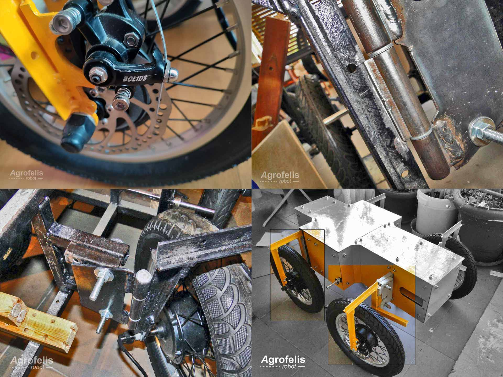

# Agrofelis robot

Energy dense, multipurpose agile agricultural robot design plans and system source code repository. www.agrofelis.com

## The Problem 

The convergence of declining demographics, economic disparities, rising energy costs, supply chain disruptions and the looming specter of climate change in the West has created a perilous confluence of issues particularly impacting agriculture and public safety.

In the agricultural sector, farmers are experiencing growing difficulty finding seasonal farm workers while also having to deal with the escalating costs of cultivation, which results in marginal profits, unharvested crops, and even abandoned farms. To combat these hurdles, there is an urgent need for an affordable and efficient platform that bridges the gap between traditional tractors and handheld tools. This imperative solution is crucial for small-scale farmers, enabling them to enhance productivity and safeguard their existing agricultural capital.

Moreover, the repercussions of climate change have increased the likelihood of wildfires and flooding. As fire departments confront more frequent fires, the necessity for an affordable vehicle that can serve in an integrated role with firefighting units in non-urban areas to reduce workloads and provide standoff safety from heat exposure is critical.

Existing vehicles on the market that can serve as adaptable platforms for various tasks are either prohibitively expensive or just not available. So it is essential to offer the ability to manufacture a low-cost base vehicle within local machine shops, in single units or small volumes, that has a small footprint, is energy dense and agile and holds the potential to tackle localized challenges in agriculture and public safety sectors. The proposed, prototyped and open-sourced robotic vehicle system attempts to address those needs through the variety of applications in those fields and could be utilized by individual farmers, agricultural cooperatives, fire departments, municipalities, and beyond.

## The Technology Considerations

The majority of technical solutions proposed for agricultural robotic systems aim for high levels of autonomy by using satellite positioning systems such as RTK GNSS (Real-Time Kinematic Global Navigation Satellite System), cameras and LIDAR sensors for achieving Simultaneous Localisation And Mapping (SLAM), as well as supplementary systems like radars, odometers and inertial systems.

In the case of RTK GNSS, signal interruption caused by factors like foliage, weather conditions, or a lack of ground stations limits its usefulness. LIDAR, on the other hand, which can be combined with odometers, cameras and IMUs, has a considerably lower cost and potential robustness. Additionally, repairing a vehicle of high technological complexity can be a challenge for the average user across the world. The strategic selection of LiFePO4 batteries offers endurance in high temperatures, incombustibility, utilization of non-toxic materials, the ability to work unevenly charged and a slow rate of self-discharge.

The purpose here is to provide a solution that is accessible to users who may lack extensive technical proficiency like farmers or volunteer firefighters. Introducing a remote control system capable of automating certain operations through recording and replaying can offer a less expensive alternative suitable for smaller platforms, while also having a broader applicability and offering a considerably affordable boost in overall productivity.

## The Potential

Within the scope of an agricultural vehicle, a variety of technologies could be integrated, encompassing implements such as:
- Grass Cutter/Lawn Mower: A frequent and necessary application in orchards.
- Turbine Sprayers: Beneficial across orchards and vegetable cultivation for dispensing pesticides or water-soluble fertilizers.
- Fog Sprayers: Enabling extended reach amidst dense foliage and providing antifreeze protection with glycerin oil.
- Fertilizer Casting: A copious job essential for both orchards and vegetable crops.
- Sensor Suite for Plant Data Collection: Facilitating comprehensive plant data acquisition, including diagnoses of plant diseases.
- Mechanized Weed Elimination: Using mechanical, laser or microwave mechanisms for weed control.
- Robotic Picking Arm Base & Power Hub: Applicable for low-lying plant cultivation and greenhouse environments.
- Power Hub for Fruit Picking from Trees (e.g. similar to Tevel technology).

Similarly, the technologies that could be incorporated on a public safety vehicle could include applications like:
- Firefighting Gear Carrier.
- Standoff Water Cannon Base.
- Tethered Drone Base for Enhanced Situational Awareness (akin to Elistair technology).
- Sensor Suite for Patrolling and Surveillance.

The potential of having the ability to create an open-source base robotic vehicle, adaptable across a wide range of applications and tools offers significant versatility.

## The Project 

The chassis of the vehicle should be designed according to the specifications of the job at hand, those being carrying capacity, suspension and wheel choices and steering radius so size is expected to vary. The project recommends the particular chassis as a baseline since it is assumed that there will be different designs. The *project core* is an open-source programmable system that can migrate in various mechanical platforms either for motion control or for implement control, while also having programmable automation capability and retaining the capability for precision applications and AI readiness.

The chassis implemented for the project is a carrying bar welded chassis with detachable components. It boasts a maximum carrying capacity of 250 kilograms of payload and for cost efficiency eschews suspension. A four wheel drive system is employed with energy efficient in-hub motors that are dynamically regulated through real-time feedback sensors. The steering system is composed of two independent linear actuators driven with mechanical and energy monitoring sensors.

The power system boasts an energy autonomy of 8.8 kWh, conveniently fitting within a 1-square-meter space. It is composed of 8-element LiFePO4 batteries rated at 320 amps, paired with an intelligent battery management system at 300 amps maximum discharge rate capacity and a data link enabling the utilization of energy-related indicators.

The processing elements of the system are modularized systems composed of Arduino or ESP32 modules connected with their relevant sensors and actuators acting on real-time adaptations, while being orchestrated via a Jetson Nano GPU running on Linux and using the ROS2 protocols and Web Sockets to allow implementation for interconnecting current and future components. A high-speed camera connected to the Jetson Nano enables the vision modality, augmented by a Coral AI accelerator, allowing machine vision tasks to be performed on the edge. A high-throughput drive (with read/write speeds of 250 MB/s) equips the system with 128GB of storage, enabling the robot to record and recall a substantial amount of offline and online data.

Furthermore, the project implements a two-degrees-of-freedom actuator rotating base, for attaching a thermal pulse jet fogger to the top of the robotic vehicle.

In addition to its wired infrastructure, the system supports a range of connectivity options, including Bluetooth for local wireless attachments, Wi-Fi for nearby controllers, mobile phones and/or modules, as well as a 2-kilometer digital wireless transceiver. A long-range digital remote control/transceiver, powered by an ESP32, a TFT monitor, joysticks and a rechargeable lipo battery, has also been developed.

An underlying IoT service allows the deployment of new firmware for the system's individual components and its behavioral functions as well as access to real-time and recorded data.

# Documentation

In the following sections, the detailed documentation of all developed modules constituting the Agrofelis robot, are referenced along with their abstracts and figures highlights, are being overviewed. The documents present the rational of each module, how they are decomposed into sub parts and sub-components, how to reproduce them by following step wise procedures using schematics and photos taken during their fabrication. The documents moreover provide indicative supliers and total cost estimations.

## Agrofelis motors hub driver

This [Motors hub driver document](components/mobility/motors_hub_driver) delves into the manufacturing and functional intricacies of a composite module tailored for controlling and sensing a pair of in-wheel motor hubs digitally, over the air. The documentation decomposes the different elements involved into sub-modules, into their sub elements in an organized and progressive manner. A detailed exposition of each component's rationale and its seamless integration with counterparts is provided, bolstered by design plans and photographic evidence of the actual implementation. The document offers a roadmap through the Agrofelis repository, elucidating the source file locations and the production processes underpinning the manufacturing of the Agrofelis Motors Hub Driver. The document presents the structural elements of the unit, the three type of PCB sub-components, the software running on the micro-controller, key tools employed in the manufacturing process and ends with a compendium of indicative suppliers to purchase the different parts.

The complete documentation for the motors hub driver module is provided below.

- [Motors hub driver document](components/mobility/motors_hub_driver)

In a nutshell, the *Motors Hub Driver module* goes over the electronic sub-modules, which include the motors hub controller, power, and ADAC modules. The motors hub controller module processes signals, wirelessly controls actuators, and manages motor hubs through ESP32. It reads analog driver hall sensors via an ADAC module, senses motor conditions, and regulates power, speed, and direction.
The motors hub power module handle motor hub drivers, incorporating relays, current sensors, and logic level converters, while the motors hub ADAC module facilitates sensor interfacing and uses external ADC for analog channel expansion.

A representative depiction of the progression in crafting the motor hub driver is showcased by the following highlights figure.

## Agrofelis robot wheels fabrication

This [Agrofelis robot wheels fabrication document](components/vehicle-wheels) presents a comprehensive overview of the manufacturing process behind the four-wheel drive (4WD) system of the Agrofelis robotic vehicle. It begins by detailing the specific requirements and then progresses to the completed fabricated solution. The design plans, compilation procedures, assistance assets and images taken throughout development are presented in a step-by-step manner. The sub-components composing four Agrofelis wheels are indexed with their unit prices and overall cost, along with references to indicative suppliers.

The complete documentation of the Agrofelis robot wheels fabrication is referenced below.

- [Agrofelis robot wheels fabrication](components/vehicle-wheels)

In the figure below, we showcase a condensed compilation of the four most illustrative images extracted from the document, highlighting the process of manufacturing the four-wheel drive system.

## Agrofelis chassis frame design and fabrication

The [chassis frame design and fabrication document](components/vehicle-frame) focuses on the manufacturing details of the vehicle's frame. The frame houses and protects the 8kw power module with its LiFePO4 batteries, the electronics, the sensors and actuators of the unmanned vehicle. The frame was implemented using a total of 7.35 meters of 20X20 mm regular square iron bars, it establishes key placeholders for mounting the detachable wheels, the protective covers and via its grid-like attachment points enables mounting anticipated tools, as well as future ones. The primary design considerations were footprint minimization, battery compartment protection, chassis rigidity, and ease of manufacture utilizing low-budget tools and readily available materials. 

The complete documentation of the Agrofelis chassis frame is provided below.

- [Chassis frame design and fabrication](components/vehicle-frame)

An indicative selection of figures from the Agrofelis chassis frame design and fabrication document, is summarised by the following figure. 

## Agrofelis robot wheels forks design and fabrication

The [wheels forks design and fabrication](components/vehicle-forks), present the fabrication details of the forks mounting the four wheels of the vehicle. The forks were designed to be detachable in order to be able to remove or replace the wheels with different ones. The forks serve the function of securing the active wheels of the vehicle, establishing active brakes actuated via servos, enabling their steering and for installing their feedback rotating mechanisms. Two types of forks are being employed, these installed in the front and these in the back. Most of the fork design is common and their differentiating factor is their mounting mechanism aimed fixed or for steering. The forks installed on the left and right sides are arranged in a mirrored fashion. The forks are constructed using regular iron T shaped rods, which are cut and welded. Additional sub-components elaborated, are the vehicle's fork mounting mechanisms and the parrot like (drop out) elements securing the wheels via the motors hub shaft. The design schematics, the plasma cut patterns, as well as images of the fabrication progression are documented. The document concludes with a list of indicative suppliers where the raw materials where acquired, enriched with bill and material information.

The complete documentation of the Agrofelis wheels forks is provided below.

- [Wheels forks design and fabrication](components/vehicle-forks)

An indicative selection of figures from the Agrofelis forks design and fabrication document, is provided by the consequent image. 

## Agrofelis steering system design and fabrication

The [Agrofelis steering system design and fabrication](components/vehicle-steering) document delves into the details making up the steering system of the Agrofelis vehicle. The logic behind the design, the structural elements composing it, the feedback mechanisms, the custom PCB board are presented and documented. The source code files, key design metrics, schematics, 3D printed assets, laser cut NC files, and photographs present the fabricated components and manufacturing steps in a progressive manner. The steering module of Agrofelis enables it to make a tight turn within 1 meter and its design minimizes the overall foot print of the vehicle. The document provides the list of components and indicative suppliers forming the bill and material information of the steering module. Last, the documentation presents an overview of the implemented driver software its classes and their relations.

The omplete documentation of the Agrofelis wheels forks is provided below.

- [Steering system design and fabrication](components/vehicle-steering)

A cherry picked selection of figures from the Agrofelis steering system design and fabrication documentation, is presetned by the following figure. 

## Cost estimation overview

This sub-section outlines the indicative costs associated with constructing the Agrofelis robot. These figures are derived from estimated costs per item discussed in the relevant *indicative suppliers section* within each of the aforementioned documents, encompassing a diverse array of components crucial to the robot's assembly. It is important to note that the presented cost estimation incorporates applicable taxes. However, it is crucial to acknowledge that this estimation serves as a preliminary assessment and is subject to potential variations. 

The values provided here are based on information gathered from indicative suppliers and are intended to provide a rough estimate of the project's financial requirements. In this estimation, we have focused solely on the intrinsic value of each component and have excluded supplementary expenses such as transportation, customs clearance, and unforeseen charges. These figures are the initial step in budget assessment and lay the foundation for more detailed financial planning. 

The table showcased below provides a breakdown of the necessary construction components along with their associated indicative costs, enhancing comprehension for informed decision-making and budget formulation. 

| Construction Component   | Sub-Total (€) |
|---------------------|---------------|
| [Motors Hub Driver](components/mobility/motors_hub_driver/readme.md#motors-hub-components-and-indicative-suppliers)   | 89.33 |
| [Wheels](components/vehicle-wheels/readme.md#wheel-components-and-indicative-suppliers)   | 575.20 |
| [Chassis Frame](components/vehicle-frame/readme.md#chassis-components-and-indicative-suppliers)   | 155.47 |
| [Wheel forks](components/vehicle-forks#forks-components-and-indicative-suppliers)   | 50.5 |
| [Steering system](components/vehicle-steering#steering-pcb-components)   | 136  |
|          |          |
| **Total Cost**   | **1,006.5**   |

Detail breakdowns of cost estimations for the manufacturing of each component can be accessed via the hyperlinked components, offering the ability to explore comprehensive analyses of the cost determination for each individual component.

Consequently, we observe that the total manufacturing cost for the Agrofelis robot is approximately **1,006.5** euros, exclusive of shipping and assembly costs.
