# Infrastructure provisioning, computing elements and data fusion

## Abstract

The document presents the provision of the main computing elements of the robot and initiation of its services. The peripheral elements established and attached to the local Agrofelis WIFI network and its USB hub are enumerated. The GPU component and the neural network accelerator tapping to the USB3 interface of the Jetson Nano are presented. The Agrofelis Unificator Software, connecting all Agrofelis modules is introduced and its source code and features presented. Also provided are lightweight 3D printed structural elements that fit in the limited space available for the USB cables and secure the components and the USB hub in their compartment. The document concludes with a list of the components used and indicative suppliers, aiding the replication of the the Agrofelis computing and networking systems.

## Introduction

The main computing elements of the Agrofelis Robot are located in its back section on top of the steering plates. The following figure depicts their locations.

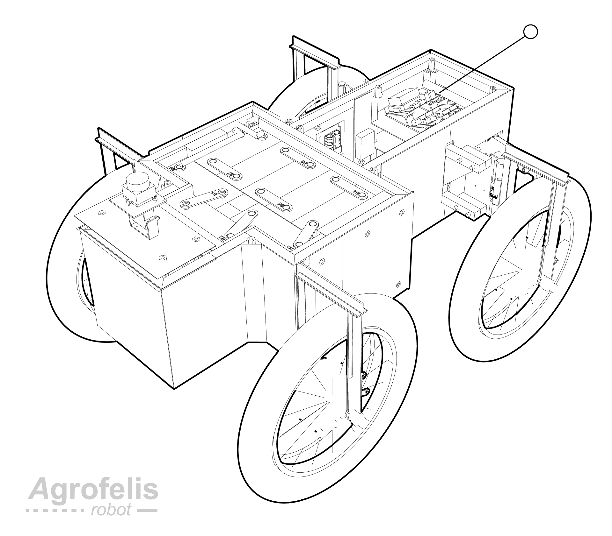

A relatively low cost fully fledged GPU capable computer, optimised for small footprint, energy consumption aimed for AI applications, is being employed. 

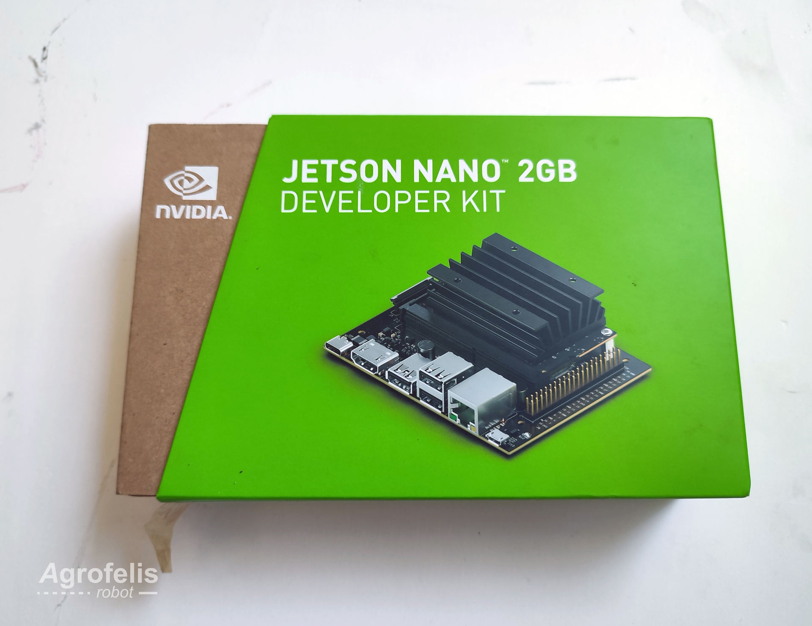

The Computer is equipped with a high speed 128 GB sd card with read and write access of 290 and 260 Megabytes per second to remedy one of the key bottle necks of the Jetson nano computer. 

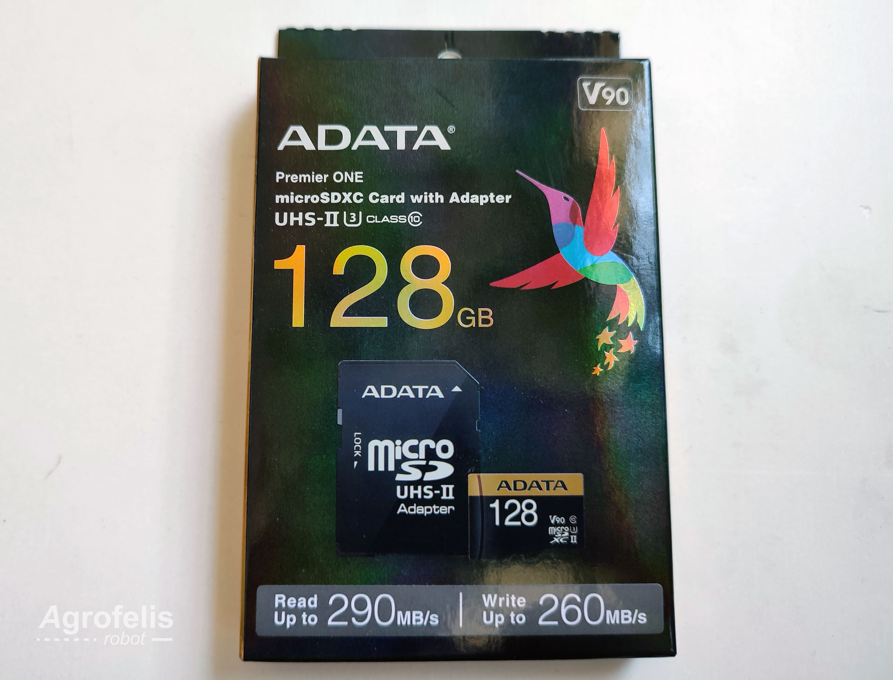

The Jetson Nano moreover, is equipped with an AI accelerator module connecting in its USBv3 port extending its capacity for parallel processing and neural networks inference.

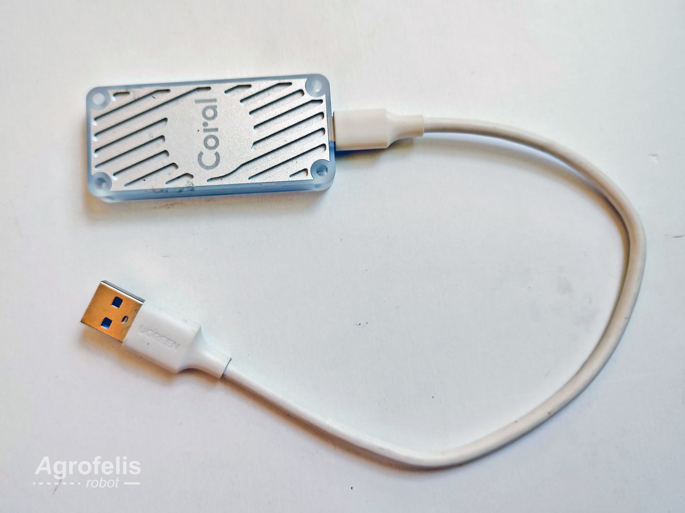

Jetson nano is machine vision ready supporting high speed high resolution camera inputs. The following photograph snapshots the camera of the Agrofelis robot along with its 1m cable extension, connecting the computer with the front section of the vehicle.

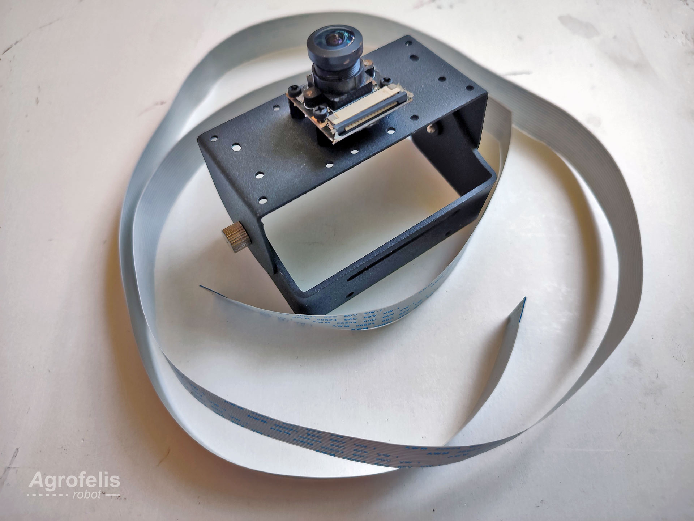

In the consequent sections, details for provisioning Jetson Nano computing modules and its services are being documented.

## Jetson nano operating system provisioning

To initialise the computer one needs the same components needed for a regular computer. That is a keyboard a mouse, a monitor and a hard disk (SD). An operating system can be written to the sd card by using a turnkey Ubuntu based image configured by NVIDIA conveniently having installed most of the needed software. The official [getting started document](https://developer.nvidia.com/embedded/learn/get-started-jetson-nano-2gb-devkit) can be followed to get acquainted with embedded computer and boot-strap it. 

Following NVdia's documentation the 6.4 GB compressed operating system image, can be downloaded from the following link.

- [https://developer.nvidia.com/jetson-nano-2gb-sd-card-image](https://developer.nvidia.com/jetson-nano-2gb-sd-card-image)

Because the file is rather large, we recommend downloading it from a fast, stable internet connection. To write the image to the SD card, a Windows or a Linux computer can be utilised with the [balenaEtcher](https://etcher.balena.io/#download-etcher) as recommended by the NVIDIA documentation. Once the SD card is written it can be slotted in its placeholder and the computer can be connected with a 5v power supply. 

Upon system initialization the USB WiFi adapter or a network cable can be attached and used to connect with the internet in order to get the latest available updates, using the following commands.

	apt-get update
	apt-get get upgrade
	apt-get autoremove
	apt-get dist-upgrade

Two handy tools, one for monitoring the hardware resource of the computer and the second for multiplexing multiple command terminals, can be installed using the following command.

	apt-get install htop screen

Once the Jetson Nano has been connected into the network, the monitor, keyboard and mouse can be removed and the computer can be operated using and ssh terminal. Although not crucial, the computer can also be set up to stream its monitor using the VNC open source software by issuing the following commands. 

	mkdir -p ~/.config/autostart
	cp /usr/share/applications/vino-server.desktop ~/.config/autostart/.
	gsettings set org.gnome.Vino prompt-enabled false
	gsettings set org.gnome.Vino require-encryption false
	gsettings set org.gnome.Vino authentication-methods "['vnc']"
	gsettings set org.gnome.Vino vnc-password $(echo -n 'agrofelis'|base64)

The commands initialise a remote desktop server which can be handy when debugging for the first time the video camera, or alter the WiFi network settings or other setting provided by the graphical user interface of the operating system. The computer's monitor feed can be accessed using another computer via the freely available [VNC viewer](https://www.realvnc.com/en/connect/download/viewer/) software.

## Agrofelis containerized services

As observed, the operating system can be setup with just a handful commands, primarily because all common requirements have already been provisioned by Nvida in the aforementioned image. Another very useful software already pre-installed in the system is the NVIDIA Docker. Docker allows to containerize arbitrary computing environments, instantiate multiple instances of them and also revert, reuse or extend their definitions. Employing the Docker technology in the Agrofelis software stack means that its systems are easily reproducible, their definitions are transparent and their execution is somewhat isolated from the main operating system. Employing Docker moreover, allows the operating system to remain clean of the application's dependencies and new technologies can be evaluated without the fear of "polluting" the system. The installed NVdia Docker variation can interface with the GPU hardware of the embedded computer which enables it to containerize AI applications. 

## Agrofelis containerized services

In total, five docker images have been developed layering their functionality in a reusable manner out of which two are mandatory for the robot's operation. The developed docker images are elaborated in further detail via the following table.

| Image Name | Extends | Necessary | Description |
|--------|-------|--------------------|-----------|
| agrofelis.unificator | node:16.17.0-bullseye-slim | Yes | The image extends the slim version of the main stream NodeJs image used to run the Agrofelis Unificator application. The particular image was found to have the smallest available footprint while still being able to run the intended application without further additions |
| NGINX | Directly used | Yes | Although an image is not defined, a relevant folder is created next to the Agrofelis images definitions for persisting the NginX settings files that are mounted on the main stream container at the time of its instantiation. [Nginx](https://www.nginx.com/) is the second most popular web server which at the same time is very lightweight and very fast because its implemented in C++. The Nginx docker instance is able to index and serve the www folder containing the web applications of the Unificator and of individual Agrofelis modules.|
| agrofelis.os | ubuntu:22.04 | No | The docker image extends the main stream Ubuntu 22.04 operating system image, setups the local timezone related settings and installs some open source tools such as decompression, file synchronization, networking and file editing utilities. The image serves as a foundational layer used by consequent Agrofelis docker images as well as for evaluating new software on ephemeral instances. |
| agrofelis.os.arduino | agrofelis.os | No | The image extends the agrofelis.os foundational image and installs the [arduino-cli](https://github.com/arduino/arduino-cli) command line tool, with it one can compile the Agrofelis steering module using an Arduino Mega and renew its firmware. The docker image definition encodes furthermore the exact 3rd party open source libraries required to compile the source code of the module. Although its not necessary to be able to compile the various micro-controllers firmware modules from the robot hardware, its convenient to share a transparent reproducible environment that anyone can effortlessly reuse to compile the software of the relevant modules. Having this docker image enables one to program the robot with just a regular computer with basic text processing capabilities. Moreover it could offer firmware updates by deploying a fraction of their binary size. The image source code can also be modified to compile the firmware of the ESP32 which is updated over the air. |
| agrofelis.os.R | agrofelis.os | No | The image extends the agrofelis.os foundational image and equips the environment with the R programming language focusing on statistics, machine learning and data manipulations and visualisation. The image is equipped with few powerful R packages the data.table a lighting fast data table manipulation engine and the FST package offering a very performant way of storing and compressing numerical information well balanced between the time needed to restore/write and the size needed to persist the information on disk. The combination of these packages and the power of the R language provide a very efficient framework to conduct data processing and machine learning procedures as well as rapidly prototype new applications. |

## File system provisioning

The file system of the Agrofelis software is organized within the root path of the Jetson Nano operating system, in a folder named :

- /web-pub

The file system can be populated by exporting the [connectivity/](https://github.com/meltoner/agrofelis/tree/main/components/connectivity) folder from the github repository and positioning it within the /web-pub folder of the Jetson nano. Following the filesystem installment and to have web applications folder in a more prominent position the **www** folder contained within the **connectivity** folder just established, is relocated within the **/web-pub/** folder. Lastly for testing the steering source code compilation and firmware upload functionality, the [source code of the steering module](https://github.com/meltoner/agrofelis/tree/main/components/vehicle-steering/src/linearSteer) is exported and located at the **/web-pub/arduino/2023** folder. 

## Docker images provisioning

The docker images definitions are contained within [images folder](https://github.com/meltoner/agrofelis/tree/main/components/connectivity/src/agrofelis-unificator/docker/images) established in the previous section. Respective folders named after the name of the aforementioned Agrofelis images contain a **Dockerfile** encoding the exact commands extending and adapting their related base image. The images folder provides one-line commands to easily provision the environments from scratch. The following example builds on the previously presented images.

	cd /web-pub/connectivity/src/agrofelis-unificator/docker/images

	./01.build.agrofelis.unificator.sh
	./02.build.agrofelis.os.sh
	./02.build.agrofelis.os.R.sh
	./03.build.agrofelis.os.arduino.sh

## Docker images instantiation

One folder above the images definitions path, named [docker](https://github.com/meltoner/agrofelis/tree/main/components/connectivity/src/agrofelis-unificator/docker) contains one-line commands instantiating the related containers based on their names as follows.

	cd /web-pub/connectivity/src/agrofelis-unificator/docker

### NginX

The following command instantiates the Nginx service and mounts the related setting files to the container :

	./20.init.nginx.sh

Once the service is initiated it will automatically start on systems boot or restart automatically, in case of a problem.

### Unificator 

The following command will initiate the container running the Unificator Software. The instantiation command, apart from mounting the Agrofelis Unificator Node JS application source code, moreover mounts privileged hardware resources namely the Arduino Mega steering system as well as that of the Front Sensors Lidar's USB connections. The command also exposes and links the port 8080 of the host machine with that of container's. Lastly it initiates the Unificator application using the NodeJs technology and opens a [Websocket](https://en.wikipedia.org/wiki/WebSocket) server on port 8080. 

	./01.init.agrofelis.unificator.sh

### Supportive 

To instantiate an ephemeral Ubuntu server as an evaluation environment the following command can be issued.

	./02.init.agrofelis.os.sh

To instantiate an ephemeral Ubuntu server to conduct data manipulation experiments the consequent command can be issued likewise.

	./04.init.agrofelis.os.R.sh

Last, to compile and upload the Arduino mega steering system firmware the next command can be applied.

	./03.agrofelis.arduino.compile.sh

In order to upload the firmware to the micro controller the USB connection must not be already reserved by some other application. To stop the Agrofelis Unificator docker instance the following command can be entered.

	docker rm -f agrofelis.unificator1

All docker instances runing on the host machine can be listed using the following command

	docker ps

The consequent command can be used to observe the hardware resources occupied by each container.

	docker stats

## GPU and TPU Computing modules

The Jetson nano apart of having a multi core processor, also has an 128-core Maxwell GPU module capable of implementing machine learning and machine vision tasks. The computer lets you run multiple neural networks in parallel for applications like image classification, object detection, segmentation, and speech processing [^Coralcom]. Along the GPU capabilities of the computer another remedy equips the Agrofelis Robot with additional Machine learning capabilities by employing Coral Accelerator which adds an Edge TPU coprocessor to the system, enabling high-speed machine learning inferencing on a wide range of systems, simply by connecting it to a USB port [^Coral]. The addition becomes highly efficient because Jetson Nano has one USB version 3 that can support the high speed bandwidth support by the Coral Accelerator. The on-board Coral Edge TPU coprocessor is capable of performing 4 trillion operations (tera-operations) per second (TOPS), using 0.5 watts for each TOPS (2 TOPS per watt). For example, it can execute state-of-the-art mobile vision models such as MobileNet v2 at almost 400 FPS, in a power efficient manner [^CoralEX].  
 
[^Coral]: https://coral.ai/products/accelerator "Coral USB Accelerator" 
[^CoralEX]: https://coral.ai/examples/ "Coral application examples" 
[^Coralcom]: https://www.raccoons.be/resources/insights/performance-comparison-:-coral-edge-tpu-vs-jetson-nano "Performance comparison : Coral Edge TPU vs Jetson Nano"

## Agrofelis Unificator

The Agrofelis Unificator Software purpose, as implied by its named, is to unify arbitrary number of modules independent of their data streams, protocols and type of buses. The lightweight Agrofelis application was built on the NodeJS technology, due to its high Performance and non-blocking I/O characteristics. The Unificator establishes connection modules utilizing the USB interface such as the Steering/Bracking modules and the Front Sensors Lidar. The application contacts the two WiFi power relay modules, utilizing the http protocol. Lastly, the Unificator application establishes a connection with three modules utilizing the Websockets interface, namely the two MotorHubDrivers as well as the Remote controller. The software moreover relays the information and routes commands to the appropriate module. 

The Agrofelis Unificator server records the unified data streams while rotates and archives in compressed assets the data once these reach about 1 MB in their raw form. The Lidar log data are kept in a separate file from the rest of the modules because its data rate is significantly higher than all other modules combined. The application also tracks how far in time the archive folder has data for and erases older data batches to prevent occupying the entire disk space eminently. 

The following image showcases the archived data log files and their size. 

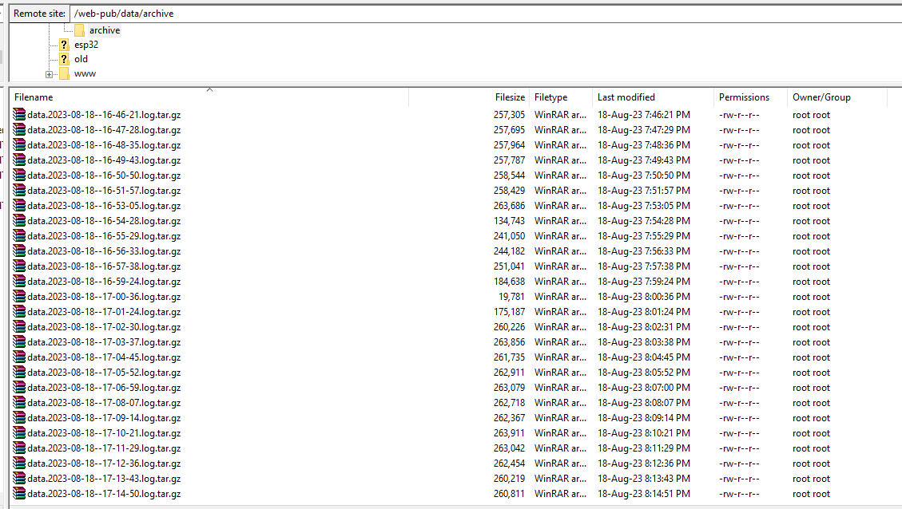

The next image showcases the content of the files archived in each package.

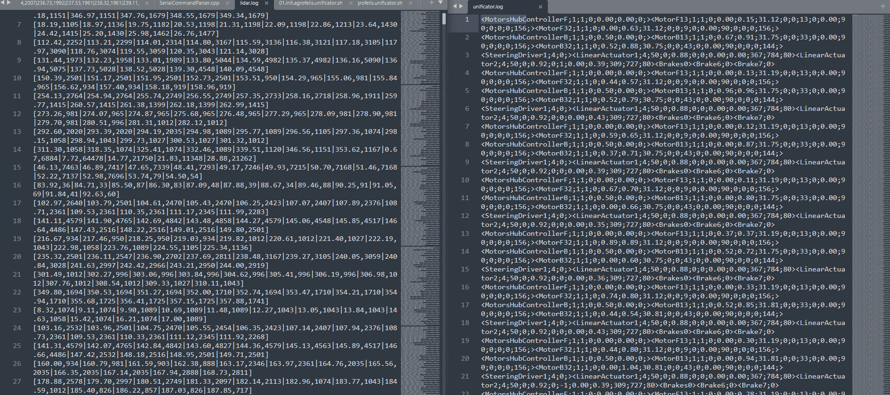

The application has been implemented within 200 lines of code, rendering the server easily maintainable. 
Using the overall recopy allows the Agrofelis modules to be operated as individual modules but also as a part of collection. The technologies employed and the design, allows arbitrary hardware and software modules within the Agrofelis network become unified with the rest of the modules expanding the capabilities of the Agrofelis robot.

The Agrofelis Unificator Software is located in the following path :

- [/web-pub/connectivity/src/agrofelis-unificator/server](https://github.com/meltoner/agrofelis/tree/main/components/connectivity/src/agrofelis-unificator/server)

The software depends on few java script libraries used for accessing the HTTP protocol, the Serial bus and the WebSockets interface as well as for performing asynchronous web requests. These dependencies are downloaded using the following commands.

	apt-get update;
	apt-get install python3;
	npm install http serialport websocket axios

Multiple agents can connect to the Agrofelis Unificator server, to observe, control or supplement the operation. For example the Remote controller can connect to the server at the same time user with a user observing the data via the Unificator client based web application. The following screenshot showcases the web application view in the aforementioned scenario.

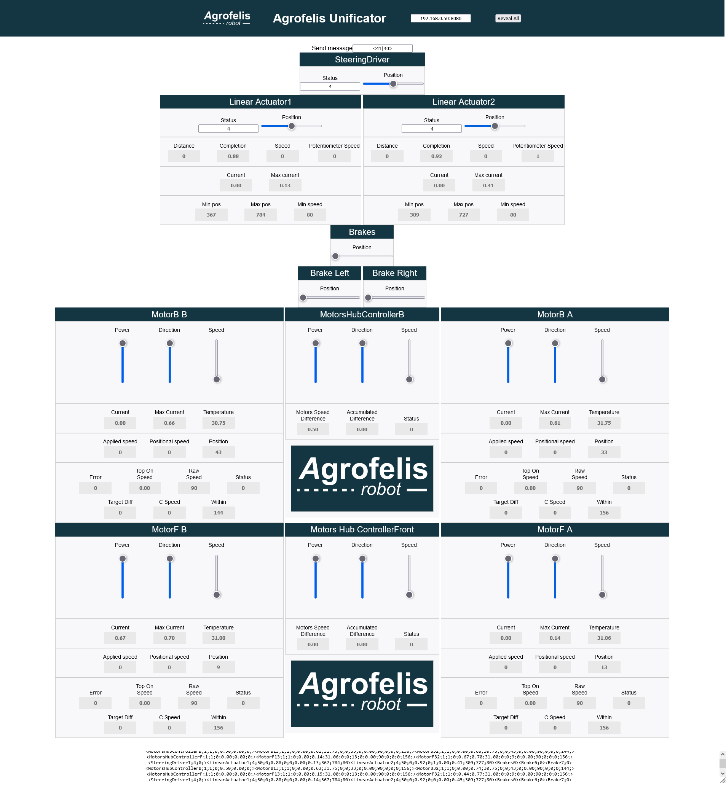

The Unificator web application, following the pattern established by the Motors Hub Controllers enables to combine multiple individual modules into one web application providing a complete overview of the totality of system. The application source code can be accessed from the following path.

- [AgrofelisUnificator.html](https://github.com/meltoner/agrofelis/blob/main/components/connectivity/www/AgrofelisUnificator.html)

The HTML file utilises moreover the following [assets](assets/) 

|File | Description |
|------|-----------------|
|styles.css|Defines the css styles of the web application.|
|motorsHubController.js|Establishes a web socket connection with the related IP of the module. Parses the HTML to identify the related sensors and actuators. Listens for interface changes as well as for websocket messages and according reflects or submits the related information. |
|agrofelis_logo_white_web.svg|The scalable vector graphic logo of the project. |
|jquery.min.js|minified js library dependency [JQuery](https://jquery.com/). |

Special care has been devoted so the setup and code is very lightweight, clean and straightforward in order to be easily modifiable, assisting the rapid prototyping.

 ## Agrofelis network

In order to interconnect the various WiFi capable modules of the robot, a compact access point module was employed. More specifically the TP-LINK TL-WR802N v4 wireless Router  supporting up to 300Mbps bandwidth. The module was chosen due to its compact size, its capacity to operate in multiple modes as well as its 5v compatibility. 

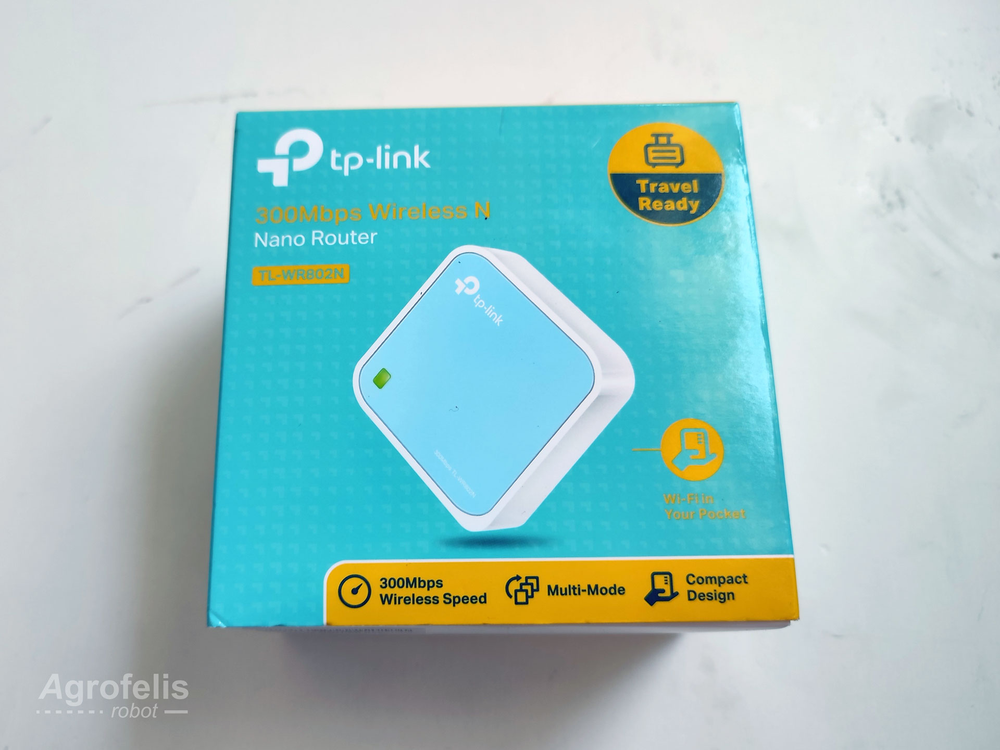

The wireless router is configured as a wireless router leading to a stable WiFi network and is used to associate the different modules with a static IP based on their unique MAC address. The WiFi network is secured with a password which is also set to the modules wishing to connect to the Agrofelis Network.

The default WiFi password followed by all WiFi modules of this repository is :

	felisagrofelistobor_

The complete configuration of the WiFi router as exported by its web application, has been persisted in the following path.

- [tplinkWR802N_conf_wirelss_Router.bin](https://github.com/meltoner/agrofelis/blob/main/components/connectivity/assets/nodes-ip_tp_link/tplinkWR802N_conf_wirelss_Router.bin)

The module was evaluated also in wisp mode allowing to relay the WiFi of a mobile phone hot-spot, to the Agrofelis Network. In wisp mode, the network was depended on the stability of the internet connection and was avoided during field missions. Instead the mode was used to provide internet access to the system when in maintenance.

The complete configuration of the WiFi router in Wisp mode, as exported by its web application, has been persisted in the following path :

- [tplinkWR802N_conf_wisp.bin](https://github.com/meltoner/agrofelis/blob/main/components/connectivity/assets/nodes-ip_tp_link/tplinkWR802N_conf_wisp.bin)

The two modes can be swiftly interchanged by uploading the respective configuration file on the wireless router web interface.

The attached configuration files also encode the IP association each WiFi module according to its Mac address which is unique for any network device in the world. Consequently these mappings should be changed accordingly after observing the mac address of the employed WiFi modules. Bellow the association map used as an indicative example is provided bellow.

|MAC Address|IP Address | Name |
|------|-------|-------|
| 48:B0:2D:2F:25:FA | 192.168.0.50| Jetson Nano |
| A0:20:A6:2E:C8:8C | 192.168.0.51| Power module A | 
| 60:01:94:7D:1C:BF | 192.168.0.52| Power module B |
| A0:B7:65:61:53:84 | 192.168.0.55| Motors hub back |
| A0:B7:65:61:7D:7C | 192.168.0.56| Motors hub Front |
| 24:0A:C4:1F:CF:50 | 192.168.0.60| Remote controller |

## Agrofelis USB hub

A compact 5v USB hub is employed, enabling multiple devices to be connected with the Jetson Nano. More specifically the following modules are connected into the hub which consequently connects with the USBv2 port of the computer.

- WiFi USB
- BMS USB sensor cable
- WiFi router
- Agrofelis steering module
- Agrofelis Front Lidar sensors

## Computing modules structural support.

One aspect often missed while arranging components, is that their connection cables can even occupy about 50% more of their size. Although various connection cables can be made compact that is not an option for USB cables which would otherwise obscure the neighboring components. The solution designed to mitigate the identified problem, was four 3d printed compact tilted mounts, allowing to pass the cables above the neighboring elements and to pass the cables through the space created  underneath. 

The following schematic illustrates the location of the computing modules, their extensions, the USB hub and the 3d printed tilted mounts positioned above the steering plates in the back section of the robot.

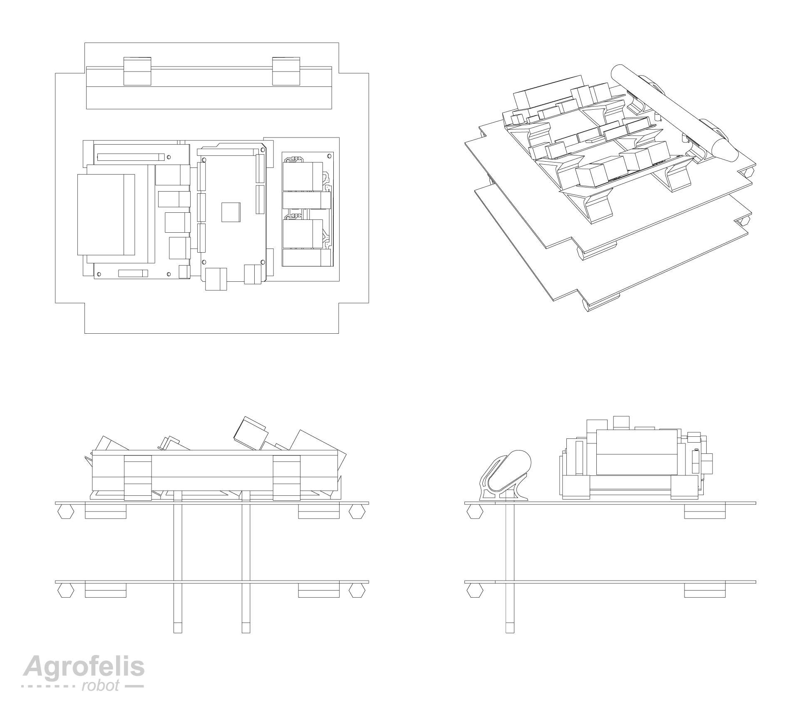

Two type of structure where designed and 3d printed twice. The brackets and their arrangment on the steering plate can be seen in the following diagram.

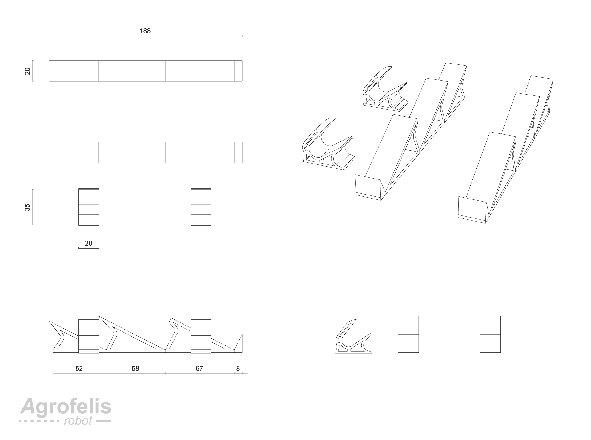

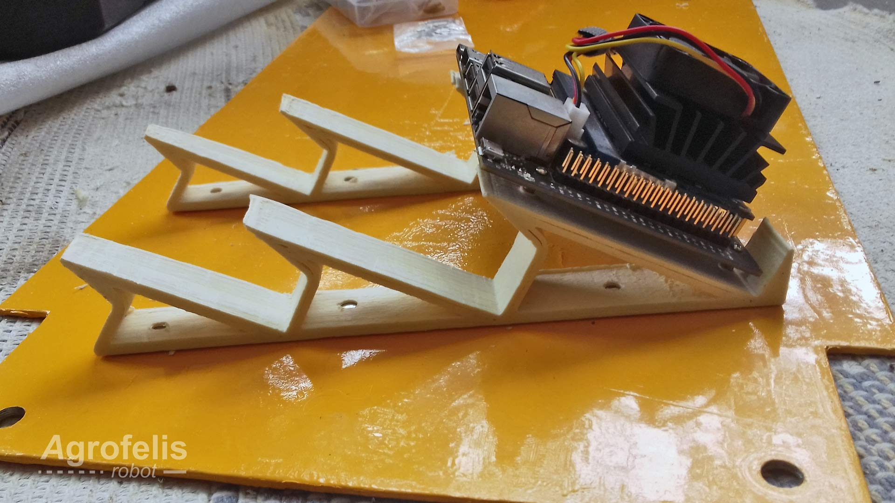
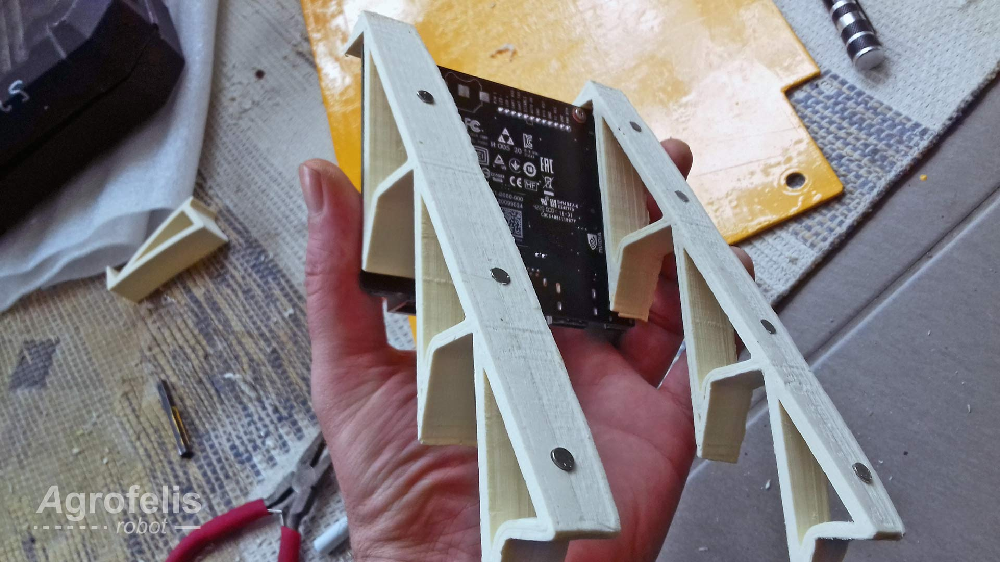
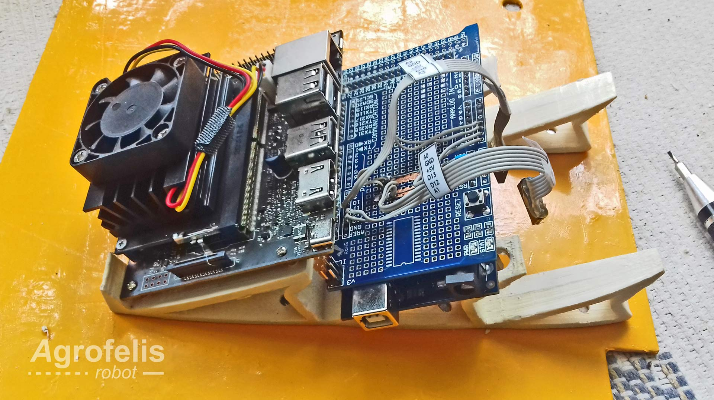
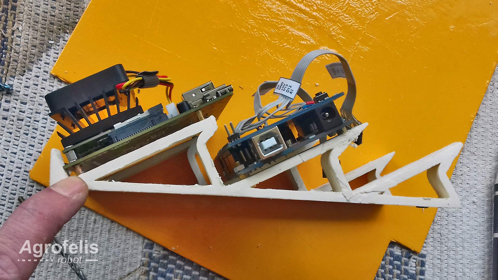

Custom brackets were designed with magnets on their bottom fixing leniently the location of the USB hub.

- The 3d printed design plans of the brackets 

## USB 3d printed brackets 
## Jetson nano 3d printed base

 

# Components

https://www.amazon.com/NVIDIA-Jetson-Nano-Developer-945-13450-0000-100/dp/B084DSDDLT
https://www.skroutz.gr/s/14227605/TP-LINK-TL-WR802N-v4-Asyrmato-Router-Wi-Fi-4.html

# Summary

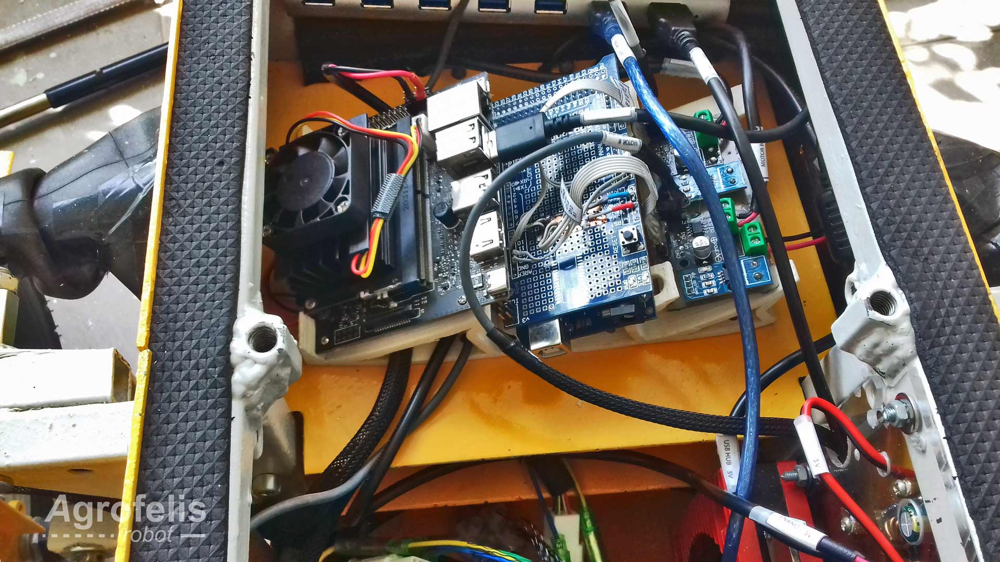
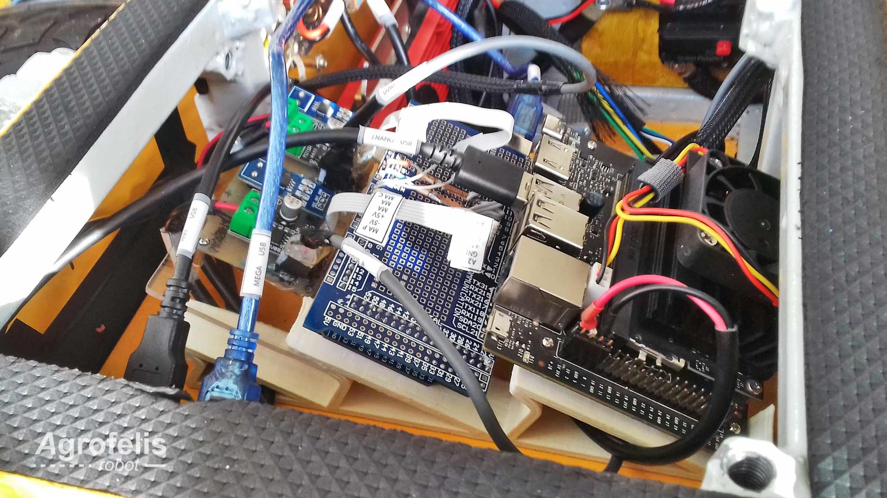
