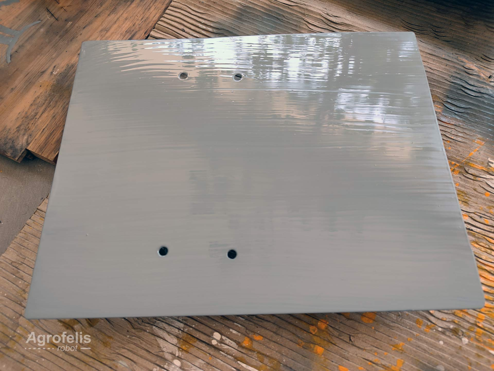

# Two Degrees of Freedom Rotating Implement Mount

# Abstract

This document outlines the construction of the Rotating Implement Mount (RIM), a crucial component positioned atop the Agrofelis robot. The RIM's primary function is to enable the use of various implements, such as the thermal fogger featured in the presentation video. The rotation is achieved through the use of a stepper motor that powers the rotation by turning a gear on a turntable, while elevation/depression is achieved with the use of a linear actuator leveraging the mount, thus granting the RIM a two degrees of freedom (2DF) capability for any implement mounted on it. This report covers the rationale behind the module, its schematics, source code files and details of the manufacturing process. The document concludes with a list of the components used and assorted with indicative suppliers, facilitating the replication of the module.

# Introduction

Implements that need to be mounted at the front of the vehicle, such as a grass cutter, must follow the vehicle's orientation. However, for implements placed on the Rotating Implement Mount (RIM), which is located on the top of the vehicle, they are able to orient independently. This feature proves especially useful for various spraying techniques. The RIM is a relatively simple 2DF mechanism, offering the flexibility to use such tools at a low cost.

## Implement Mount Module

The bottom part of the module features a 360-degree ball-bearing turntable with an attached horizontal gear disc of 70 laser-cut rectangular holes in which a 13-teeth gear runs and provides the horizontal tilt. The middle part possesses a depression angle of -5 degrees and an elevation angle of +40 degrees, which can be leveraged using the linear actuator, and it enables the vertical tilt. The top part serves as the actual mount surface for attaching implements. Note that the suspension of the mid-part onto the turntable is achieved by using four long screws and two 3D printed plastic arcs supporting the over-structure. 

The parts of the rotating assembly, alongside with the supporting plastic arcs and the four long screws that link the bottom and mid parts, are visible in the following photo.

An exploded view of the entire mechanism and its functional design details, is presented in the schematic below.

Furthermore, a lineup of the assembly parts of a decomposed mechanism can be seen in the following schematic.

The list below enumerates the components of the Rotating Implement Mount (RIM).

1. Bottom Base
2. Ball Bearing Turntable
3. Horizontal Gear Disk with rectangular holes
4. Supporting Plastic Arcs
5. Stepper Motor with Gear
6. Linear Actuator
7. Mid Base
8. Linear Shaft Support Bracket
9. Linear Shaft
10. Top Base

## Fabrication Parts

### Bottom Base

The dimensions, followed by a fabricated metal sheet base, are presented below.

### Stainless Steel Horizontal Gear Disk

The following figure illustrates the schematics of the horizontal gear disk.

The horizontal gear disk was fabricated using a 2 mm stainless steel sheet, which was laser-cut by an external service, because it was too detailed for our DIY plasma cutter. 

The design source code file that was sent to the service is available below.

- [Horizontal disk gear and vertical gears file](assets/stainless-steel-laser-cut/laser-cut_stainless_gear_disk_motor_gear_order.dwg)

A preview of the design source file containing the horizontal gear disk and four gears for use with three of them stacked together, is provided below.

### Gear 

The gear is comprised of three layers that are stacked and screwed together before being ground.

In the images below, the rounded edges created using a Dremel tool can be seen.

### Servo Motor

The servo motor on its mount, with its attached gear producing 0.3NM of torque, is shown below.

The complete rotating mechanism, including the horizontal gear disk, motor and gear, and four long screws, is displayed below.

### Supporting Plastic Arcs 

The plastic arcs incorporate holes that precisely fit the four long screws. These arcs provide support for the over-structure, whereas the screws primarily support the horizontal forces generated by the rotation. The entire assembly is quite sturdy.

The assembly, including the plastic arcs, is depicted below.

The source code design plans for implementing the side walls are persisted in the following path.

- [Supporting side walls](assets/RotationTableWalls/3d-print/walls.stl)

### Mid Base

A schematic with dimensions and photos of a plasma-cut and welded fabricated mid base is shown below.

### Top Base

Details of the metal sheet used for the top base are shown below.

### End Module

The complete assembly of the Rotating Implement Mount (RIM), before being painted, can be seen in the following photographs.

 
## Implement Mount Components and Indicative Suppliers
 
The following table lists the individual components employed for manufacturing the Agrofelis two degrees of freedom rotating implement mount. The index table includes moreover the product URLs, the indicative suppliers, as well as unit prices and total cost estimates.

| No. |  Product | Product URL | Supplier | Used Quantity | VAT Price (€) | Subtotal (€)  | Note |
|----|--------------|------------|-----|---|---|---|---|
| #1 | Black iron metal sheet 1000x2000x3mm  | [3mm metal sheet](https://www.e-metalshop.gr/sidera/lamarynes/lamarina-sidhroy-mayrh-1000x2000x3mm) | [QOOP Metalworks](https://www.qoop.gr)  | 0.2 | 73.85 | 14.77 | - |
| #2 | Black iron metal sheet 1000x2000x2mm  | [2mm metal sheet](https://www.e-metalshop.gr/sidera/lamarynes/lamarina-sidhroy-mayrh-1000x2000x2mm) | [QOOP Metalworks](https://www.qoop.gr)  | 0.3 | 49.23 | 14.76 | - |
 #3 | 100 pack Allen screws DIN 912 8.8 M 8 x 25 | [Screws M8X25](http://www.sinter-hellas.gr/index.php/products/eidh-vidopoiias/vides-me-speirwma-gia-perikoxlio/93-allen/din912-88-mavr)  |[Sinter Hellas](http://www.sinter-hellas.gr/) | 0 | 18.62 | 0 | 4 scews reused from frame material |
| #4 | 300mm Aluminium Rotating Bearing Turntable | [Turntable](https://www.aliexpress.com/item/1005002246256122.html) | [AliExpress](https://www.aliexpress.com/) | 1 | 29.53 | 29.53 | - |
| #5 | Linear Actuator 50 mm 24V 200N 45 mm/s| [Linear actuator](https://www.aliexpress.com/item/32687100164.html) |  [AliExpress](https://www.aliexpress.com/) | 1 | 21.93 | 21.93 | - |
| #6 | H-Bridge Brushed DC Motor Driver | [Motor driver](https://www.cableworks.gr/ilektronika/arduino-and-microcontrollers/motors/drivers/drv8871-h-bridge-brushed-dc-motor-driver-breakout-board-for-arduino/) | [Cableworks](https://www.cableworks.gr) | 2 | 6.00 | 12.00 | - |
| #7 | NEMA23 single shaft 8mm, 4.2A | [NEMA23](https://www.aliexpress.com/item/32868067877.html) | [AliExpress](https://www.aliexpress.com/) | 1 | 18.44 | 18.44 | - |
| #8 | Closed loop Nema 23 driver | [closed loop stepper driver](https://www.aliexpress.com/item/1005005446035245.html) | [AliExpress](https://www.aliexpress.com/) | 1 | 21.82 | 21.82  | - |
| #9 | Nema 23 L bracket | [Stepper bracket](https://isac.gr/product/goniaki-vasi-nema-23-motor/) | [ISAC Advanced robotics](https://isac.gr) | 1 | 6 | 6 | - |
| #10 | Linear motion shaft OD 12mm 500mm length | [Linear shaft](https://isac.gr/product/axonas-grammikis-kinisis-od-12mm/?attribute_pa_size=500mm) | [ISAC Advanced robotics](https://isac.gr) | 1 | 8.3 | 8.3 | - |
| #11 | Linear shaft support bracket SHF 12mm | [Linear shaft bracket](https://isac.gr/product/vasi-thesis-axona-shf-12mm/) | [ISAC Advanced robotics](https://isac.gr) | 2 | 4.84 | 9.67 | - |
| #12 | Omega shaft bracket 12mm | [Omega shaft](https://isac.gr/product/koyzineto-kp-omega12mm/) | [ISAC Advanced robotics](https://isac.gr) | 2 | 5.58 | 11.16 | - |
| #13 | 750ml Vitex Metal Primer | [Primer](https://www.stereotiki.gr/store4/vitex-metal-primer-astari-metallon.html) | [Stereotiki](https://www.stereotiki.gr) | 0 | 6.50 | 0.00 | Reused from frame material|
| #14 | Orange oil paint 0.75kg | [Metal paint](https://www.bousounis.gr/%CF%87%CF%81%CF%89%CE%BC%CE%B1%CF%84%CE%B1-amp-%CE%B2%CE%B5%CF%81%CE%BD%CE%B9%CE%BA%CE%B9%CE%B1/%CE%BD%CF%84%CE%BF%CF%85%CE%BA%CE%BF%CF%87%CF%81%CF%89%CE%BC%CE%B1%CF%84%CE%B1/vechro-gumilak-metal-duco-%CF%85%CF%88%CE%B7%CE%BB%CE%B7%CF%83-%CE%B1%CE%BD%CF%84%CE%BF%CF%87%CE%B7%CF%83-%CE%BD%CF%84%CE%BF%CF%85%CE%BA%CE%BF%CF%87%CF%81%CF%89%CE%BC%CE%B1-603-%CE%B7%CE%BB%CE%B5%CE%BA%CF%84%CF%81%CE%BF-750ml.htm) | [Bousounis](https://www.bousounis.gr/) | 1 | 9.70 | 9.70 | - |
| #15 | Brushes| [Brush](https://nova-ceramica.gr/products/morris-39253) | [Nova Ceramica](https://nova-ceramica.gr/) | 3 | 1.00 | 3.00 | - |
| #16 | White spirit| [White spirit](https://www.rigatos-shop.gr/dialytika-diavrwtika-spray/2381-white-spirit-%CE%B4%CE%B9%CE%B1%CE%BB%CF%85%CF%84%CE%B9%CE%BA%CF%8C-500ml.html)  | [Rigatos Shop](https://www.rigatos-shop.gr/) | 1 | 1.50 | 1.50 | - |
| #17 | Paper sheet | [Paint paper](https://xromagora.gr/%CF%83%CF%85%CE%BD%CE%B1%CF%86%CE%AE-%CF%87%CF%81%CF%89%CE%BC%CE%AC%CF%84%CF%89%CE%BD/%CF%87%CE%B1%CF%81%CF%84%CE%AF-%CE%B3%CE%BA%CE%BF%CF%86%CF%81%CE%AD-%CE%BD%CE%AC%CF%85%CE%BB%CE%BF%CE%BD/%CF%87%CE%B1%CF%81%CF%84%CE%AF-%CE%B3%CE%BA%CE%BF%CF%86%CF%81%CE%B5-%CE%BF%CE%BD%CF%84%CE%BF%CF%85%CE%BB%CE%B5.) | [Xromagora](https://xromagora.gr/) | 0 | 0.80 | 0.00 | Reused from frame material|
| #18 | Laser cut gears out of stainless steel sheet 2mm as of design | - | [QOOP Metalworks](https://www.qoop.gr) | 1 | 85 | 85 | [See dwg design file](assets/stainless-steel-laser-cut/laser-cut_stainless_gear_disk_motor_gear_order.dwg) |
| #19 | 3D printed side walls as of G-code | [3D printing services](https://www.3dhub.gr/upload-3d-file/) | [3DHub](https://www.3dhub.gr/) | 1 | 55 | 55 | [See G-code design file](assets/3d-print/RotationTableWalls/walls.stl) |
| **Total** |      |    |     |      |     |  **322.58**  | | 

The total cost for manufacturing the Agrofelis two degrees of freedom rotating implement mount, excluding expenses for shipping, cutting, welding, and painting, amounts to approximately **322.58** euros.

## Summary

The design rationale, component specifications, and essential dimensions for replicating the Rotating Implement Mount (RIM) of the Agrofelis robot has been documented in a progressive manner. To conclude, the photograph below showcases the vehicle equipped with the RIM, featuring a thermal fogger.

