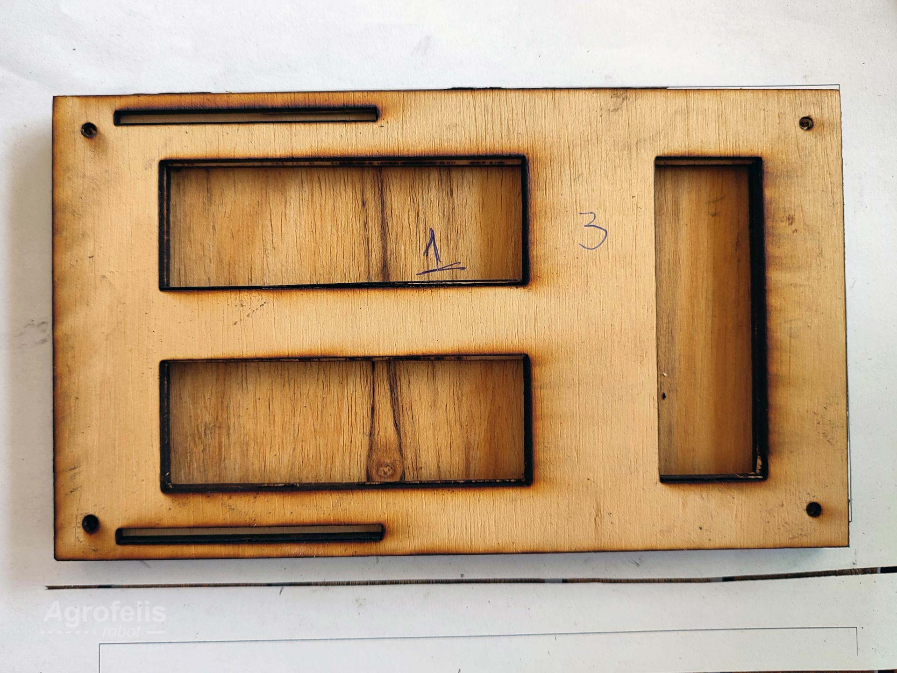
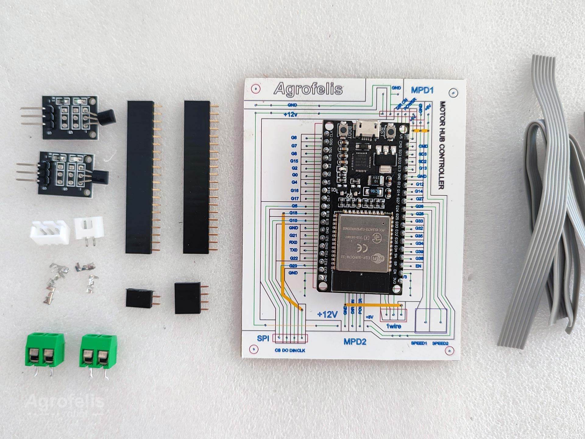
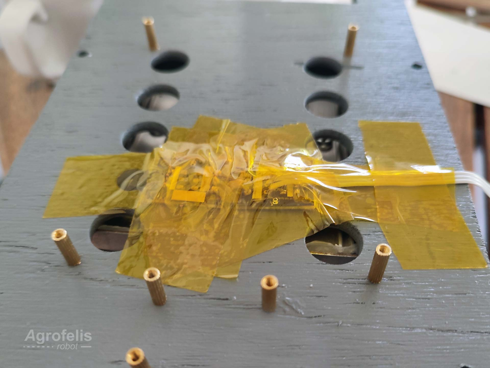

## Motors Hub Driver

The Agrofelis Motors Hub Driver module purpose is to digitally control over the air, a pair of motors via two drivers, to monitor their thermal, current and positional indicators as well as to guide the air flow cooling the electronic components, to actuate their power, speed and direction. The module is composed by structural elements, PCB boards separating the different functionalities into simpler standalone sub modules and the software running on the micro controller. 

Two such modules are employed in the Agrofelis robot, to achieve four wheel drive and precision control. The following figure illustrates the schematics of the overall module.

Find below is a photo of the implemented module positioned within the front and the back part of the vehicle.

In the following sections the structural and electronics sub-component of the module are documented.

### Structural

This component of the Agrofelis Motors hub driver, deals with the structural elements of the composite module.
The structural component is formed by two parts enclosing and mounting the related sub elements. Moreover the structural component  serves for guiding the air flow efficiently to 
cool down the electronics during their operation. The structure body, is composed of layers of ply-wood and 3d printed air fins, glued and painted.

The individual elements forming the structural body is illustrated by the following figure.

The top part of the structural body, creates sockets to host two temperature sensors, sockets to host the two power modules vertically, sockets to attach the analog drivers, as well as holes indicating exactly where the PCB boards are mounted and a socket for an 80mm fan.

The following photos showcase the top and bottom parts of the structure, manufactured using a low end CNC, equipped with with laser.

The 3d printed air fins glued on the bottom part of the structure are illustrated below.

The bottom and top part, and how these fit together using the motor drivers as building blocks, is captured by the following photo.

The Motors Hub structure sub-module, is implemented using of the following parts in detail :

1. Five 4 mm ply-wood layers cut using a laser cutter into 204.83 mm X 119.67 mm parts. The layers 1-3 layers form the bottom part and the remaining the top part. 
2. Four 3d printed elements guiding the air flow across the sides of the analog motor drivers as well providing extra support to the top layer.
3. Wood glue
4. A spray paint
5. Capton tape to secure the temperature sensors in the top wood layer slot.
6. Eight Standoff, Bolts and screws 2m to mount the controller and ADAC into the wooden layer
7. Two 2.8mm X 16mm screws securing the top layer with the outer fins.

The schematics and source files to cut and 3d print the parts 1. and 2. are located within the following folders respectively.

- structural\box_wood_layers\laser_cut
- structural\box_fins\3d_print

More specifically the laser cut folder, documents the procedure for exporting and transforming the Rhino diagrams into five SVG files and consequently to five NC instructions used to cut the related parts. The 3d print folder contains two stl files and two gcode instruction files for the inner and outer fins structural elements.

### Electronics

The electronics sub modules of the Agrofelis Motors hub driver sum into four PCB sub-modules, namely the :

1. Motors hub controller module.
2. Motors hub power module (A).
3. Motors hub power module (B).
4. Motors hub ADAC module.

Their compilation is illustrated by the following diagram.

In the following sections the three type of modules are documented in further detail.

### Motors hub controller

This sub-module of the Motors Hub Driver integrates all electronics components of the overall module. The controller decomposes the functionality of processing the signals, of broadcasting the sensors impulses and for controlling the actuators via wireless means. The module digitally drives the two motor hubs via an ESP32 and reads and intercepts the hall sensors of the analog drivers using the ADAC module. The module senses the current drawn by the motors, reads the individual temperature of the analog drivers and controls the power and spin direction of the motors. 

The PCB is illustrated by the following figure.

Lines in green, indicate the connection between two points in the board. Lines in black offsetting the green lines indicate curves cutting the cooper, creating the end routes between connected points in the board. Lines in yellow indicate bridges connecting two points from to top side of the board via a wire. Lines in red, indicate components or connectors of the board.

The Motors Hub controller is composed of the following elements :
 
1. A PCB board 
2. The printed schematic glued on top of the PCB, indicating the location of components and the underlying routes of the PCB.
3. One ESP32 with 38 pins. 
4. Two twenty pin female headers allowing to remove the ESP32.
5. One two pin female header for connecting the 12v fan.
6. One four pin female header.
7. One 2 pin JST male connector for the 5v supply.
8. One 3 pin JST male and female connector used to connect two temperature sensors via the one wire protocol.
9. Two Green 5 mm Screw terminal PCB Connector, one for the speed link of both motors and one for the 12v input.
10. Two five wire ribbon cable 7 cm, used to connect the power modules.
11. Two five ping female headers used to connect the power modules at the end of ribbon cable.
12. One three wire ribbon cable 7 cm, used to connect the temperature sensors.
13. Two temperature sensors DS18B20 connected via one wire.
14. Pieces of wire for the implementing the PCB bridges as indicated by the yellow color in the PCB.PRINT.Stickers schematic.
15. A case cooler 8 cm LogiLink FAN101 at 12V
16. Two Agrofelis Motor Hub Power Drivers and the Agrofelis Motors hub ADAC module. 
17. Non mandatory connectors, two 2 pin terminal, high current red an black wire, male and female connectors to power the analog motor drivers with.
18. Glue gun to secure the copper side of the pcb from extrernal factors applied after its function has been verified.
19. The software https://github.com/meltoner/agrofelis/tree/main/components/mobility/motors_hub_driver/src/DualMotorDriver

Remarks :

- One pin is trimmed off the twenty pin female headers to match the 19 pins of the ESP32.
- The temperature sensor male headers are removed and connected with the 3 wire ribbon cable, to keep a lower profile.

Various elements of the controller are layout by the following photo.

Bellow, the module with most of its elements established is illustrated.

The temperature sensors as positioned and secured using capton tape in the top part of the structural component are presented bellow.

After the functionality of the board has been verified, the copper side of the PCB is shielded using hot glue to prevent corrosion and improve its longevity.

The schematics and source files to manufacture parts 1. using a regular CNC equipped with a drill are located within the following folder :

- pcb\PCB.CNC.controller

More specifically the folder, documents the procedure for exporting and transforming the Rhino diagrams into two SVG files and consequently to two NC instructions files enhanced using two JavaScript applications. 

- PCB.CNC.controller\readme.md

The PCB board is developed in two phases. The first phase handles the drilling, using a drill bit specifically for this purpose. In the second phase the drill bit is changed into one appropriate for curving the copper of the PCB.

Within the Folder the following respective files encode the desired movements to perform.

- 1.DRILL.svg
- 2.CURVE.svg

The SVGs are converted into CNC instructions using the open source [laserGRBL](https://lasergrbl.com/) software.
Consequently using the following JavaScript application the NC files are enhanced to incorporate Z axis movements based on the continuity and coordinates of the schematics and the scope of the instructions, to drilling or routing.

- LineRoutesToHoles.html
- LineRoutesToWire.html
 
The end instructions to reproduce the board are the :

- 1.DRILL.ENHANCED.nc
- 2.CURVE.ENHANCED.NC

The first pattern indicating the paths visiting each drill to make and the second pattern indicating the curves to route are illustrated by the following figure.

The top non conductive cover of the PCB is enriched with a diagram printed in photographic paper, glued and punctured using a needle. The related PDF containing more than one diagram to cover four pcb is stored in the following folder.

-  PCB.PRINT.Stickers\motors_hub_driver-sticker-pcb-controller.pdf

### Motor hub power module

This sub-module of the Motors Hub Driver decomposes the functionality of powering, sensing the current and reversing the direction of a motor hub driver. 
Two identical are modules are used for the first and second motor driver on the left and right side of the structural component of the module.
The power modules interface with the Motors hub controller using a five wire ribbon cable caring 12v, 5v, gnd and signal for activating two relays one controlling the direction of the moter and another one chained with a large relay supplying power to the motor driver. The module interface indirectly with the controller module via the ADAC module capable of monitoring 5v signal and more specifically the current sensor of the module.

The PCB is illustrated by the following figure.

Lines in green, indicate the connection between two points in the board. Lines in black offsetting the green lines indicate curves cutting the cooper, creating the end routes between connected points in the board. Lines in yellow indicate bridges connecting two points from to top side of the board via a wire. Lines in red, indicate components or connectors of the board.

The Motors Hub Power Driver is composed of the following components :

1. A PCB board, with its schematics located within PCB.CNC.power\ folder.
2. The PCB top side printed cover located within PCB.PRINT.Stickers.
3. Two relays trigger/able with 3v [HK4100F-DC 3V SHG Relay 6Pin]
4. One car relay, trigger/able with 12v with 20 amp capacity [6770718 - 12v 20A].
5. An [ACS712] 20 amp current Sensor.
6. One 5 pin male header.
7. A JST-SM 2pin connector, connecting with the motor driver reverse function.
8. One small wire for connecting the PCB with the 20 amp relay.
9. 3 pin headers for connecting the PCB with the 20 amp relay.
10. One 4 cm high current wire.
11. One 6.2 mm female connector.
12. Glue gun to secure the copper side of the pcb from corrosion

This sub-module is used twice, within the Motors hub driver module.

Remarks :

- Two pins of the 3v relays are trimmed as illustrated in the schematics, thus interfacing with the PCB with only the utilised pins.
- The ACS712 20 amp current sensor pins/connectors are de-soldered and pins are solder from the bottom side of the sensor's PCB, interfacing with the PCB of the module.
- It was noticed that not all HK4100F-DC 3V were operational with esp32. About 45% of these relays are manufactured more efficiently and are triggerable by the low amp digital output of the esp32. During tests these found to operate with the ESP32, were triggerable with less voltage like 1.8v, while others required at least 2v. This issue can be mitigated by using a [ULN2003](https://microcontrollerslab.com/relay-driver-circuit-using-uln2003/) relay driver circuit IC which could be integrated in either the power module or the controller module. 

Various elements of the controller are layout by the following photo.

Bellow, the module and details while establishing its parts is illustrated.

The bottom/copper side and assembled module is captured bellow.

After the functionality of the board has been verified, the copper side of the PCB is shielded using hot glue to prevent corrosion and improve its longevity.

The schematics and source files to manufacture parts 1. using a regular CNC equipped with a drill are located within the following folder :

- pcb\PCB.CNC.power

More specifically the folder, documents the procedure for exporting and transforming the Rhino diagrams into two SVG files and consequently to two NC instructions files enhanced using two JavaScript applications. 

- PCB.CNC.power\readme.md

The PCB board is developed in two phases. The first phase handles the drilling, using a drill bit specifically for this purpose. In the second phase the drill bit is changed into one appropriate for curving the copper of the PCB.

Within the Folder the following respective files encode the desired movements to perform.

- 1.drill.svg
- 2.curve.svg

The SVGs are converted into CNC instructions using the open source [laserGRBL](https://lasergrbl.com/) software.
Consequently using the following JavaScript application the NC files are enhanced to incorporate Z axis movements based on the continuity and coordinates of the schematics and the scope of the instructions, to drilling or routing.

- LineRoutesToHoles.html
- LineRoutesToWire.html
 
The end instructions to reproduce the board are the :

- 1.drill.normalised.enhanced.nc
- 2.curve.normalised.enhanced.nc

The first pattern indicating the paths visiting each drill to make and the second pattern indicating the curves to route are illustrated by the following figure.

The top non conductive cover of the PCB is enriched with a diagram printed in photographic paper, glued and punctured using a needle. The related PDF containing more than one diagram to cover nine pcb, is stored in the following folder:

-  PCB.PRINT.Stickers\motors_hub_driver-sticker-pcb-power

 