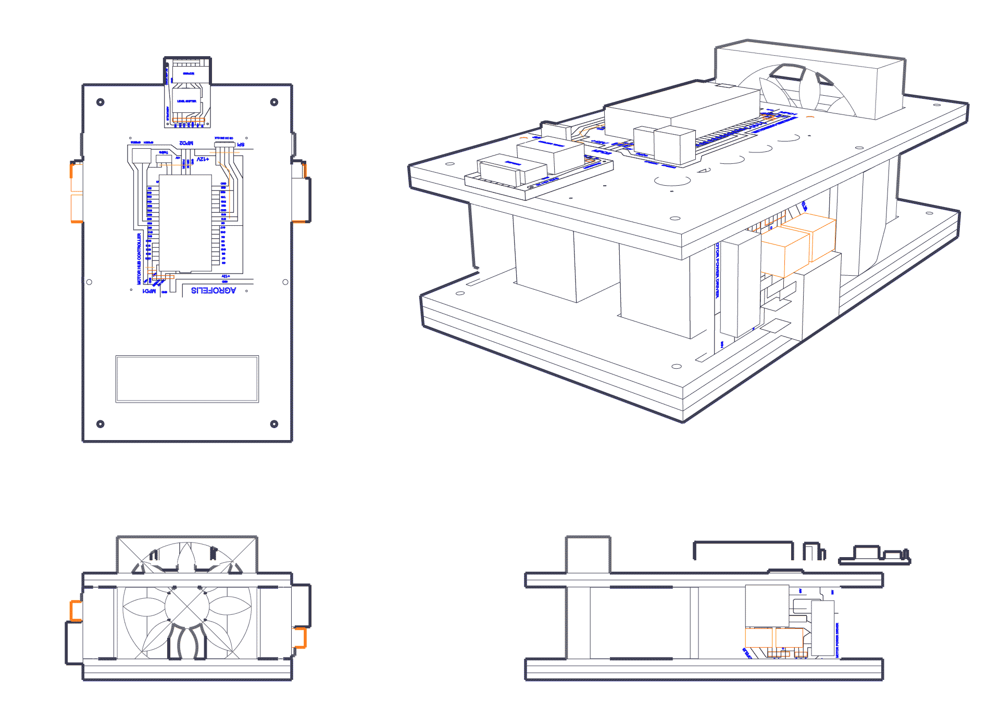

## Motors Hub Driver

The Agrofelis Motors Hub Driver module aim is to develop a unit to control digitally over the air, two motors via two drivers, to monitor their thermal, current and positional indicators as well as to cool the electronic components and control their power, speed and direction. The module is composed by structural elements, PCB boards decomposing the different functionalities into simpler standalone sub modules and the software running on the micro controller. Two such modules are employed in the Agrofelis robot, to achieve four wheel drive and precision control. 

The following figure illustrates projections of the overall module.

