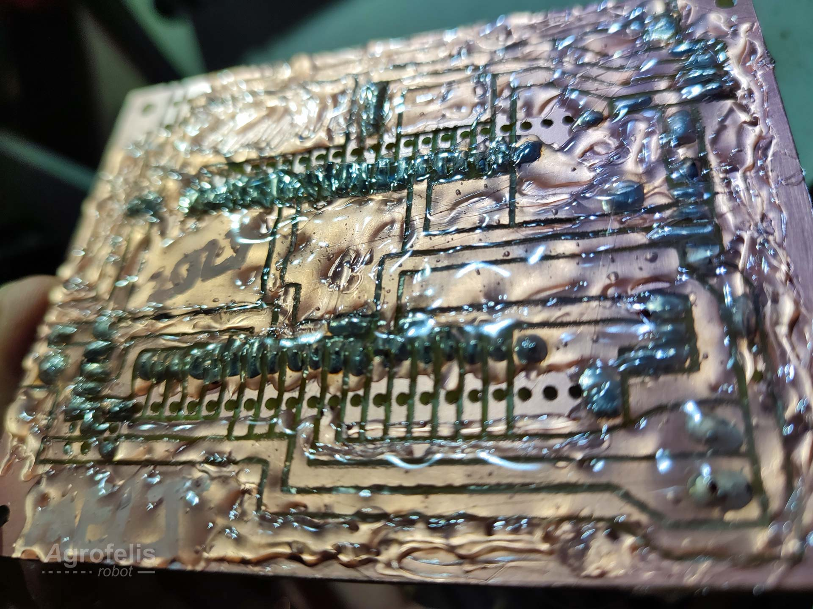
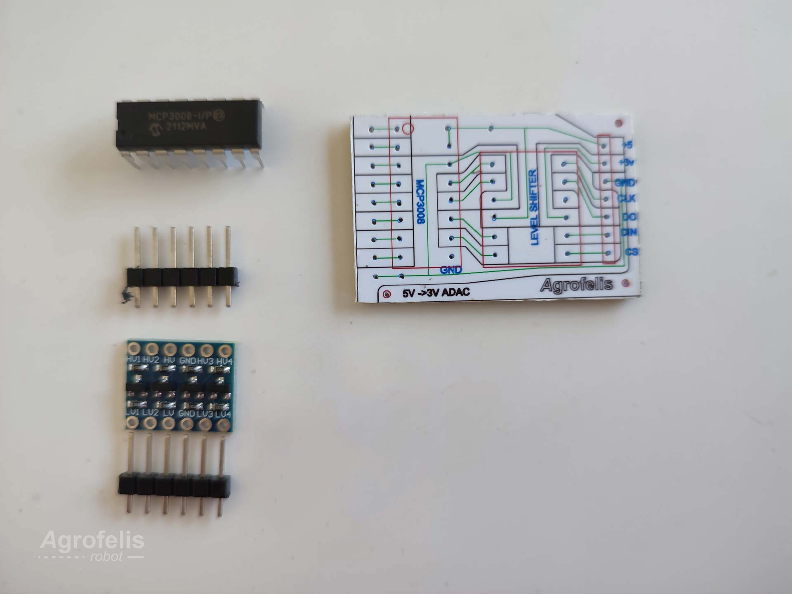
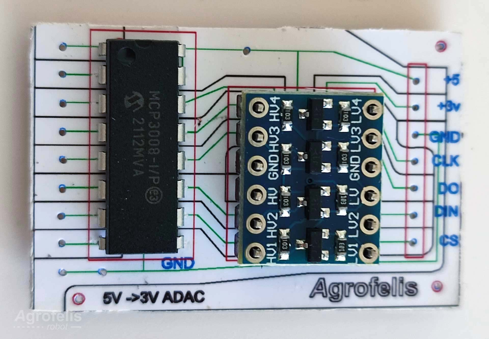
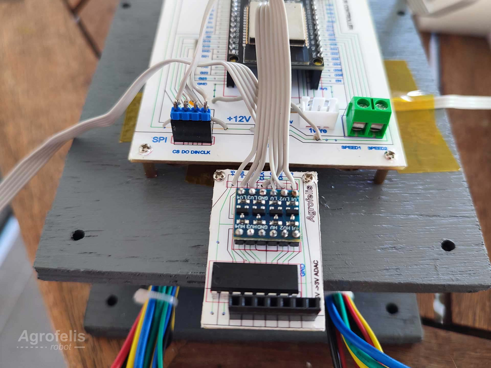
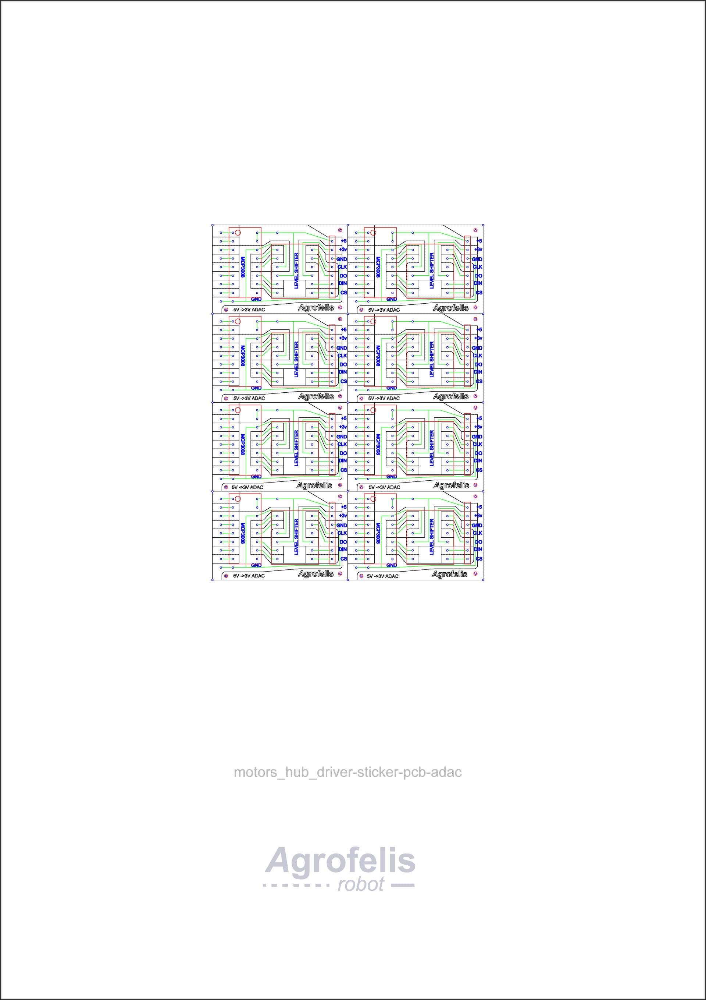
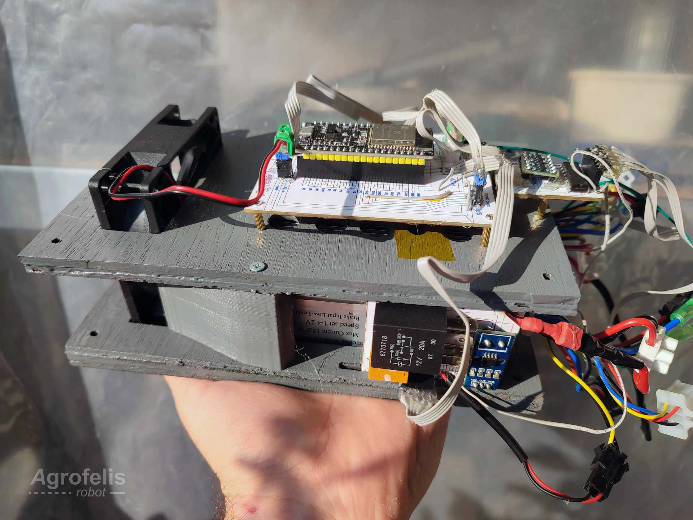

# Abstract

This document delves into the manufacturing and functional intricacies of a composite module tailored for controlling and sensing a pair of in-wheel motor hubs digitally, over the air. The documentation decomposes the different elements involved into sub-modules, into their sub elements in an organized and progressive manner. A detailed exposition of each component's rationale and its seamless integration with counterparts is provided, bolstered by design plans and photographic evidence of the actual implementation. 

The document offers a roadmap through the Agrofelis repository, elucidating the source file locations and the production processes underpinning the manufacturing of the Agrofelis Motors Hub Driver. The document presents the structural elements of the unit, the three type of PCB sub-components, the software running on the micro-controller, key tools employed in the manufacturing process and ends with a compendium of indicative suppliers to purchase the different parts.

## Motors Hub Driver

The Agrofelis Motors Hub Driver module purpose is to digitally control over the air, a pair of motors via two drivers, to monitor their thermal, current and positional indicators as well as to guide the air flow cooling the electronic components, to actuate their power, speed and direction. The module is composed by structural elements, PCB boards separating the different functionalities into simpler standalone sub modules and the software running on the micro controller. 

Two such modules are employed in the Agrofelis robot, to achieve four wheel drive and precision control. The following figure illustrates the schematics of the overall module.

Find below a photo of the implemented module, positioned within the front and the back enclosures of the vehicle.

In the following sections the structural and electronics sub-component of the unit, are documented.

### Structural component

This component of the Agrofelis Motors hub driver, deals with the structural elements of the composite module.
The structural component is formed by two parts enclosing and mounting the related sub elements. Moreover the structural component  serves for guiding the air flow to efficiently cool down the electronics during their operation. 
The structure body, is composed of layers of ply-wood and 3d printed air fins, glued and painted.

The individual elements forming the structural body are illustrated by the following figure.

The top part of the structural body, creates sockets to host two temperature sensors, sockets to host the two power modules vertically, sockets to attach the analog drivers, as well as holes indicating exactly where the PCB boards are mounted and a socket for an 80 mm fan.

The following photos showcase the top and bottom parts of the structure, manufactured using a low end CNC, equipped with a laser.

The 3d printed air fins glued on the bottom part of the structure are illustrated below.

The bottom and top part and how these fit together using the motor drivers as building blocks, are captured by the following photo.

The Motors Hub structure sub-module, is implemented using of the following parts in detail:

1. Five 4 mm ply-wood layers cut using a laser cutter into 204.83 mm X 119.67 mm parts. The layers 1-3 form the bottom part and the remaining the top part. 
2. Four 3d printed elements guiding the air flow across the sides of the analog motor drivers as well providing extra support to the top layer.
3. Wood glue
4. A spray paint
5. Capton tape to secure the temperature sensors in the top wood layer slot.
6. Eight Standoff, Bolts and screws 2mm to mount the Controller and ADAC sub-modules, into the wooden top layer.
7. Two 2.8mm X 16mm screws, securing the top layer with the outer fins.

The schematics and source files to cut and 3d print the *parts 1* and *2* are located within the following folders respectively.

- [structural/box_wood_layers/laser_cut](https://github.com/meltoner/agrofelis/tree/main/components/mobility/motors_hub_driver/structural/box_wood_layers/laser_cut)
- [structural/box_fins/3d_print](https://github.com/meltoner/agrofelis/tree/main/components/mobility/motors_hub_driver/structural/box_fins/3d_print)

More specifically, the *laser cut* folder documents the procedure for exporting and transforming the Rhino diagrams into five SVG (scalable vector graphics) files and consequently to five NC (Numerical Control) instructions, used to cut the related parts. The *3d print* folder contains two STL (stereolithography) files and two Gcode (geometry code) instruction files for the inner and outer fins structural elements.

### Electronic sub-modules

The electronics sub-modules of the Agrofelis Motors hub driver, sum into four PCB sub-modules namely the:

1. Motors hub controller module.
2. Motors hub power module (A).
3. Motors hub power module (B).
4. Motors hub ADAC module.

Their compilation is illustrated by the following diagram.

In the following sections the three type of modules are documented in further detail.

### Motors hub controller

This sub-module of the Motors Hub Driver integrates all electronics components of the overall module. The controller decomposes the functionality of processing the signals, of broadcasting the sensors impulses and for controlling the actuators via wireless means. The module digitally drives the two motor hubs via an ESP32 and reads and intercepts the hall sensors of the analog drivers using the ADAC module. The module senses the current drawn by the motors, reads the individual temperature of the analog drivers and controls the power, the speed and spin direction of the motors. 

The PCB is illustrated by the following figure.

Lines in green, indicate a connection between two points in the board. Lines in black offsetting the green lines indicate curves cutting the copper surface, creating the end routes between the connect coordinates in the board. Lines in yellow indicate bridges, connecting two points from the top side of the board via a wire. Lines in red, indicate components or connectors of the board and their orientation.

<a name="motors-hub-controller-components" />The Motors Hub controller is composed of the following elements:
 
1. A PCB board.
2. The printed schematic glued on top of the PCB, indicating the location of components and the underlying routes of the PCB.
3. One ESP32 with 38 pins. 
4. Two 20-pin female headers allowing to remove the ESP32.
5. One 2-pin female header for connecting the 12v fan.
6. One 4-pin female header.
7. One 2-pin JST male connector for the 5v supply.
8. One 3-pin JST male and female connector used to connect two temperature sensors via the one wire protocol.
9. Two Green 5 mm Screw terminal PCB Connectors, one for the speed link of both motors and one for the 12v input.
10. Two 5-wire ribbon cable 7 cm, used to connect the power modules.
11. Two 5-pin female headers used to connect the power modules at the end of ribbon cable.
12. One 3-wire ribbon cable 7 cm, used to connect the temperature sensors.
13. Two temperature sensors DS18B20 connected via one wire.
14. Pieces of wire for the implementing the PCB bridges as indicated by the yellow color in the [PCB.PRINT.Stickers](https://github.com/meltoner/agrofelis/blob/main/components/mobility/motors_hub_driver/pcb/PCB.PRINT.Stickers/motors_hub_driver-sticker-pcb-controller.pdf) schematic.
15. A case cooler 8 cm LogiLink FAN101 at 12V.
16. The Agrofelis Motor Hub Power Driver modules and the Agrofelis Motors hub ADAC module.
17. Non-mandatory connectors, two 2-pin terminal, high current red and black wire, male and female connectors to power the analog motor drivers with.
18. Glue stick to secure the copper side of the pcb from extrernal factors applied after its function has been verified.
19. The software for the [back](https://github.com/meltoner/agrofelis/tree/main/components/mobility/motors_hub_driver/src/DualMotorDriverBack) and [front](https://github.com/meltoner/agrofelis/tree/main/components/mobility/motors_hub_driver/src/DualMotorDriverFront) dual motor driver. 

Remarks:

- One pin is trimmed off the twenty pin female headers, to match each side of the 19 pins of the ESP32.
- The temperature sensor male headers, are removed and connected with the 3-wire ribbon cable, to lower their height profile.

Various listed elements of the controller, are layout by the following photo.

Below, the module with most of its elements established, is illustrated.

The temperature sensors as positioned and secured using capton tape in the top part of the structural component, are presented below.

After the functionality of the board has been verified, the copper side of the PCB is shielded using hot glue to prevent corrosion and improve its longevity.

The schematics and source files to manufacture *part 1* using a regular CNC equipped with a drill, are located within the following folder:

- [pcb/PCB.CNC.controller](https://github.com/meltoner/agrofelis/tree/main/components/mobility/motors_hub_driver/pcb/PCB.CNC.controller)

More specifically, the folder documents the procedure for exporting and transforming the Rhino diagrams into two SVG files and consequently to two NC instructions files, enhanced using two custom JavaScript applications. 

- [PCB.CNC.controller/readme.md](https://github.com/meltoner/agrofelis/blob/main/components/mobility/motors_hub_driver/pcb/PCB.CNC.controller/readme.md)

The PCB board is developed in two phases. The first phase handles the drilling aspect using a drill bit, specifically for this purpose. In the second phase, the drill bit is changed into one appropriate for curving the copper of the PCB.

Within the aforementioned folder, the following respective files encode the desired movements to be perform.

- [1.DRILL.svg](https://github.com/meltoner/agrofelis/blob/main/components/mobility/motors_hub_driver/pcb/PCB.CNC.controller/1.DRILL.svg)
- [2.CURVE.svg](https://github.com/meltoner/agrofelis/blob/main/components/mobility/motors_hub_driver/pcb/PCB.CNC.controller/2.CURVE.svg)

The SVGs are converted into CNC instructions using the open source [laserGRBL](https://lasergrbl.com/) software.
Consequently, using the following JavaScript applications the NC files are enhanced to incorporate Z axis movements based on the continuity and the coordinates of the schematics and the scope of the instructions (drilling or routing).

- [LineRoutesToHoles.html](https://github.com/meltoner/agrofelis/blob/main/components/mobility/motors_hub_driver/pcb/PCB.CNC.controller/LineRoutesToHoles.html)
- [LineRoutesToWire.html](https://github.com/meltoner/agrofelis/blob/main/components/mobility/motors_hub_driver/pcb/PCB.CNC.controller/LineRoutesToWire.html)
 
The end instructions to reproduce the board are the:

- [1.DRILL.ENHANCED.nc](https://github.com/meltoner/agrofelis/blob/main/components/mobility/motors_hub_driver/pcb/PCB.CNC.controller/1.DRILL.ENHANCED.nc)
- [2.CURVE.ENHANCED.nc](https://github.com/meltoner/agrofelis/blob/main/components/mobility/motors_hub_driver/pcb/PCB.CNC.controller/2.CURVE.ENHANCED.nc)

The first pattern indicating the paths visiting each hole to make and the second pattern indicating the curves to route, are illustrated by the following figure.

The top non conductive cover of the PCB is enriched with a diagram printed in photographic paper, glued and punctured using a needle. The related PDF containing more than one diagram to cover four pcb, is stored in the following folder.

- [PCB.PRINT.Stickers/motors_hub_driver-sticker-pcb-controller.pdf](https://github.com/meltoner/agrofelis/blob/main/components/mobility/motors_hub_driver/pcb/PCB.PRINT.Stickers/motors_hub_driver-sticker-pcb-controller.pdf)

### Motor hub power module

This sub-module of the Motors Hub Driver decomposes the functionality of powering, sensing the current and reversing the direction of a motor hub driver. 

Two identical modules are employed for the first and second motor driver mounted on the left and right side of the structural component of the module, vertically within the curved slots. The power modules interfaces with the Motors hub controller using a 5-wire ribbon cable carrying 12v, 5v, and the signals for activating two relays, one controlling the direction of the motor and another chained with a large relay supplying high current power to the motor driver. The module interfaces indirectly with the controller module via the ADAC module capable of monitoring a 5v signal and more specifically with the current sensor of the power module.

The PCB is illustrated by the following figure.

Lines in green, indicate a connection between two points in the board. Lines in black offsetting the green lines indicate curves cutting the copper, creating the end routes between connected points in the board. Lines in yellow, indicate bridges connecting two points from the top side of the board via a wire. Lines in red, indicate components or connectors of the board and their orientation.

The PCB is manufactured using a low budget [VEVOR CNC 3018 Pro.](https://eur.vevor.com/wood-engraving-machine-c_11142/3018-pro-cnc-router-3-axis-w-offline-controller-laser-engraver-machine-10000rpm-p_010521182027)

<a name="motors-hub-power-components" />The Motors Hub Power Driver is composed of the following elements:

1. A PCB board, with its schematics located within [PCB.CNC.power/](https://github.com/meltoner/agrofelis/tree/main/components/mobility/motors_hub_driver/pcb/PCB.CNC.power) folder.
2. The PCB top side printed cover located within [PCB.PRINT.Stickers](https://github.com/meltoner/agrofelis/blob/main/components/mobility/motors_hub_driver/pcb/PCB.PRINT.Stickers/motors_hub_driver-sticker-pcb-power_driver.pdf).
3. Two relays trigger/able with 3v [HK4100F-DC 3V SHG Relay 6Pin].
4. One car relay, trigger/able with 12v with 20 amp capacity [6770718 - 12v 20A].
5. An [ACS712] 20 amp current Sensor.
6. One 5-pin male header.
7. A JST-SM 2-pin connector, connecting with the motor driver reverse function.
8. One small wire for connecting the PCB with the 20 amp relay.
9. One 3-pin header for connecting the PCB with the 20 amp relay.
10. One 4 cm high current wire.
11. One 6.2 mm female connector.
12. Glue stick to secure the copper side of the pcb from corrosion.
13. Two  40v 1amp diodes, protecting the digital GPIO of the ESP32 from the back voltage, potentially generated by the Relay coils.

This sub-module is used twice, within the Motors hub driver module.

Remarks:

- Two pins of the 3v relays are trimmed as illustrated in the schematics, interfacing with the PCB with only the utilised pins.
- The ACS712 20 amp current sensor pins/connectors are de-soldered and pins are soldered from the bottom side of the sensor's PCB, interfacing with the PCB of the module.
- It was noticed that not all HK4100F-DC 3V were operational with ESP32. About 45% of these relays are manufactured more efficiently and are triggerable by the low amp digital output of the ESP32. During tests these found to operate with the ESP32, were triggerable with less voltage, 1.8v, while the non trigger-able ones required at least 2v. This issue can be mitigated by employing a [ULN2003](https://microcontrollerslab.com/relay-driver-circuit-using-uln2003/) relay driver circuit IC, which could be integrated in either the power module or the controller module. 
- A diode not depicted by the photos is installed in parallel with the relay's triggering pins.

Various elements of the controller are layout by the following photo.

Below, the module and details for establishing its components, are provided.

The bottom/copper side of the assembled module, is captured below.

The assembled module with its counterpart, are captured by the following photos.

After the functionality of the board was verified, the copper side of the PCB was shielded using hot glue to prevent corrosion and improve its longevity.

The schematics and source files to manufacture *part 1* using a regular CNC equipped with a drill, are located within the following folder:

- [pcb/PCB.CNC.power](https://github.com/meltoner/agrofelis/tree/main/components/mobility/motors_hub_driver/pcb/PCB.CNC.power)

More specifically. the folder documents the procedures for exporting and transforming the Rhino diagrams into two SVG files and consequently to two NC instructions files, enhanced using two custom JavaScript applications. 

- [PCB.CNC.power/readme.md](https://github.com/meltoner/agrofelis/blob/main/components/mobility/motors_hub_driver/pcb/PCB.CNC.power/readme.md)

The PCB board is developed in two phases. The first phase handles the drilling, using a drill bit appropriate for drilling. In the second phase, the drill bit is changed into one appropriate for curving the copper of the PCB.

Within the folder, the following respective files encode the related movements to be followed by the CNC.

- [1.drill.svg](https://github.com/meltoner/agrofelis/blob/main/components/mobility/motors_hub_driver/pcb/PCB.CNC.power/1.drill.svg)
- [2.curve.svg](https://github.com/meltoner/agrofelis/blob/main/components/mobility/motors_hub_driver/pcb/PCB.CNC.power/2.curve.svg)

The SVGs are converted into CNC instructions using the open source [laserGRBL](https://lasergrbl.com/) software.
Consequently, using the following JavaScript applications developed, the NC files are enhanced to incorporate Z axis movements based on the continuity and coordinates of the schematics and the scope of the instructions (drilling or routing).

- [LineRoutesToHoles.html](https://github.com/meltoner/agrofelis/blob/main/components/mobility/motors_hub_driver/pcb/PCB.CNC.power/LineRoutesToHoles.html)
- [LineRoutesToWire.html](https://github.com/meltoner/agrofelis/blob/main/components/mobility/motors_hub_driver/pcb/PCB.CNC.power/LineRoutesToWire.html)
 
The end instructions to reproduce the board, are the:

- [1.drill.normalised.enhanced.nc](https://github.com/meltoner/agrofelis/blob/main/components/mobility/motors_hub_driver/pcb/PCB.CNC.power/1.drill.normalised.enhanced.nc)
- [2.curve.normalised.enhanced.nc](https://github.com/meltoner/agrofelis/blob/main/components/mobility/motors_hub_driver/pcb/PCB.CNC.power/2.curve.normalised.enhanced.nc)

The first pattern indicating the paths visiting each hole to make and the second pattern indicating the curves to route, are illustrated by the following figure.

The top non conductive cover of the PCB is enriched with a diagram printed in photographic paper, glued and punctured using a needle. The related PDF containing more than one diagram to cover nine PCBs, is stored in the following folder:

- [PCB.PRINT.Stickers/motors_hub_driver-sticker-pcb-power_driver.pdf](https://github.com/meltoner/agrofelis/blob/main/components/mobility/motors_hub_driver/pcb/PCB.PRINT.Stickers/motors_hub_driver-sticker-pcb-power_driver.pdf)

### Motors hub ADAC

This sub-module of the Motors Hub Driver allows to interface 5v sensors with ESP32, operating at 3.3v via a bidirectional logic level conditioner.
Moreover, using an external ADAC the module can handle additionally 4 analog channels, enough so an ESP32 can operate and sense two motor drivers simultaneously.

The module interfaces with the two current sensors signals of the power modules as well as with the six hall sensors, tracking the rotation of the motors hubs.

The PCB is illustrated by the following figure.

Lines in green, indicate a connection between two points in the board. Lines in black offsetting the green lines, indicate curves cutting the cooper, creating the end routes between connected points of the board. Lines in yellow, indicate bridges connecting two points from the top side of the board via a wire. Lines in red, indicate components or connectors of the board and their orientation.

<a name="motors-hub-adac-components" />The Motors Hub ADAC is composed of the following components:

1. A PCB board, with its schematics located within [PCB.CNC.adac/](https://github.com/meltoner/agrofelis/tree/main/components/mobility/motors_hub_driver/pcb/PCB.CNC.adac) folder.
2. The PCB top side printed cover located within [PCB.PRINT.Stickers](https://github.com/meltoner/agrofelis/blob/main/components/mobility/motors_hub_driver/pcb/PCB.PRINT.Stickers/motors_hub_driver-sticker-pcb-adac.pdf).
3. One MCP3008 8-channel 10 bit ADC.
4. One 4-channel I2C safe Bi-directional Logic Level Converter between 5V and 3.3V.
5. One 7-pin ribbon cable for connecting with the ADAC module.
6. One 4-pin male header for connecting with the Agrofelis controller.
7. One 8-pin female header.
8. Two one wire cable of 7 cm connecting the ADAC with the current sensors of the Agrogelis Motor Power driver.
9. Glue stick to secure the copper side of the PCB from extrernal factors applied after its function has been verified.

Remarks:

- The first and second channels of the MPC3004 ADAC are connected to the current sensors of the power module.
- The remaining channels of the ADAC are connected with the hall sensors of the motor. The Hall sensors signals connected with between the motor and the analog motor drivers are intercepted following the yellow, green, blue, yellow, green, blue and closing with their ground,
- The ground of the halls sensors outlet, is connected with the ground pin of the Motors hub ADAC module.
- One pin from the 8-pin female header, is trimmed off to match the 7 input pins of the module.

 Various listed elements of the sub-module, are layout by the following photo.

The module interfaces with the controller module via the SPI interface, as depicted by the following photo.

After the functionality of the board was verified, the copper side of the PCB was shielded using hot glue to prevent corrosion and improve its hardness.

The schematics and source files to manufacture *part 1* using a regular CNC equipped with a drill, are located within the following folder:

- [pcb/PCB.CNC.adac](https://github.com/meltoner/agrofelis/tree/main/components/mobility/motors_hub_driver/pcb/PCB.CNC.adac)

More specifically the folder, documents the procedure for exporting and transforming the Rhino diagrams into two SVG files and consequently to two NC instructions files, enhanced using two custom JavaScript applications. 

- [PCB.CNC.adac/readme.md](https://github.com/meltoner/agrofelis/blob/main/components/mobility/motors_hub_driver/pcb/PCB.CNC.adac/readme.md)

The PCB board is developed in two phases. The first phase handles the drilling, using a drill bit appropriate for drilling. In the second phase, the drill bit is changed into one appropriate for curving the copper of the PCB.

Within the folder, the following respective files encode the desired movements to be action-ed.

- [1_DRILL.svg](https://github.com/meltoner/agrofelis/blob/main/components/mobility/motors_hub_driver/pcb/PCB.CNC.adac/1_DRILL.svg)
- [2_CURVE.svg](https://github.com/meltoner/agrofelis/blob/main/components/mobility/motors_hub_driver/pcb/PCB.CNC.adac/2_CURVE.svg)

The SVGs are converted into CNC instructions using the open source [laserGRBL](https://lasergrbl.com/) software.
Consequently, using the following JavaScript applications the NC files are enhanced to incorporate Z axis movements based on the continuity, the coordinates of the schematics and the scope of the instructions, as drilling or routing.

- [LineRoutesToHoles.html](https://github.com/meltoner/agrofelis/blob/main/components/mobility/motors_hub_driver/pcb/PCB.CNC.adac/LineRoutesToHoles.html)
- [LineRoutesToWire.html](https://github.com/meltoner/agrofelis/blob/main/components/mobility/motors_hub_driver/pcb/PCB.CNC.adac/LineRoutesToWire.html)
 
The end instructions to reproduce the board, are the:

- [1_DRILL.normalised.enhanced.nc](https://github.com/meltoner/agrofelis/blob/main/components/mobility/motors_hub_driver/pcb/PCB.CNC.adac/1_DRILL.normalised.enhanced.nc)
- [2_CURVE.normalised.enhanced.nc](https://github.com/meltoner/agrofelis/blob/main/components/mobility/motors_hub_driver/pcb/PCB.CNC.adac/2_CURVE.normalised.enhanced.nc)

The first pattern indicating the paths visiting each drill to make and the second pattern indicating the curves to route, are illustrated by the following figure.

The top non conductive cover of the PCB is enriched with a diagram printed in photographic paper, glued and punctured using a needle. The related PDF containing more than one diagram to cover, eight PCBs, is stored in the following folder:

- [PCB.PRINT.Stickers/motors_hub_driver-sticker-pcb-adac.pdf](https://github.com/meltoner/agrofelis/blob/main/components/mobility/motors_hub_driver/pcb/PCB.PRINT.Stickers/motors_hub_driver-sticker-pcb-adac.pdf)

### Software 

The software of the module is contained within [src folder](https://github.com/meltoner/agrofelis/tree/main/components/mobility/motors_hub_driver/src). The software is composed of a C++ application and web application developed to reflect and control the internal state of the micro controller. The software is elaborated in further detail in a dedicated chapter of the documentation. [add]

### Power distribution module

The module receives power from the Power distribution module, documented in the related chapter of the documentation. [add]

### Indicative suppliers

In the pursuit of crafting a resilient and high-performing robot, the selection of reliable suppliers for essential components holds profound significance. We present a comprehensive overview of the suppliers who have contributed to our robot-building endeavor. This compilation of essential supplier information not only showcases the parts acquired and supplier names but also includes product types and URLs for direct reference, along with pertinent notes where necessary. Furthermore, the table presents information about quantities, VAT-inclusive prices, and subtotals, all denominated in euros (€), allowing for a detailed financial analysis. Keep in mind that this list of suppliers serves as an illustrative guide, aimed primarily at providing details about the requisite components essential for the construction of each module.

The following table provides an overview of indicative suppliers associated with various parts described in the [motors hub controller module](#motors-hub-controller-components).

| No.  | Product     | Product URL        | Supplier   | Used Quantity   |  VAT Price (€)  |  Subtotal (€)   | Note |
|------|---------------|---------------|------------|-------------|-----------------------------------|---------------------|--------------------|
| #1 | Copper board 420x297mm    |      [PCB board](https://grobotronics.com/prototyping-copper-board-420x297mm-2-layer.html)   | [GRobotronics](https://grobotronics.com/)    |    1  | 9.90 | 9.90 | To Be Reused  |
| #2 | A4 paper | [Paper](https://www.bitprice.gr/%CE%B5%CE%BA%CF%84%CF%85%CF%80%CF%89%CF%84%CE%AD%CF%82-%CF%83%CE%B1%CF%81%CF%89%CF%84%CE%AD%CF%82/xartika/epson-photo-quality-inkjet-paper-a4--10-sh.-167g-selfadh.-s041106-123849-detail)   | [Bitprice](https://www.bitprice.gr/)  | 1  | 12.00 | 12.00 | To Be Reused | 
| #3 | ESP32 with 38 pins  | [Development Board](https://www.aliexpress.com/item/1005001636295529.html#29:~:text=Store%20Coupon-,Color%3A%20ESP%2D32%2038Pin,-More%20price%20information)   | [AliExpress](https://www.aliexpress.com/?spm=a2g0o.detail.1000002.1.21e1578bwcz0II)  | 1  | 3.62 | 3.62 | - | 
| #4 | 20-pin female headers  | [Female Pin Header Kit](https://www.nettop.gr/index.php?option=com_virtuemart&view=productdetails&virtuemart_product_id=1592)   | [Nettop](https://www.nettop.gr/)  | 2  | 9.90 | 9.90 | To Be Reused |
| #5 | 2-pin female header  | [Female Pin Header Kit](https://www.nettop.gr/index.php?option=com_virtuemart&view=productdetails&virtuemart_product_id=1592)   | [Nettop](https://www.nettop.gr/)  | 1  | 0.00 | 0.00 | Pre-billed as Common Kit |
| #6 | 4-pin female header  | [Female Pin Header Kit](https://www.nettop.gr/index.php?option=com_virtuemart&view=productdetails&virtuemart_product_id=1592)   | [Nettop](https://www.nettop.gr/)  | 1  | 0.00 | 0.00 | Pre-billed as Common Kit |
| #7 | 2-pin JST male connector | [XH Connector Kit](https://grobotronics.com/jst-xh-connector-assortment-kit-2.5mm-230pcs.html)   | [GRobotronics](https://grobotronics.com/)  | 1  | 6.20 | 6.20 | To Be Reused for all JST |
| #8 | 3-pin JST male and female connector  | [XH Connector Kit](https://grobotronics.com/jst-xh-connector-assortment-kit-2.5mm-230pcs.html)   | [GRobotronics](https://grobotronics.com/) | 1  | 0.00 | 0.00 | Pre-billed and Common Kit |
| #9 | Green screw terminal 2P 2.54mm  | [Screw Terminal](https://grobotronics.com/screw-terminal-2p-2.54mm.html?sl=en)   | [GRobotronics](https://grobotronics.com/) | 2  | 0.30 | 0.60 |  |
| #10 | Two 5-wire ribbon cable  | [Ribbon cable 28AWG](https://grobotronics.com/ribbon-cable-28awg-0.081mm2-20-wire.html)   | [GRobotronics](https://grobotronics.com/) | 0.50  | 1.00 | 0.50 | Reused |
| #11 | 5-pin female headers  | [Female Pin Header Kit](https://www.nettop.gr/index.php?option=com_virtuemart&view=productdetails&virtuemart_product_id=1592)   | [Nettop](https://www.nettop.gr/)  | 2  | 0.00 | 0.00 | Pre-billed as Common Kit |
| #12 | One 3-wire ribbon cable  | [Ribbon cable 28AWG](https://grobotronics.com/ribbon-cable-28awg-0.081mm2-20-wire.html)   | [GRobotronics](https://grobotronics.com/) | 0.15  | 1.00 | 0.15 | Reused |
| #13 | DS18B20 temperature sensors  | [DS18B20 Temperature Sensor](https://nettop.gr/index.php/eksartimata/aisthitires/humidity-temperature/ds18b20-temperature-sensor-module.html)   | [Nettop](https://www.nettop.gr/)  | 2  | 2.20 | 4.40 | |
| #14 | Wire pieces for PCB bridges  | [Ribbon cable 28AWG](https://grobotronics.com/ribbon-cable-28awg-0.081mm2-20-wire.html)   | [GRobotronics](https://grobotronics.com/) | 0.05  | 1.00 | 0.05 | Reused |
| #15 | 8 cm case cooler  | [Case Cooler](https://www.mgmanager.gr/anavathmisi-ypologisti-2/koutia-ypologiston/axesouar-cases/logilink-logilink-pc-case-cooler-80mm-black-fan101-_237833/)   | [MG Manager](https://www.mgmanager.gr/) | 1  | 2.83 | 2.83 |  |
| #16 | Agrofelis Motor Hub Power Driver modules| [Driver modules](#motor-hub-power-module) | Agrofelis | 1  | TBD | TBD |  |
|  | Agrofelis Motors Hub ADAC module | [ADAC module](#motors-hub-adac) | Agrofelis | 1  | TBD | TBD |  |
| #17 | Black and red wire| [Black-red wire](https://grobotronics.com/wire-2x0.5mm-stranded-black-red-10m.html)   | [GRobotronics](https://grobotronics.com/)  | 1  | 8.00 | 8.00 | To Be Reused (Non-Mandatory) |
|  | Green screw terminal 2P 2.54mm  | [Screw Terminal](https://grobotronics.com/screw-terminal-2p-2.54mm.html?sl=en)   | [GRobotronics](https://grobotronics.com/) | 2  | 0.30 | 0.60 | Non-Mandatory |
|  | Connectors | [Standoff, Bolts & Nuts Kit](https://grobotronics.com/standoff-bolts-and-nuts-assortment-kit-m2-brass-270pcs.html)   | [GRobotronics](https://grobotronics.com/) | 1  | 4.90 | 4.90 | Non-Mandatory |
| #18 | Glue gun | [Hot Glue Stick](https://grobotronics.com/rabdos-thermokollas-20cm-f11-leyko.html)   | [GRobotronics](https://grobotronics.com/) | 1  | 0.40 | 0.40 | |
| #19   | In-House Developed Software | Dual Motor Driver Software | In-House   | 1             | 0.00               | 0.00         |   |
| **Total** |      |    |     |      |     |  **64.05**  |   |

The subsequent table presents indicative suppliers for the necessary components detailed within the [motors hub power module](#motors-hub-power-components).

| No.  | Product     | Product URL        | Supplier   | Used Quantity   |  VAT Price (€)  |  Subtotal (€)   | Note |
|------|---------------|---------------|------------|-------------|-----------------------------------|---------------------|--------------------|
| #1 | Copper board 420x297mm    |      [PCB board](https://grobotronics.com/prototyping-copper-board-420x297mm-2-layer.html)   | [GRobotronics](https://grobotronics.com/)    |    1  | 0.00 | 0.00 | Pre-billed with Reuse |
| #2 | A4 paper | [Paper](https://www.bitprice.gr/%CE%B5%CE%BA%CF%84%CF%85%CF%80%CF%89%CF%84%CE%AD%CF%82-%CF%83%CE%B1%CF%81%CF%89%CF%84%CE%AD%CF%82/xartika/epson-photo-quality-inkjet-paper-a4--10-sh.-167g-selfadh.-s041106-123849-detail)   | [Bitprice](https://www.bitprice.gr/)  | 1  | 0.00 | 0.00 | Pre-billed with Reuse | 
| #3 | 3V SHG relay 6Pin | [Relay](https://www.hellasdigital.gr/electronics/relays/hk4100f-dc-3v-shg-relay-6pin/)   | [Hellas Digital](https://www.hellasdigital.gr/)  | 2  | 0.50 | 1.00 |  | 
| #4 | 12V car relay 20A | [Microrele](https://www.amazon.co.uk/Meat-Doria-73232300-Microrele/dp/B07RC82TB9)   | [Soulis Niaos](https://soulis-niaos.business.site/)  | 1  | TBD | TBD |  | 
| #5 | ACS712 20A current sensor module | [Current Sensor](https://www.aliexpress.com/item/32348760733.html)  | [AliExpress](https://www.aliexpress.com/?spm=a2g0o.detail.1000002.1.21e1578bwcz0II)  | 1 | 1.02 | 1.02 |  | 
| #6 |  5-pin male header | [Male Pin Header](https://www.hellasdigital.gr/electronics/prototyping/cables-pins/40pin-2.54mm-single-row-male-pin-header/)   | [Hellas Digital](https://www.hellasdigital.gr/)  | 1  | 0.24 | 0.24 | To Be Reused | 
| #7 | Green screw terminal 2P 2.54mm  | [Screw Terminal](https://grobotronics.com/screw-terminal-2p-2.54mm.html?sl=en)   | [GRobotronics](https://grobotronics.com/) | 1  | 0.30 | 0.30 |  |
| #8 | Small wire for PCB  | [Ribbon cable 28AWG](https://grobotronics.com/ribbon-cable-28awg-0.081mm2-20-wire.html)   | [GRobotronics](https://grobotronics.com/) | 0.05  | 1.00 | 0.05 | Reused |
| #9 |  3-pin male header | [Male Pin Header](https://www.hellasdigital.gr/electronics/prototyping/cables-pins/40pin-2.54mm-single-row-male-pin-header/)   | [Hellas Digital](https://www.hellasdigital.gr/)  | 1  | 0.00 | 0.00 | Reused | 
| #10 | 4 cm high current wire | [Black-red wire](https://grobotronics.com/wire-2x0.5mm-stranded-black-red-10m.html)   | [GRobotronics](https://grobotronics.com/)  | 1  | 0.00 | 0.00 | Reused |
| #11 | 6.2 mm female connector | [Crimp Wire Connectors](https://www.e-wireless.gr/150pcs-crimp-wire-connectors-terminals-crimp-female-male-spade-terminals-with-transparent-insulating-sleeves/)   | [Soulis Niaos](https://soulis-niaos.business.site/)  | 1  | TBD | TBD | Reused |
| #12 | Glue stick | [Hot Glue Stick](https://grobotronics.com/rabdos-thermokollas-20cm-f11-leyko.html)   | [GRobotronics](https://grobotronics.com/) | 1  | 0.40 | 0.40 | |
| #13 | 1A 40V Schottky Diode | [Schottky Diode](https://www.hellasdigital.gr/electronics/components/diode/1n5819-5819-1a-40v-schottky-diode/)   | [Hellas Digital](https://www.hellasdigital.gr/) | 1  | 0.08 | 0.08 | |
| **Total** |      |    |     |      |     |  **3.09**  |   |

Finally, the ensuing table outlines the constituents comprising the components of the [motors hub ADAC module](#motors-hub-adac-components).

<a name="motors-hub-adac-components" />The Motors Hub ADAC is composed of the following components:

1. A PCB board, with its schematics located within [PCB.CNC.adac/](https://github.com/meltoner/agrofelis/tree/main/components/mobility/motors_hub_driver/pcb/PCB.CNC.adac) folder.
2. The PCB top side printed cover located within [PCB.PRINT.Stickers](https://github.com/meltoner/agrofelis/blob/main/components/mobility/motors_hub_driver/pcb/PCB.PRINT.Stickers/motors_hub_driver-sticker-pcb-adac.pdf).
3. One MCP3008 8-channel 10 bit ADC.
4. One 4-channel I2C safe Bi-directional Logic Level Converter between 5V and 3.3V.
5. One 7-pin ribbon cable for connecting with the ADAC module.
6. One 4-pin male header for connecting with the Agrofelis controller.
7. One 8-pin female header.
8. Two one wire cable of 7 cm connecting the ADAC with the current sensors of the Agrogelis Motor Power driver.
9. Glue gun to secure the copper side of the PCB from extrernal factors applied after its function has been verified.

| No.  | Product     | Product URL        | Supplier   | Used Quantity   |  VAT Price (€)  |  Subtotal (€)   | Note |
|------|---------------|---------------|------------|-------------|-----------------------------------|---------------------|--------------------|
| #1 | Copper board 420x297mm    |      [Copper Board](https://grobotronics.com/prototyping-copper-board-420x297mm-2-layer.html)   | [GRobotronics](https://grobotronics.com/)    |    1  | 9.90 | 9.90 | Multiple boards can be cutted from this.  |
| #2 | MCP3008 8-Channel 10-Bit ADC  | [Microcontroller](https://grobotronics.com/prototyping-copper-board-420x297mm-2-layer.html)   | [Hellas Digital](https://www.hellasdigital.gr/)  | 1  | 5.87 | 5.87 | - | 
| #3 | 4-channel I2C-safe Bi-directional  | [Level Converter](https://grobotronics.com/4-channel-i2c-safe-bi-directional-logic-level-converter-bss138.html)   | [GRobotronics](https://grobotronics.com/)  | 1  | 4.90 | 4.90 | - | 
| **Total** |      |    |     |      |     |  **175.00**  |   |

### Cost estimation overview

This section outlines the indicative costs associated with constructing the agricultural robot. These figures are derived from estimated costs per item discussed in the [indicative suppliers section](#indicative-suppliers), encompassing a diverse array of components crucial to the robot's assembly. It is important to note that the cost estimation provided in this section incorporates applicable taxes. However, it is crucial to acknowledge that this estimation serves as a preliminary assessment and is subject to potential variations. 

The values provided here are based on information gathered from indicative suppliers and are intended to provide a rough estimate of the project's financial requirements. In this estimation, we have focused solely on the intrinsic value of each component and have excluded supplementary expenses such as transportation, customs clearance, and unforeseen charges. These figures are the initial step in budget assessment and lay the foundation for more detailed financial planning. 

The table showcased below provides a detailed breakdown of components and their indicative costs, enhancing comprehension for informed decision-making and budget formulation. 

| Construction Part   | Sub-Total (€) |
|---------------------|---------------|
| Μotors hub controller   | 200.00   |
| Μotors hub power   | 300.00   |
| Μotors hub ADAC   | 400.00   |
|          |          |
| **Grand Total**   | **900.00**   |

### Conclusion

The rational of the module, its sub components and their elements were elaborated. Photos outlining details of the different phases of the manufacturing process are provided. Source code files, schematics, instructions and printouts to reconstruct the Agrofelis motors hub driver module have been documented.

