# Agrofelis remote controller design and fabrication

# Abstract

The document, presents the details of fabricating a basic remote controller for actuating the wheels, the steering, the breaks and the power of the Agrofelis Robot. Accounting for ergonomics, low cost and readily available components a simple extendable design is presented, rapidly prototyping the minimum number of sensors and components needed for booting and controlling the mobility functions of the vehicle. The module is decomposed to its  using design plans encoded with crucial metrics and is recompiled using photos taken during the fabrication process. The software source code running on the remote micro-controller is presented following approaches implemented in other Agrofelis modules. The document concludes with a list of the components used and assorted with indicative suppliers, aiding in the replication of the module.

# Introduction

The scope of this module was to implement a minimum viable remote controller of the Agrofelis Robot. Serving its purpose to conduct the first round of on the field testings, the module acts as a baseline remote controller, that can be extended with additional modules such as a TFT monitor, additional sensors and interface indicators. The following photo depicts the remote controller operating the Agrofelis Robot in a vineyard. 

In the following sections the Agrofelis Robot basic remote controller prototype, is documented.

## Agrofelis Remote Controller

Although the Agrofelis unificator software combining all Agrofelis modules stream of data with its corresponding web application, allows the system to be controlled through regular mobile phones and computers, the need to have a dedicated physical interface operated with your hands offers a more robust interface. A dedicated physical interface bypasses problems compared to mobile phones, that are prune to program interruption in case someone calls, or the need to have bare / clean hand to touch it or their accessibility is be influenced based on the ambient luminosity levels of the environment. 

The Remote controller implemented is composed of a reversed drawer like structure, about the size of usual person chest span promoting a more comfortable user experience. Moreover, the holding sides of the structure fit conveniently within the palm of the user offering a firm grip to the module. The controller's input sensors are arranged within thumb distance allowing to easily access and engage the controls. The controller employs an ESP32, a battery, a 5v step down converter, a joystick with an embedded switch, two potentiometers, two switches, attached on the sides of wooden structure. 

Although controllers used in game engines are often employed in such projects, prototyping from the ground up leads to important know how enabling to consequently extend the baseline modules, based the acquainted experience. The implementation reuses established patterns and practices employed in the Agrogelis Motors Hub Driver and Front Sensors Lidar modules, testing even further the decisions made, leading to more robust software. The key difference between other Agrofelis modules and the baseline remote controller, is that the latter is composed of simple input sensors, only.

The controller detects momentary button presses, prolonged presses, combinations of presses. Moreover, the controller quantizes the sensors outputs ranges suppressing noise or accidental movements. The software listens for changes in the joystick's internal potentiometers, mapping the forward and backward movement with its y axis while the steering with the x axis. The controller uses an indirect way to control the speed based on how much time the stick is lifted or is left at rest. The controller fades-in the y axis input values slower when actuated and fades-out them faster when un-engaged. The first potentiometer limits the speed signal sent to the robot via the joystic vehicle. The second potentiometer controls the maximum degree sent to the disk brakes controlling how hard or soft they will be actuated. The first switch powers up or down the Agrofelis robot mobility system when its pressed prolonged. The second switch actuates the brakes. The joystick's button when pressed prolonged switched on or off, the maximum steering radius of the vehicle.

The software features developed implement a smooth start and a fast slow down control of the vehicle promoting safer maneuverability of the module. The speed of the vehicle limits can be set to four speed states ranging from zero to the maximum programmed. Likewise when on an slope or not the brakes can be adapted to consume less energy. The remote controller was programmed and adapted on the field, in order to optimise its responsiveness such that the corresponding vehicle movements are smooth, safe as well as forgiving. 

The following diagram depicts the Remote controller module.

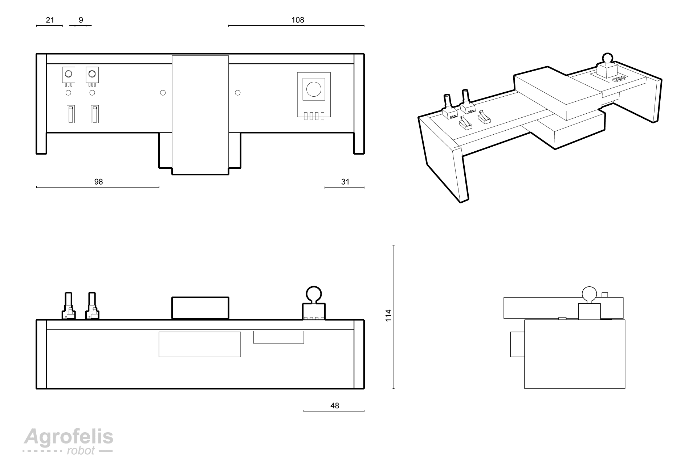

The module component are enumerated by the consequent schematic.

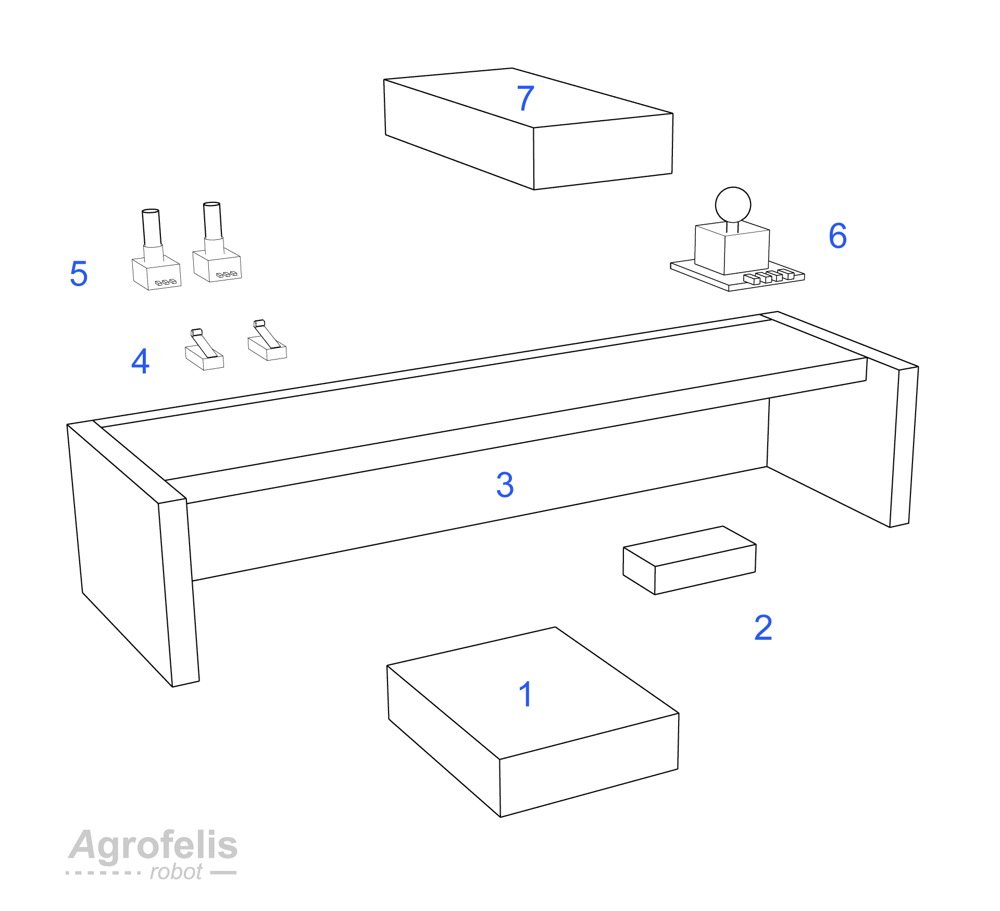

The figure indexes the following components composing the remote controller module :

1. ESP32 38 pin on an ESP32 terminal adapter
2. 5v Step down converter
3. Wooden structure
4. Two Limit switches
5. Two 10k metallic potentiometers 
6. Cartesian Joystick with press down switch
7. Battery

### Structure

To prototype the body of the remote controller the module utilised pieces of wood due to their lightweight density and because they can be easily drilled and machined. The structure is composed of four pieces of wood glued together to form a solid structure all components are attached to.
Although the body and finishing is not the envisaged end look and feel of the remote controller, the rapid prototype implement confirmed the module's approximate size, the components arrangement, their connectivity and establishing a functional remote controller.

The following diagram encodes the dimensions of the wooden pieces assembling the structure of the module. 

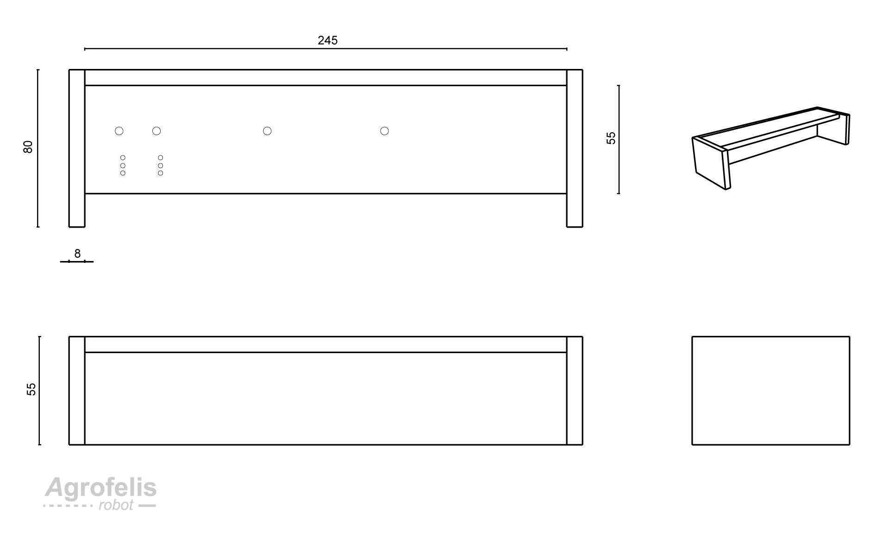

The figure moreover encodes on the top left side of the diagram two holes to pass the potentiometer cables and three smaller holes matching the pins of the limit switches layout. Another two holes can be seen in center of the top side, used to secure the battery of the remote controller using a strap. The following photo, shows the fabricated structure underside hosting the ESP32 terminal adapter attached using two screws. 

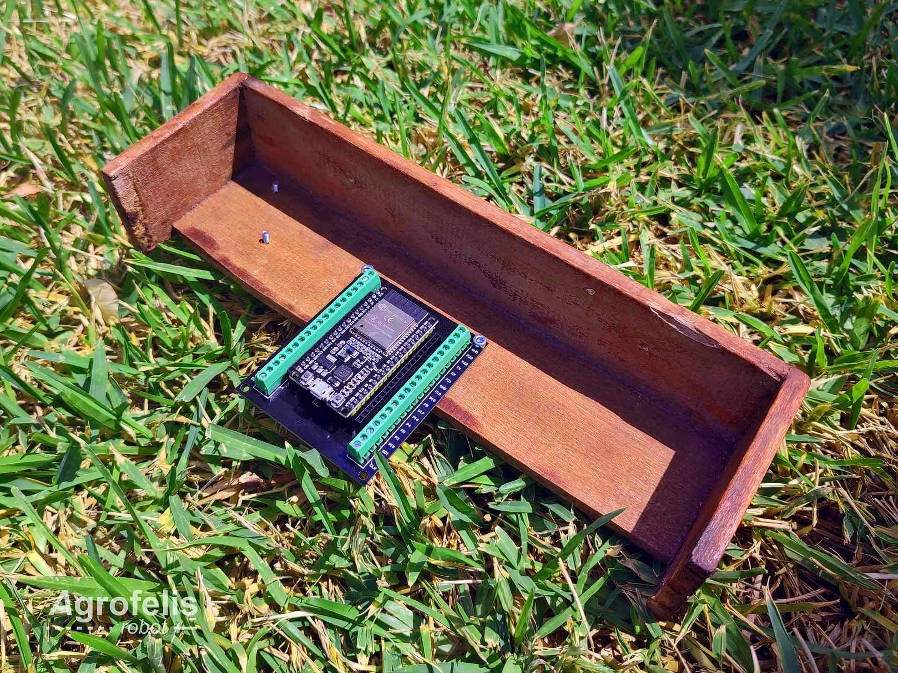

The subsequent photo depicts the top side of the structure hosting the joystick, the battery positioned in the top middle, above the ESP32 terminal adapter pinned on the underside of the structure.

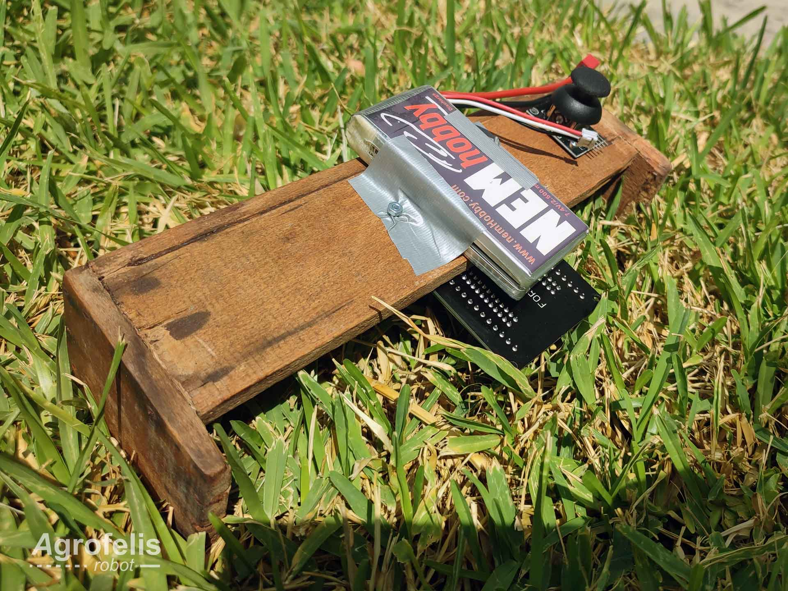

The following photo provides a side view of the module, at the same fabrication step as of the previous figure.

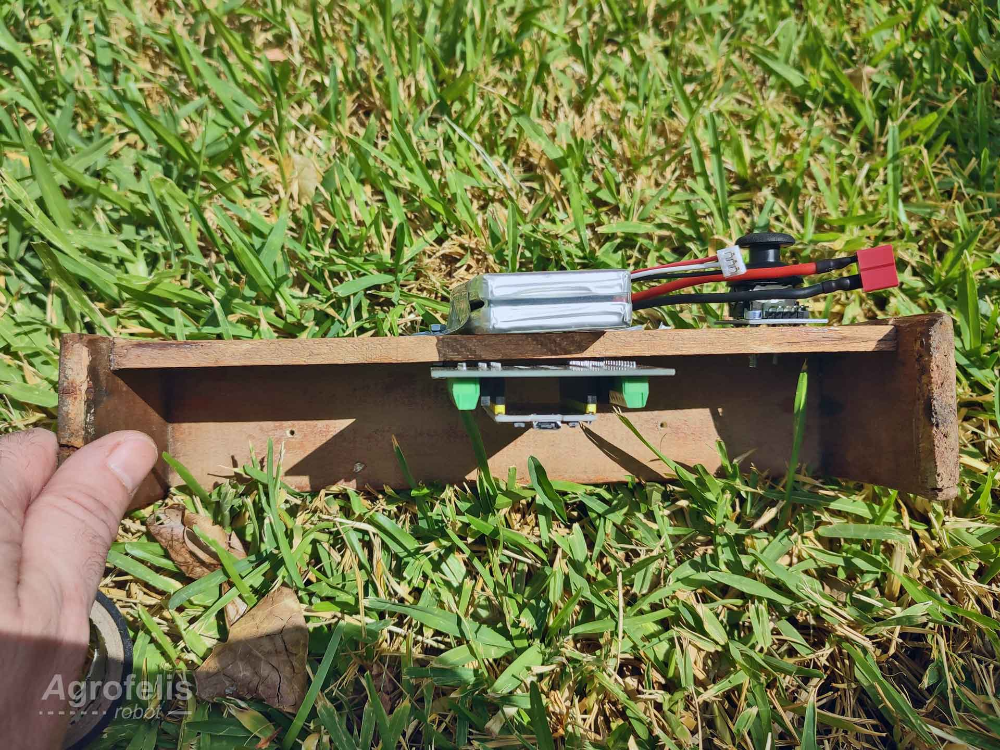

The consequent photo, focuses on the left side of the remote controller where two limit switches and two potentiometers have been attached using hot glue. The cables of the input sensors pass through the structure, on the electronics side, using holes made following the layout of the components. The four input sensors, connect with the ESP32 GPIO using a four pin and a two pin ribbon cable, used for their signals pins as well as for powering them. 

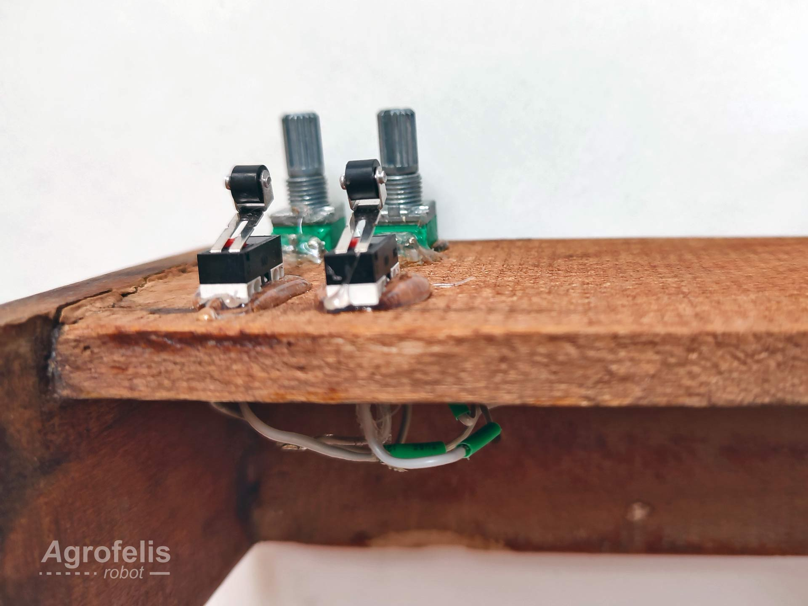

The fabricated remote controller is shown via the following photograph.

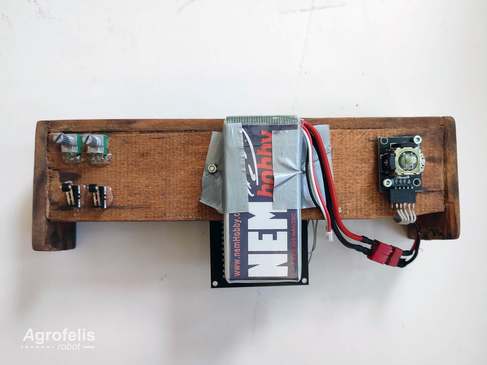

The side view of the fabricated module, is attached next.

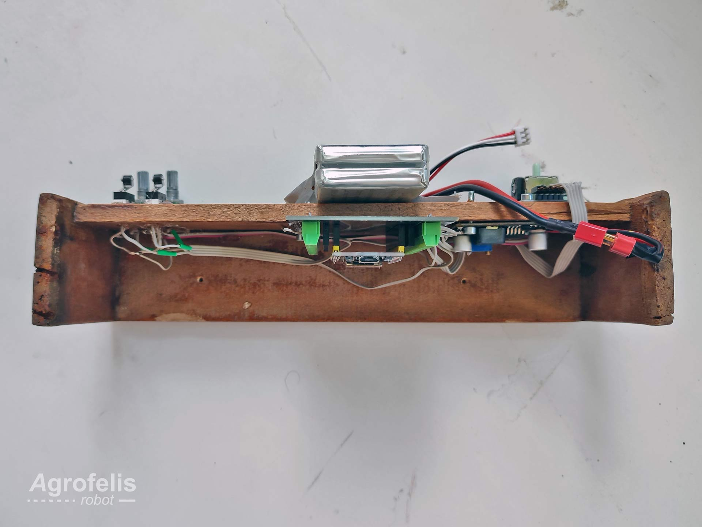

### Electronics

The following photo snapshots the underside of the module, its electronics and their connections.

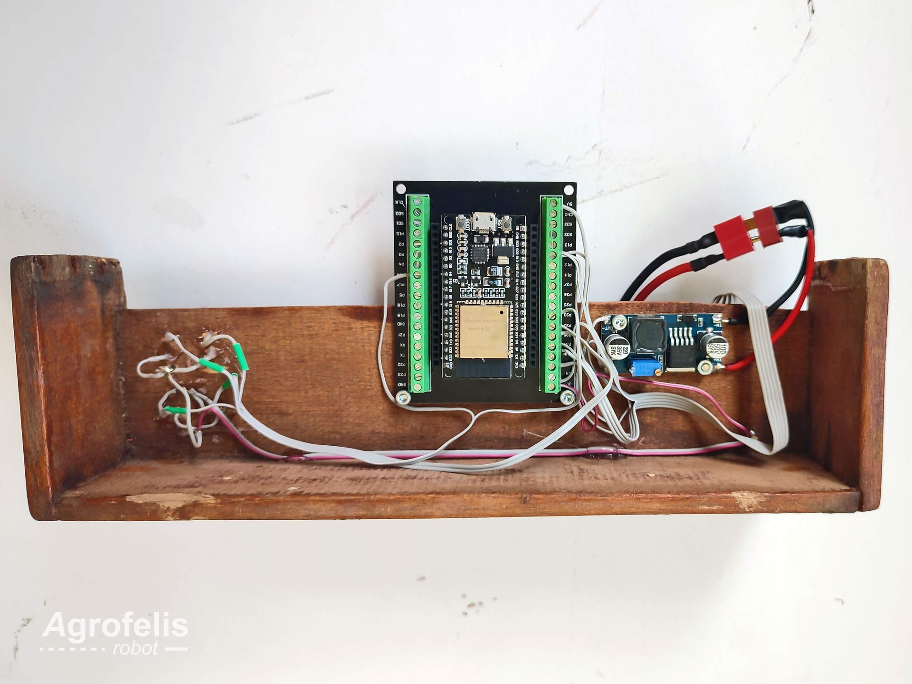

The consequent photograph focuses the left underside of the controller where the limit switches and the potentiometer are linked with the ESP32. 
All sensors input pin are connected with the 3.3v output of the controller, their output pins connected to the digital or analogue respective ESP32 ports and the potentiometer are additionally linked with the ground.

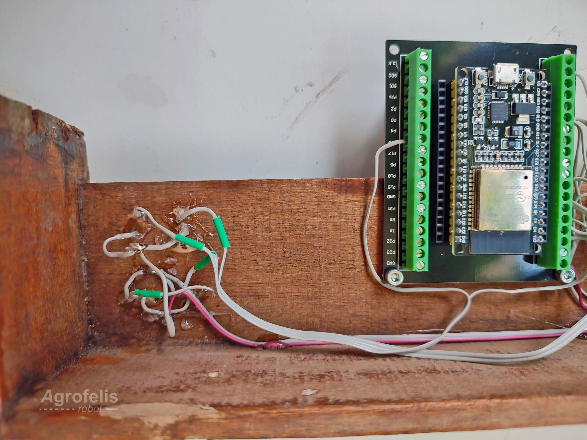

The following image depicts the right underside of the structure where the 5v step down converter and the right side of the ESP32 terminal pin connections can be seen.

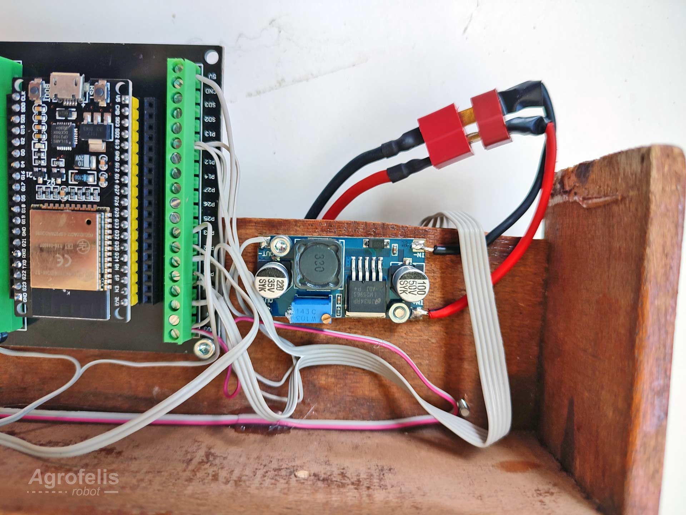

The Joystick X and Y axis sensors are connected to 34 and 39 GPIO ports, while its tactile switch on port 36. The left side potentiometers are connected to ports 35 and 32. Last the two limit switches are linked with ports 16 and 33. 

## Software

This *Agrofelis Base remote controller Software* adheres to a common baseline pattern that has been established in nearly all Agrofelis modules. This baseline pattern introduces a "context" class, which is passed to practically all classes as a common ground, enabling instances to exchange information when necessary. The second baseline pattern established refers to the frequency of execution, providing the facilities to trigger specific functionalities at desired intervals. This design consideration accommodates for components such as an MPU or a magnetometer sensors, which require much more frequent updates compared to components such as potentiometer sensors. As a bootstrap template, the software provides six different execution frequencies, ranging from 50 milliseconds to 5-second intervals. Using this approach, delays blocking the execution are avoided and the different calls can be organized based on their responsiveness requirements.

The software encodes easy to follow concrete implementations such as current sensors or motor(s), resulting in a one-to-one mapping between the physical element and its respective software counterpart. In this particular software prototype where the module contained only input sensors a Sensors module was defined implementing all sensor reading and processing in one class. The software utilises the web socket interface connecting with the Unificator software over the Wifi.

The following table indexes and summarizes the implemented classes of the Agrofelis remote controller software.

| Class | Description | 
|----|------------------|
|esp32RemoteController.ino | Boots the application, initialises the top classes and encodes the triggering frequencies of the functional elements. |
|Context | Provides a common ground for sharing information and encodes the triggering frequencies, helpful functions and a unique identifier of the model. |
|Invoker | Tracks the execution frequencies so these are called at the right time. |
|Sensors | The class defines the pin ports of all input sensors. The software reads all input sensors based on their type in one step and a second step evaluates their conbinatorial state and and amount of time being actuated, triggering accordingly a respective command action to be sent to the Agrofelis Robot. |
 
## Remote controller components

The following table lists the individual components employed for manufacturing the Agrofelis front sensors Lidar controller. The index table includes moreover the product URLs, the indicative suppliers, as well as unit prices and total cost estimates.

| No. |  Product | Product URL | Supplier | Used Quantity | VAT Price (€) | Subtotal (€)  | Note |
|----|--------------|------------|-----|---|---|---|---|
| #1 | ESP32 38 pin | [ESP32](https://www.aliexpress.com/item/1005001636295529.html) | [AliExpress](https://www.aliexpress.com) | 1 | 3.67 | 3.67 | - | 
| #2 | ESP32 38 pin terminal adapter | [ESP32](https://www.aliexpress.com/item/1005001636295529.html) | [AliExpress](https://www.aliexpress.com) | 1 | 2.69 | 2.69 | - | 
| #3 | 100 X 80 X 8 mm ply-wood | [plywood](https://www.skroutz.gr/mp/162035068/Kontra-Plake-THalassis-Okoume-100CH80-cm-Pachos-8mm.html) | [Skroutz](https://www.skroutz.gr) | 1 | 16.02 | 16.02 | - |
| #4 | Gravity: Joystick Module V2 (DFR0061) | [Joystick](https://www.hellasdigital.gr/electronics/sensors/keypad-and-joystick/gravity-joystick-module-v2-dfr0061/) | [Hellas Digital](https://www.hellasdigital.gr) | 1 | 6.20 | 6.20 | - |
| #5 | 10K Ohm Linear Potentiometer B10K 15mm | [Potentiometer](https://www.hellasdigital.gr/electronics/components/potentiometer/10k-ohm-linear-potentiometer-b10k-15mm/) | [Hellas Digital](https://www.hellasdigital.gr) | 2 | 0.50 | 1 | - |
| #6 | 5v step down converter | [step down converter](https://grobotronics.com/dc-dc-step-down-1.3-35v-3a.html) | [Grobotronics](https://grobotronics.com) | 1 | 2.90 | 2.90 | - |
| #7 | Micro limit switch | [limit switch](https://grobotronics.com/microswitch-micro-spdt-on-on-roller-lever.html) | [Grobotronics](https://grobotronics.com) | 2 | 0.20 | 0.40 | - | 
| #8 | 5 wire, 4-wire and 2-wire ribbon cable  | [Ribbon cable 28AWG](https://grobotronics.com/ribbon-cable-28awg-0.081mm2-20-wire.html)   | [GRobotronics](https://grobotronics.com/) | 1  | 1 | 1 | - |
| #9 | NEM Li-PO 7.4v/ 1500mAh/ 20C | [battery](http://nemhobby.com/nem-li-po-7-4v-1500mah-20c-500-charges-p31130.html) | [NEM hobby](http://nemhobby.com) | 1 | 15.00 | 15.00 | - |
| #10 | Connector T-Plug Gold Plated -Male | [T-plug](http://nemhobby.com/connector-t-plug-gold-plated-male-p34785.html) | [NEM hobby](http://nemhobby.com) | 1 | 0.62  | 0.62 | - |
| #11 | Black and red wire| [Black-red wire](https://grobotronics.com/wire-2x0.5mm-stranded-black-red-10m.html)   | [GRobotronics](https://grobotronics.com/)  | 1  | 8.00 | 0.00 | shared Component |
 | **Total** |      |    |     |      |     |  **65.52**  | - | 

The total cost to manufacture the Agrofelis remote controller prototype controller, excluding shipping and labor cost, amounts to approximately **65.52** euros.

# Conclusion

The rationale of the module, its sub components and their elements were elaborated. Photos outlining details of the different phases of the manufacturing process were provided. Source code files, schematics, instructions and printouts to reconstruct the Agrofelis basic remote controller  have been documented. The document closes with a photo of the remote controller being held by the Robot's operator. 

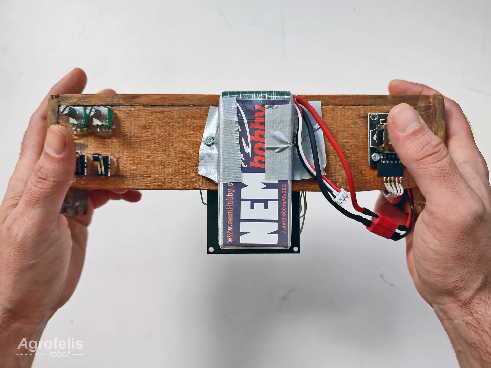

