# Agrofelis Protective Covers Design and Fabrication

# Abstract 

The document builds on the Agrofelis frame design and fabrication documentation by detailing the protective covers of the vehicle, including their schematics and the source code files utilized for a CNC plasma cutter. Additionally, photographic material offers insights into the manufactured parts. A list of components and indicative suppliers that comprise the bill and material information for the metal sheets, is documented. 

# Introduction

To protect the robot from the harsh environment prevalent in agricultural fields, where dust, dirt, rocks and rain are expected, protective covers were designed and fabricated from black iron sheet of 2mm and 3mm thickness. The rigid detachable cover parts, conveniently provide access to the compartments of the robotic vehicle. The covers are secured to the vehicle using 8mm bolts, attaching to its front, back, top, bottom, left, and right sides. While the side covers are quantised by smaller parts, the top and bottom parts were manufactured with fewer and larger parts to provide additional protection by minimizing the number of intersections. The larger parts were fabricated using a grinder, while the remainder were produced with our small DIY plasma cutter.

In the following sections, the details for fabricating the Agrofelis Robot protective covers are documented.

# Protective Covers

The vehicle's detachable covers amount to a total of 25 items. Most items of the left and right sides are symmetrical, with two exceptions that feature additional cavities to accommodate the vehicle's main power switch and charging socket. The following diagram visualizes the vehicle's protective covers. 

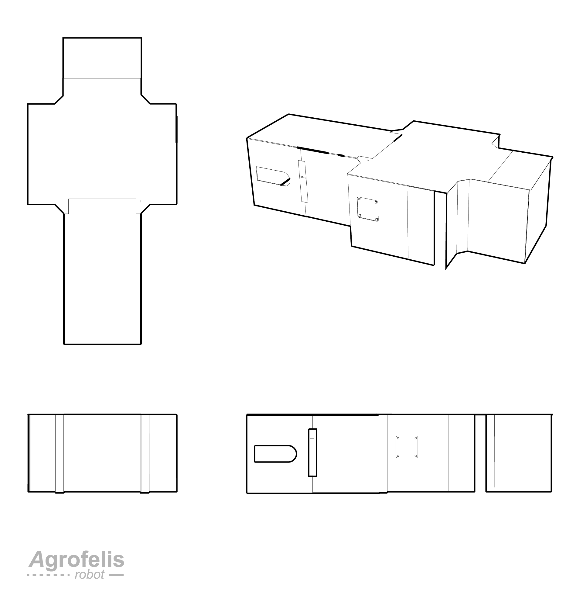

More specifically, the following schematic enumerates all plasma-cut covers. For the sake of simplicity, the symmetric left side items were omitted.

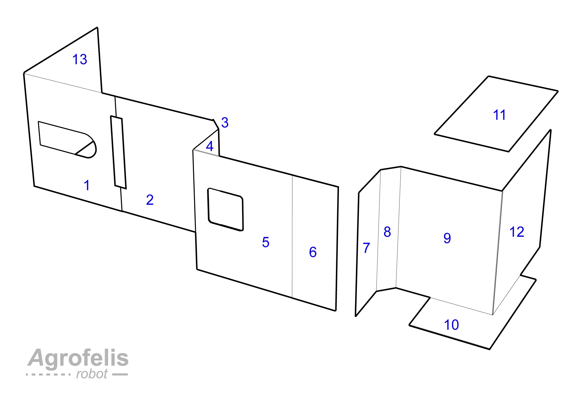

The consequent table, following the depicted enumeration, lists the item part, the Scalable Vector Graphic (SVG) design file and its derived Numerical Control (NC) file driving the CNC plasma cutter.

| Part | SVG file | NC file |
|--|-------------------------|----------------------------|
| 1 | [cover_r1_normalised.svg](assets/frame-covers/SVG/cover_r1_normalised.svg) | [cover_r1_normalised.nc](assets/frame-covers/NC/cover_r1_normalised.nc) |
| 2 | [cover_r2_normalised.svg](assets/frame-covers/SVG/cover_r2_normalised.svg) | [cover_r2_normalised.nc](assets/frame-covers/NC/cover_r2_normalised.nc) |
| 2 | [cover_r2_side_door_normalised.svg](assets/frame-covers/SVG/side_door_normalised.svg) | [cover_r2_side_door_normalised.nc](assets/frame-covers/NC/side_door_normalised.nc) |
| 3 | [cover_r3_normalised.svg](assets/frame-covers/SVG/cover_r3_normalised.svg) | [cover_r3_normalised.nc](assets/frame-covers/NC/cover_r3_normalised.nc) |
| 4 | [cover_r4_normalised.svg](assets/frame-covers/SVG/cover_r4_normalised.svg) | [cover_r4_normalised.nc](assets/frame-covers/NC/cover_r4_normalised.nc) |
| 5,6 | [cover_r56_normalised.svg](assets/frame-covers/SVG/cover_r56_normalised.svg) | [cover_r56_normalised.nc](assets/frame-covers/NC/cover_r56_normalised.nc) |
| 7,8 | [cover_r78_normalised.svg](assets/frame-covers/SVG/cover_r78_normalised.svg) | [cover_r78_normalised.nc](assets/frame-covers/NC/cover_r78_normalised.nc) |
| 9 | [cover_r9_normalised.svg](assets/frame-covers/SVG/cover_r9_normalised.svg) | [cover_r9_normalised.nc](assets/frame-covers/NC/cover_r9_normalised.nc) |
| 1 (Left) | [cover_l1_normalised.svg](assets/frame-covers/SVG/cover_l1_normalised.svg) | [cover_l1_normalised.nc](assets/frame-covers/NC/cover_l1_normalised.nc) |
| 2 (Left) | [cover_l2_normalised.svg](assets/frame-covers/SVG/cover_l2_normalised.svg) | [cover_l2_normalised.nc](assets/frame-covers/NC/cover_l2_normalised.nc) |
| 10 | [bottom_front_normalised.svg](assets/frame-covers/SVG/bottom_front_normalised.svg) | [bottom_front_normalised.nc](assets/frame-covers/NC/bottom_front_normalised.nc) |
| 11 | [top_front_normalised.svg](assets/frame-covers/SVG/top_front_normalised.svg) | [top_front_normalised.nc](assets/frame-covers/NC/top_front_normalised.nc) |
| 12 | [cover_front_normalised.svg](assets/frame-covers/SVG/cover_front_normalised.svg) | [cover_front_normalised.nc](assets/frame-covers/NC/cover_front_normalised.nc) |
| 13 | [cover_back_normalised.svg](assets/frame-covers/SVG/cover_back_normalised.svg) | [cover_back_normalised.nc](assets/frame-covers/NC/cover_back_normalised.nc) |

Non-symmetrical parts 1 and 2 are provided for both the left and right sides, while symmetrical parts 3-9 are provided just for the right side since they are identical to their left counterparts.

Part 2 on the right side also includes the design blueprint for fabricating a side door with its sealing cover, as depicted in the following diagram. The side door is used to provide access to the charging socket of the vehicle.

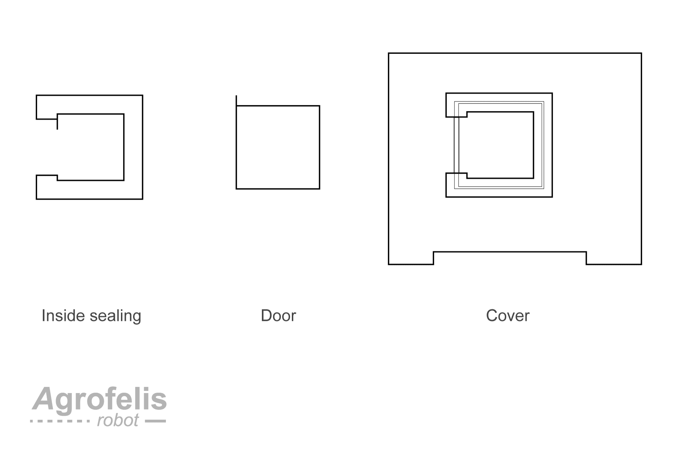

The fabricated side door, as seen from within the vehicle, can be viewed in the following photograph.

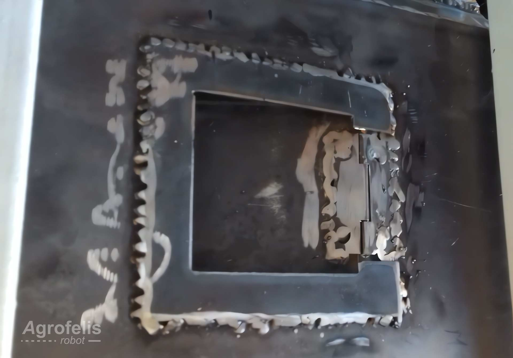

Likewise, the next photograph displays the door from its outer side.

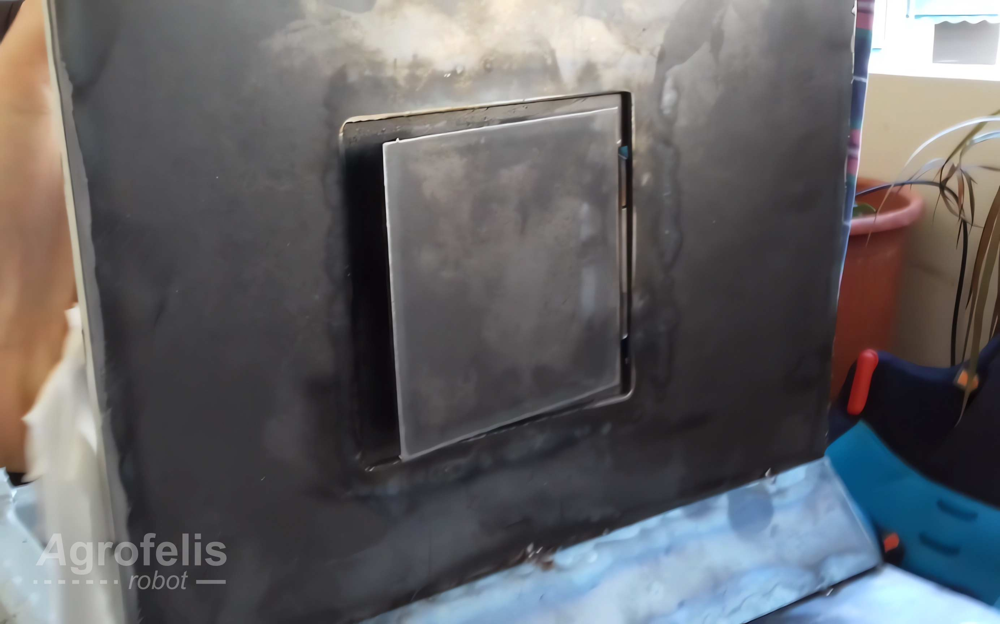

The following diagram lays out all covers made out of a 2mm thickness iron sheet. It also outlines the approximate area these covers occupy within a standard metal sheet profile of 1 by 2 meters.

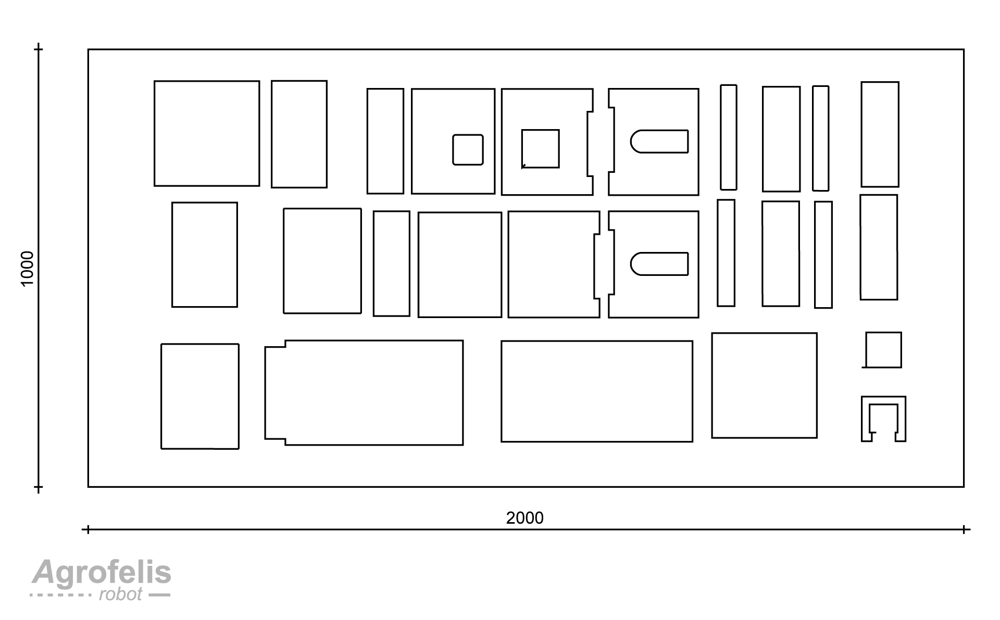

The following photograph shows the plasma cutter fabricating the left-side part 2 cover.

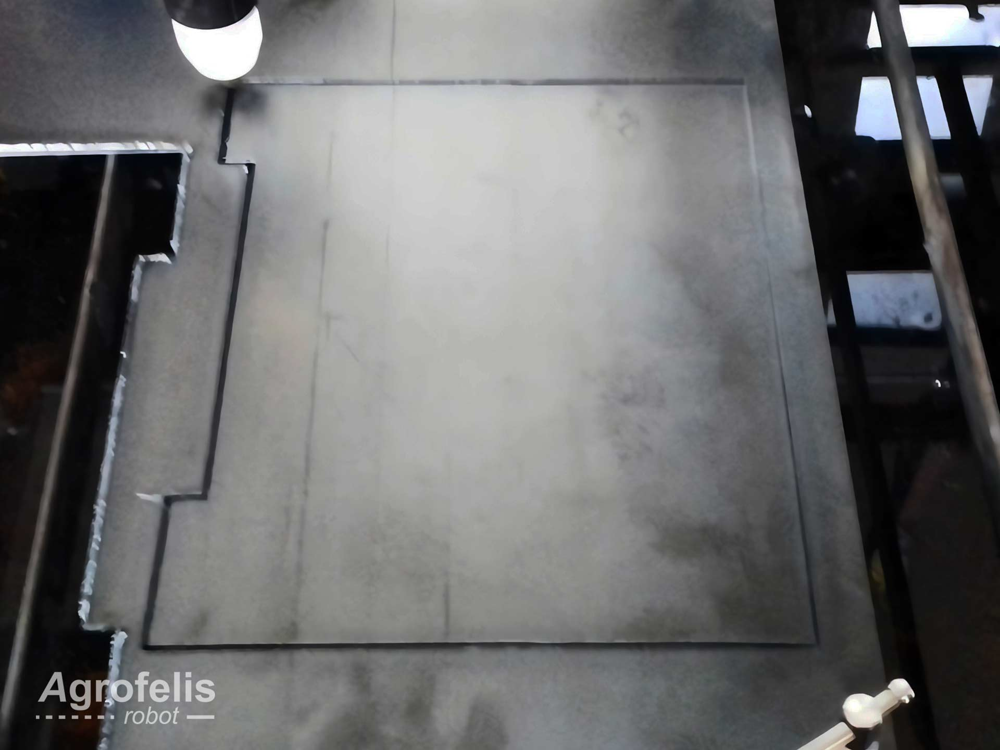

To provide additional protection, a 3mm black iron sheet was employed to completely overlay the battery compartment. The following schematic encodes the dimensions for the cover's silhouette, which had to be fabricated manually due to its size exceeding the capacity of our DIY plasma cutter. 

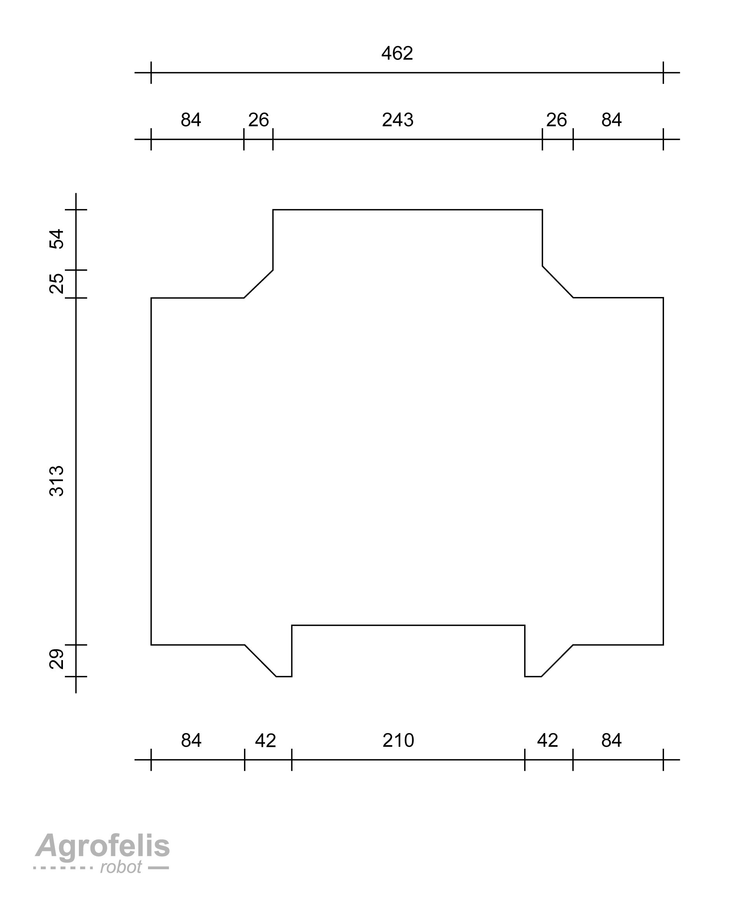

The top back and bottom back covers were also too large to be produced by our DIY plasma cutter. The silhouette dimensions are annotated in the following schematic.

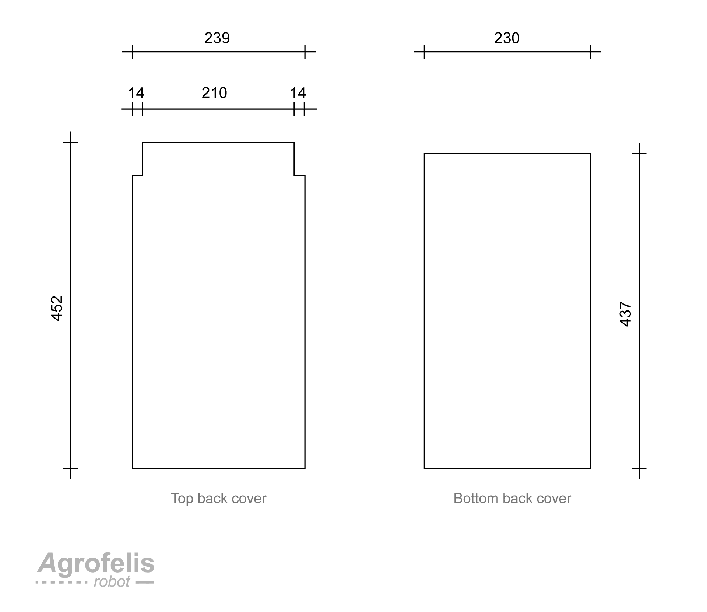

The fabricated details of the battery cover and the top back cover as these are mounted consequently in the vehicle, are showcased by the consequent photo.

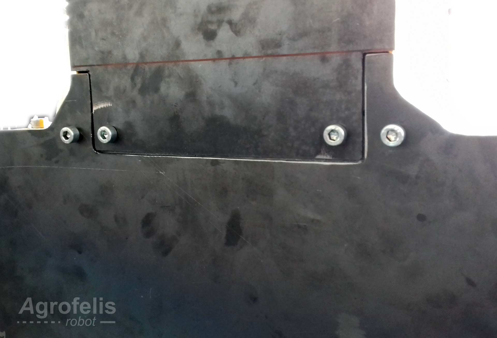

The fabricated left-side part 1 and 2 covers mounted in the vehicle, are showcased by the following photo.

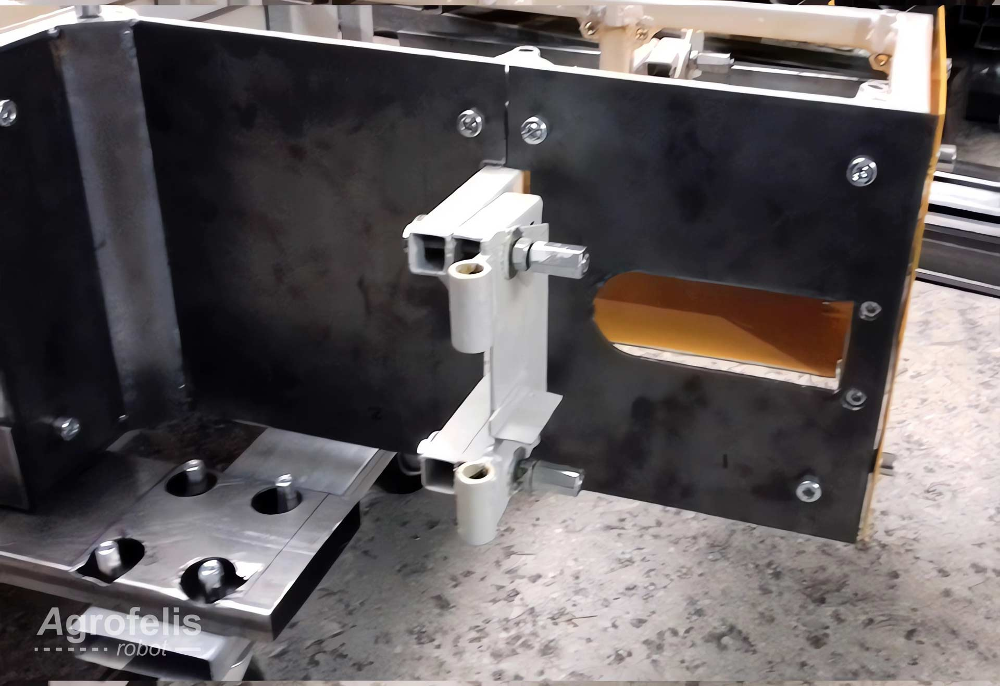

The next photograph depicts the detail of the back left-side covers. as these change into the battery compartment, specifically parts 1-6.

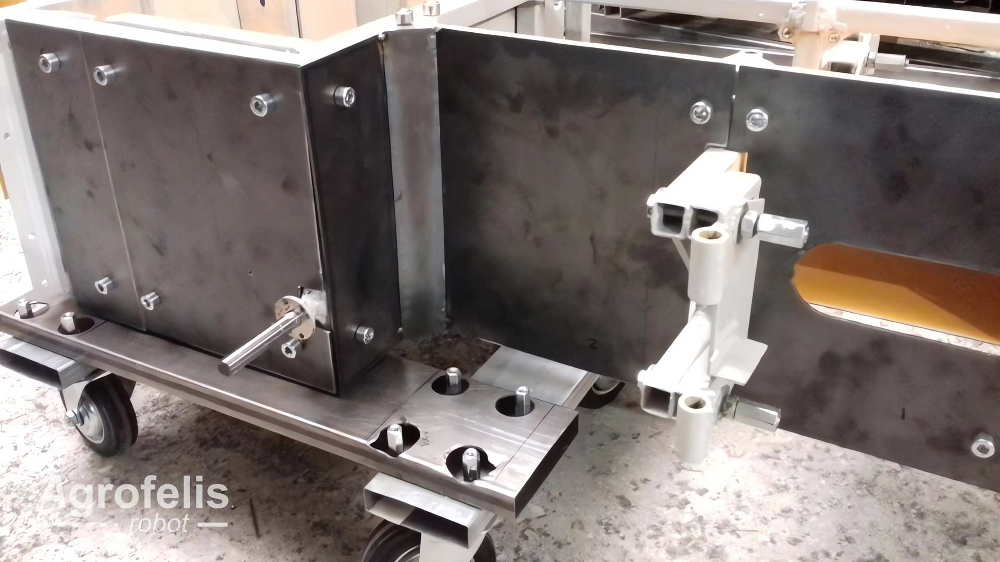

The following photo snapshots the covers in the process of drying after being coated with primer and orange oil paint.

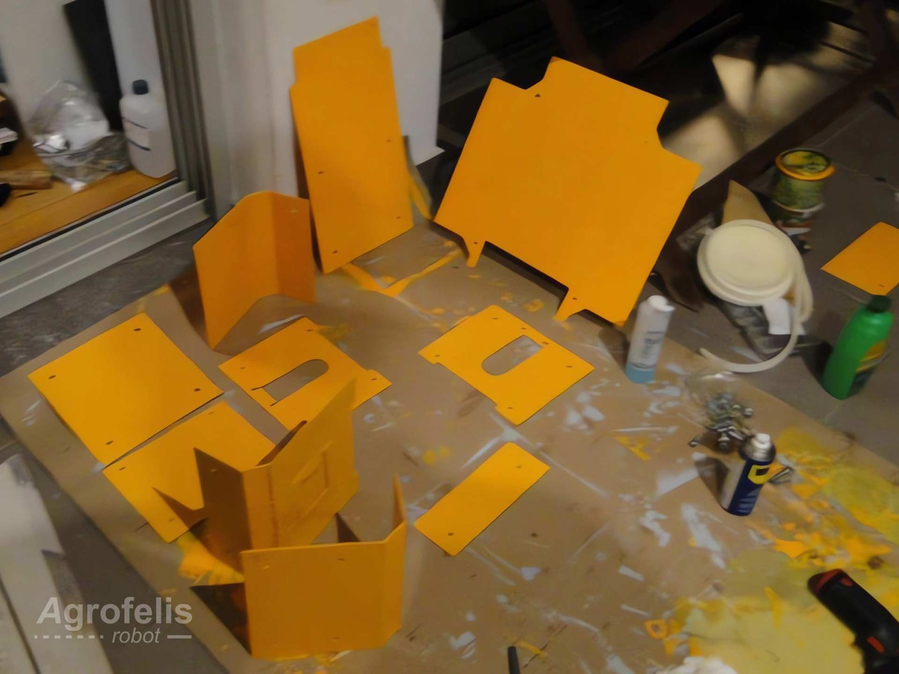

## Covers Material and Indicative Suppliers
 
The following table lists the individual components employed for manufacturing the Agrofelis frame's protective covers. The index table includes moreover the product URLs, the indicative suppliers, as well as the unit price total amount.

| No. |  Product | Product URL | Supplier | Used Quantity | VAT Price (€) | Subtotal (€)  | Note |
|----|--------------|------------|-----|---|---|---|---|
| #1 | Black iron metal sheet 1000x2000x3mm  | [3mm metal sheet](https://www.e-metalshop.gr/sidera/lamarynes/lamarina-sidhroy-mayrh-1000x2000x3mm) | [QOOP Metalworks](https://www.qoop.gr)  | 0.25 | 73.85 | 18.5 | - |
| #2 | Black iron metal sheet 1000x2000x2mm  | [2mm metal sheet](https://www.e-metalshop.gr/sidera/lamarynes/lamarina-sidhroy-mayrh-1000x2000x2mm) | [QOOP Metalworks](https://www.qoop.gr)  | 1 | 49.23 | 49.23 | - |
| #3 | 750ml Vitex Metal Primer | [Primer](https://www.stereotiki.gr/store4/vitex-metal-primer-astari-metallon.html) | [Stereotiki](https://www.stereotiki.gr) | 0 | 6.50 | 0 | Reused from frame material|
| #4 | Orange oil paint 0,75kg | [Metal paint](https://www.bousounis.gr/%CF%87%CF%81%CF%89%CE%BC%CE%B1%CF%84%CE%B1-amp-%CE%B2%CE%B5%CF%81%CE%BD%CE%B9%CE%BA%CE%B9%CE%B1/%CE%BD%CF%84%CE%BF%CF%85%CE%BA%CE%BF%CF%87%CF%81%CF%89%CE%BC%CE%B1%CF%84%CE%B1/vechro-gumilak-metal-duco-%CF%85%CF%88%CE%B7%CE%BB%CE%B7%CF%83-%CE%B1%CE%BD%CF%84%CE%BF%CF%87%CE%B7%CF%83-%CE%BD%CF%84%CE%BF%CF%85%CE%BA%CE%BF%CF%87%CF%81%CF%89%CE%BC%CE%B1-603-%CE%B7%CE%BB%CE%B5%CE%BA%CF%84%CF%81%CE%BF-750ml.htm) | [bousounis](https://www.bousounis.gr/) | 1 | 9,7 | 9.7 | - |
| #5 | Brushes| [Brush](https://nova-ceramica.gr/products/morris-39253) | [Nova Ceramica](https://nova-ceramica.gr/) | 3 | 1.00 | 3.00 | - |
| #6 | White spirit| [White spirit](https://www.rigatos-shop.gr/dialytika-diavrwtika-spray/2381-white-spirit-%CE%B4%CE%B9%CE%B1%CE%BB%CF%85%CF%84%CE%B9%CE%BA%CF%8C-500ml.html)  | [Rigatos Shop](https://www.rigatos-shop.gr/) | 1 | 1.50 | 1.50 | - |
| #7 | Paper sheet | [Paint paper](https://xromagora.gr/%CF%83%CF%85%CE%BD%CE%B1%CF%86%CE%AE-%CF%87%CF%81%CF%89%CE%BC%CE%AC%CF%84%CF%89%CE%BD/%CF%87%CE%B1%CF%81%CF%84%CE%AF-%CE%B3%CE%BA%CE%BF%CF%86%CF%81%CE%AD-%CE%BD%CE%AC%CF%85%CE%BB%CE%BF%CE%BD/%CF%87%CE%B1%CF%81%CF%84%CE%AF-%CE%B3%CE%BA%CE%BF%CF%86%CF%81%CE%B5-%CE%BF%CE%BD%CF%84%CE%BF%CF%85%CE%BB%CE%B5.) | [Xromagora](https://xromagora.gr/) | 0 | 0.80 | 0.00 | Reused from frame material|
| #8 | 40mm x 40 mm hinge | [Door hinge](https://zalonis.eu/menteses-plake-siderenios-40x40-galvanize-italy) | [zalonis](zalonis.eu) | 1 | 0.60 | 0.60 | - |
| **Total** |      |    |     |      |     |  **82.53**  | | 

Consequently, we observe that the total manufacturing cost of the Agrofelis protective covers, excluding expenses for shipping, cutting, welding and painting, is approximately  **83** euros.

# Summary

This document has provided a comprehensive illustration and enumeration of all the vehicle's covers. The design blueprints for the cover parts as well as the plasma-cut source files were organized and indexed. Additionally, the raw materials needed to fabricate the vehicle's protective covers were documented and linked to indicative suppliers. To conclude, an image of the vehicle, positioned vertically on a transferring platform with most of its covers attached, is presented below.

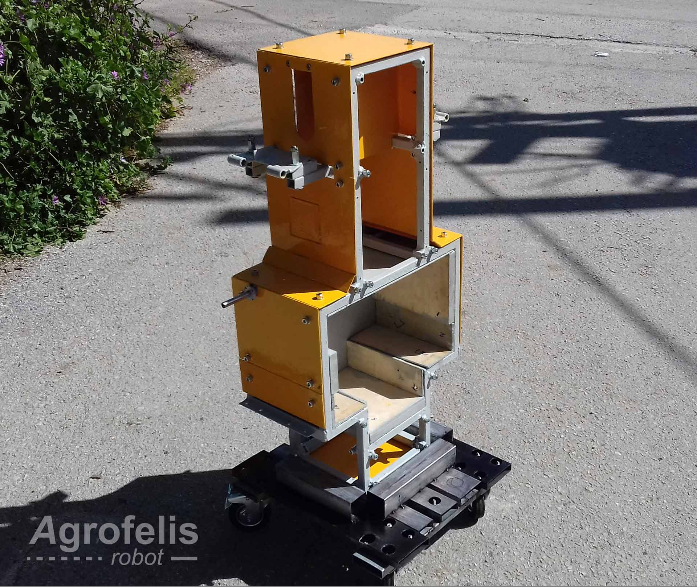
