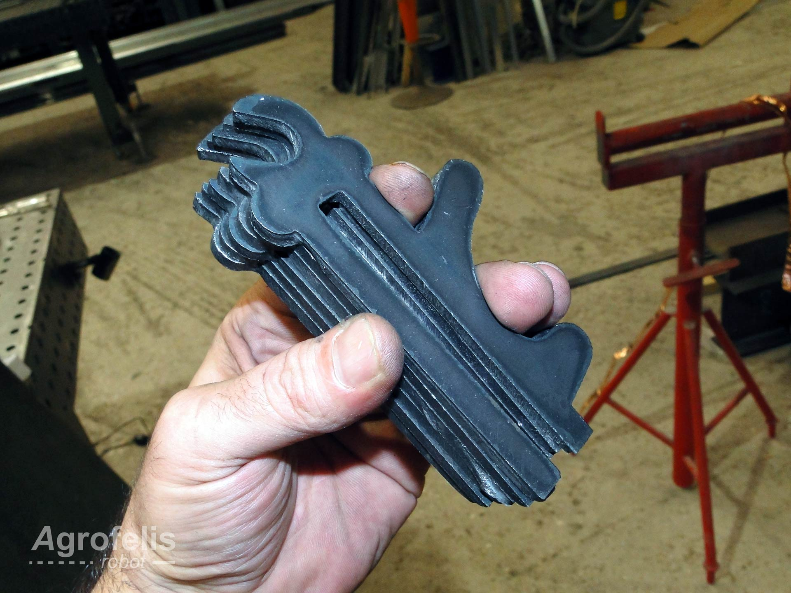
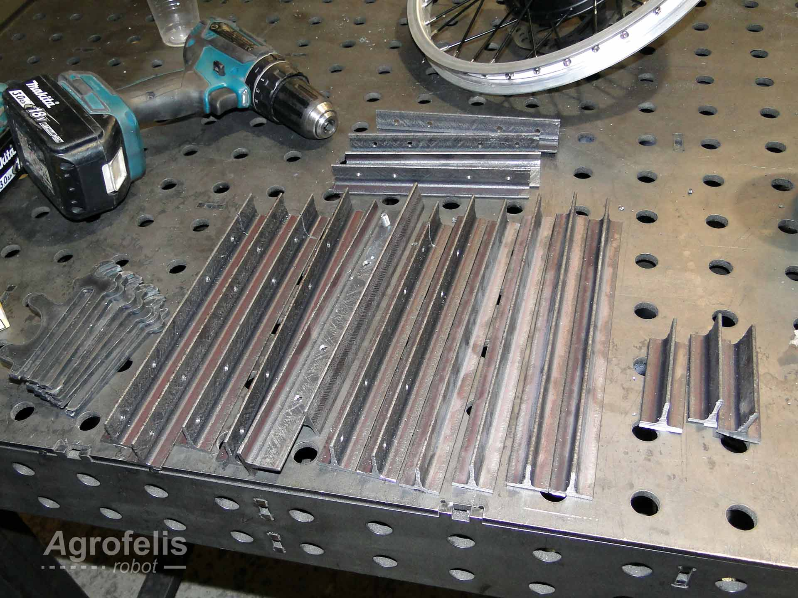
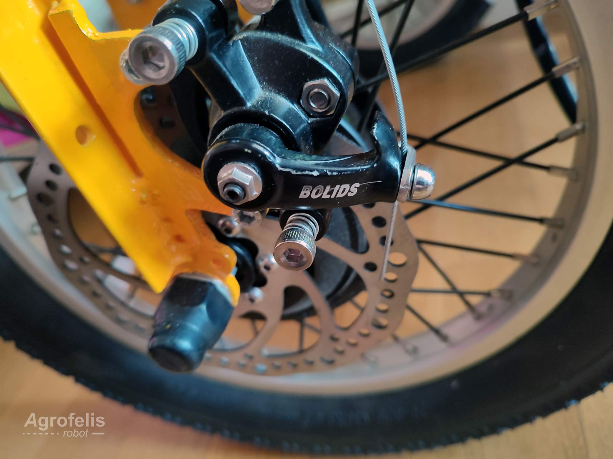
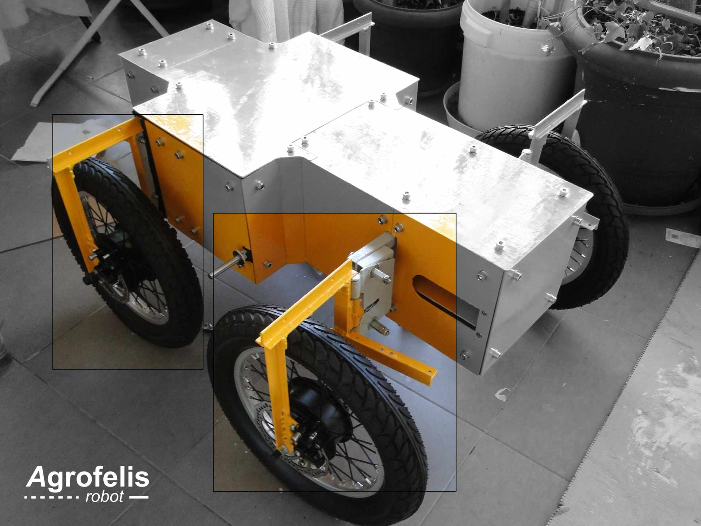

# Agrofelis Robot Wheels Forks Design and Fabrication

# Abstract

This document presents a comprehensive overview of the fabrication process for the forks mounting the four wheels of the Agrofelis vehicle. These forks are intentionally designed to be detachable, so that the wheels could be removed or replaced with alternative ones. The forks are responsible for securing the active wheels of the vehicle, establishing active brakes actuated via servos, enabling steering and installing feedback rotating mechanisms. Two types of forks are being employed, those installed in the front and those installed in the back. The majority of fork designs are similar, with the only differentiating factor being the mounting mechanism aimed for fixed or steering purposes. The forks installed on the left and right sides are arranged in a mirrored fashion. The forks are constructed from regular iron T-shaped rods that have been cut and welded. Additional sub-components elaborated are the vehicle's fork mounting mechanisms and the parrot-like (drop out) elements securing the wheels via the motor's hub shaft. The design schematics, plasma cut patterns, as well as images of the fabrication progression are all documented. The document concludes by providing a list of indicative suppliers from whom the raw materials were acquired, further enriched with bill and material details.

# Introduction

In order to minimize the footprint of the vehicle, to have a sturdier front structure where mechanisms could be mounted, to reduce the fabrication complexity and to cut manufacturing costs, the front wheels were designed with a fixed function in mind, while the back wheels were designed with a dynamic function implementing the steering of the vehicle. The forks utilized existing profile characteristics found in the bicycle industry and more specifically for the fork drop out and brake mounting points, so disk brakes could be employed. Fabrication of the forks and their mounting mechanisms involves regular 25 mm T-shaped rods, along with two plasma-cut components that are cut, drilled and MIG welded. All forks were designed so they are detachable in order to support future revisions or variations of the forks.

In the following sections, the Agrofelis forks are being decomposed into their sub-elements, showcasing their fabrication details.

## Forks Arrangement

The following schematic illustrates the four wheel forks of the vehicle.

The following figure depicts the forks mirrored arrangement.

The image provided below highlights the two distinct types of forks, those located at the front and those positioned at the back of the vehicle.

## Front Forks

All fours forks share a common structure, differentiating only at the final fabrication stage based on their intended usage. 
The diagram below encodes the profile characteristics and dimensions of a front fork.

The front fork mounting mechanism is also fabricated using a T-shaped rod, with its top part trimmed to create a socket for the fork's placement. The mounting mechanism is welded onto the vehicle's frame. Both the mounting mechanism and the fork are drilled and connected together using regular nuts and bolts. The mounting mechanism (A) of the front fork (B) is illustrated by the following figure.
 

The front fork sub-parts are indexed by the following exploded view diagram.

The following part designed and fabricated, has a vertical socket allowing to slide within the T-shaped rod as seen by the following schematic.

Two of these elements are fabricated per fork and are welded in each of its bottom sides. The component accommodates for mounting the wheels, as well as for mounting the disk brakes mechanism. The NC files used to fabricate them are provided in the following directory in the open source repository.

- [assets/forks_dropout](https://github.com/meltoner/agrofelis/tree/main/components/vehicle-forks/assets/forks_dropout)

The following directory contains the scalable vector graphics design plan of the component, offset by 1 mm, accounting for the plasma torch diameter.

- [forks_dropout_1mm_offset.svg](https://github.com/meltoner/agrofelis/tree/main/components/vehicle-forks/assets/forks_dropout/forks_dropout_1mm_offset.svg)

In addition, the NC (Numerical Control) instructions file sent to the CNC is available in the following file.

- [forks_dropout_1mm_offset.nc](https://github.com/meltoner/agrofelis/tree/main/components/vehicle-forks/assets/forks_dropout/forks_dropout_1mm_offset.nc)

The SVG to NC conversion was accomplished by the Laser GRBL free laser engraving software and its outcome was transformed for a plasma cutter (z-axis actuation) using the open-source software developed for driving a custom DIY plasma cutter tailored for this specific purpose.

- [https://github.com/meltoner/g-code-plasma-cutting](https://github.com/meltoner/g-code-plasma-cutting)

The fabricated plasma cut drop out component can be seen by the following image.

## Back Forks

The back forks of the Agrofelis vehicle closely resemble to the front forks. They differentiate by welding the half part of a hinge on their side, as well as welding a lever where a liner actuator can push rotate the wheels at the desired degree. The back fork schematic and dimensions are encoded by the following diagram.

The back fork sub-parts are indexed by the following exploded view diagram.

A more detailed schematic of the related level element is encoded by the consequent image.

Within the lever at the depicted distance a hole is drilled and an extended nut is installed via a bolt to accommodate the end of a linear actuator, rotating the wheel. Further details about this detail are covered in the Agrofelis steering design and fabrication document.

The sub-components of the forks laid out, ready to be welded have been photographed by the next image.

The back fork, is connected with the frame using a custom plasma cut part and a hinge. The half part of the hinge is welded into this component and the other half to the fork. The schematic of the custom cut part is presented by the following figure.

Two of these elements are fabricated for the back forks and are drilled and connected to the frame using 12 mm bolt and nuts. The NC files used to fabricate them are provided in the following directory in the open source repository.

- [assets/back_wheel_mount](https://github.com/meltoner/agrofelis/tree/main/components/vehicle-forks/assets/back_wheel_mount)

The directory contains the scalable vector graphics design plan of the component, offset-ed by 1 mm, accounting for the plasma torch diameter.

- [back_wheel_mount.svg](https://github.com/meltoner/agrofelis/tree/main/components/vehicle-forks/assets/back_wheel_mount/back_wheel_mount.svg)

In addition, the NC (Numerical Control) instructions file sent to the CNC are provided by the following file.

- [back_wheel_mount.nc](https://github.com/meltoner/agrofelis/tree/main/components/vehicle-forks/assets/back_wheel_mount/back_wheel_mount.nc)

The SVG to NC conversion process was carried out using the Laser GRBL free laser engraving software and its outcome was converted for a plasma cutter (with z-axis actuation) using open-source software specifically developed to steer a custom DIY plasma cutter designed for this precise application.

- [https://github.com/meltoner/g-code-plasma-cutting](https://github.com/meltoner/g-code-plasma-cutting)

The fabricated mounting mechanism as plasma cut and welded with the first half part of the hinge is captured by the following photo.

A detailed view of the fork just prior to welding the second part of the hinge is depicted in the following photo.

The steerable fork, successfully mounted onto the vehicle, is showcased in the ensuing photo.

A bottom side focused view of the related mechanism after it has been painted is provided by the next image.

A close-up photo revealing the dropout element of the fork with a disk brake attached to it, is displayed by the following photo.

# Forks Components and Indicative Suppliers

The following table lists the individual components employed for manufacturing the four Agrofelis forks and their mounting mechanism. The index table includes moreover the product URLs, the indicative suppliers, as well as the total unit price amounts.

| No. |  Product | Product URL | Supplier | Used Quantity | VAT Price (€) | Subtotal (€)  | Note |
|----|--------------|------------|-----|---|---|---|---|
| #1 | 4 meter black iron T bar 25 x 3 | [T bar](https://sitsianis.gr/%CF%80%CF%81%CE%BF%CE%B9%CE%BF%CE%BD%CF%84%CE%B1-%CF%83%CE%B9%CE%B4%CE%B7%CF%81%CE%BF%CF%85-%CE%BC%CE%B5%CF%84%CE%B1%CE%BB%CE%BB%CE%BF%CF%85/%CF%84%CE%B1%CF%86/) | [QOOP Metalworks](https://www.qoop.gr) | 1 | 24.00 | 24.00 | - |
| #2 | Black iron metal sheet 1000x2000x3mm  | [3mm metal sheet](https://www.e-metalshop.gr/sidera/lamarynes/lamarina-sidhroy-mayrh-1000x2000x3mm) | [QOOP Metalworks](https://www.qoop.gr)  | 0 | 0.00 | 0.00 | Already accounted in the chassis frame bill and material  |
| #3 | Black iron metal sheet 600x400x4mm  | [4mm metal sheet](https://www.e-metalshop.gr/sidera/lamarynes/lamarina-sidhroy-mayrh-1000x2000x4mm) | [QOOP Metalworks](https://www.qoop.gr)  | 1 | 15.00 | 15.00 | - |
| #4 | Bolt 12mm X 50mm | [Bolt 12mm X 50mm ](https://www.vida.gr/exagones-vides-olopasses-m8-galvanize-metrikes-din-933/) | [Vida](https://www.vida.gr) | 4 | 0.70 | 2.80 | - |
| #5 | 30 Nuts pack 12mm | [Nuts 12mm](https://www.flextools.gr/index.php?route=product/product&path=260&product_id=1077) | [flextools](https://www.flextools.gr) | 1 | 1.50 | 1.50 | - |
| #6 | Welded Hinge with 3 winds | [Hinge](https://www.schmiedekult.de/Hinges-for-welding-with-3-wings-and-removable-pin) |[QOOP Metalworks](https://www.qoop.gr) | 2 | 5.00 | 10.00 | - |
| **Total** |      |    |     |      |     |  **53.30**  | | 

The total cost to manufacture four Agrofelis forks, exclusive of shipping and assembly expenses, totals approximately **53** euros.

 
# Summary

The development process, component details, essential dimensions and Numerical Control source files for reproducing the Agrofelis wheels forks have all been documented in a progressive manner. To conclude, an image depicting the vehicle with a focus on its front and back forks is presented below.

