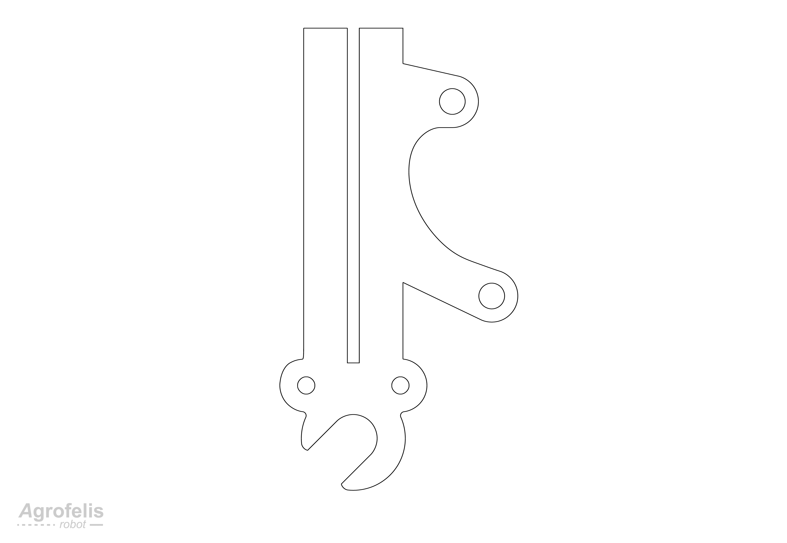

# Agrofelis Robot Forks Design and Fabrication

# Abstract

The document, present the fabrication details of the forks mounting the four wheels of the vehicle. The forks were designed to be detachable in order to be able to remove or replace the wheels with different ones. The forks serve the function of securing the active wheels of the vehicle, establishing active brakes actuated via servos, enabling their steering and for installing their feedback rotating mechanisms. Two types of forks being employed, these installed in the front and these in the back. Most of the fork design is common and their differentiating factor is their mounting mechanism aimed fixed or for steering. The forks installed on the left and right sides are arranged in a mirrored fashion. The forks are constructed using regular iron T shaped rods, which are cut and welded. Additional sub-components elaborated, are the vehicle's fork mounting mechanisms and the parrot like (drop out) elements securing the wheels and via the motor hub shaft. The design schematics, the plasma cut patterns, and images of the fabricated components are presented. The document concludes with a list of indicative suppliers where the raw materials where acquired, enriched with bill and material information.

# Introduction

In order to minimize the footprint of the vehicle, to have a sturdier front structure where mechanisms could be mounted, to minimize the fabrication complexity and manufacturing costs, the front wheels were designed with a fixed function in mind while the back wheels with a dynamic function implementing the steering of the vehicle. The forks utilised existing profile characteristics found in the bicycle industry and more specifically for the fork drop out and brakes mounting points, so disk brakes could be employed. The forks and their mounting mechanism are fabricated using regular 25 mm T shaped rods, two plasma cut elements, which are cut, drilled and MIG welded. All forks were designed so they are detachable in order to support future revisions or variations of the forks.

In the following sections the Agrofelis forks are being decomposed into their sub elements, showcasing their fabrication details.

The following schematic illustrates the four wheel forks of the vehicle.

The following figure depicts the forks mirrored arrangement.

The two types of forks, front and back are focused by the following image.

## Front forks

All fours forks share a common structure and differentiate at their end of the fabrication depending on their end use. 
The profile characteristics and dimensions of a front fork are encoded in the following diagram.

The front fork mounting mechanism is also fabricated using a T shaped rod, with its top part trimmed to create a socket where the fork can rest.
The mounting mechanism is welded into the vehicle's frame. Both the mounting mechanism and the fork are drilled and connected together using regular nuts and bolts. The mounting mechanism (A) of the front fork (B) is illustrated by the following figure.
 

The front fork sub parts are indexed by the following exploded view diagram.

The following part designed and fabricated, has a vertical socket allowing to slide within the T shaped rod as seen by the following schematic. 

Two of these elements are fabricated per fork and are welded in each of its bottom sides. The component accommodates for mounting the wheels as well as for mounting disk brakes mechanism. The NC files used to fabricated them are provided in the following directory in the open source repository.

- [assets/forks_dropout](assets/forks_dropout)

The directory contains the scalable vector graphics design plan of the component, offset-ed by 1 mm, accounting for the plasma torch diameter.

- [forks_dropout_1mm_offset.svg](assets/forks_dropout/forks_dropout_1mm_offset.svg)

Moreover the NC (Numerical Control) instructions file sent to the CNC are provided by the following file

- [forks_dropout_1mm_offset.nc](assets/forks_dropout/forks_dropout_1mm_offset.nc)

The SVG to NC conversion was accomplished by the [Laser GRBL](https://lasergrbl.com/) free laser engraving software and its outcome was converted for a plasma cutter (z axis actuation) using the open source software developed to drive a custom DIY plasma cutter created for this purpose. 

- [https://github.com/meltoner/g-code-plasma-cutting](https://github.com/meltoner/g-code-plasma-cutting)

## Back forks

The back forks of the Agrofelis vehicle share a great percentage with the front forks. They differentiate by welding the half part of a hinge on their side as well as welding a lever where a liner actuator can push rotate the wheels at the desired degree. The back fork schematic and dimensions are encoded by the following diagram.

The back fork sub parts are indexed by the following exploded view diagram.

A more detailed schematic of the related level element is encoded by the consequent image.

Within the lever at the depicted distance a hole is drilled and a extended nut is installed via a bolt to accommodate the end of a linear actuator, rotating the wheel. This detail is elaborated further at the Agrofelis steering design and fabrication document.

The back fork, is connected with the frame using a custom plasma cut part and a hinge. The half part of the hinge is welded into this component and the other half to the fork. The schematic of the custom cut part is presented by the following figure. 

Two of these elements are fabricated for the back forks and are drilled and connected to the frame using 12 mm bolt and nuts.The NC files used to fabricated them are provided in the following directory in the open source repository.

- [assets/back_wheel_mount](assets/back_wheel_mount)

The directory contains the scalable vector graphics design plan of the component, offset-ed by 1 mm, accounting for the plasma torch diameter.

- [back_wheel_mount.svg](assets/back_wheel_mount/back_wheel_mount.svg)

Moreover the NC (Numerical Control) instructions file sent to the CNC are provided by the following file

- [back_wheel_mount.nc](assets/back_wheel_mount/back_wheel_mount.nc)

The SVG to NC conversion was accomplished by the [Laser GRBL](https://lasergrbl.com/) free laser engraving software and its outcome was converted for a plasma cutter (z axis actuation) using the open source software developed to drive a custom DIY plasma cutter created for this purpose. 

- [https://github.com/meltoner/g-code-plasma-cutting](https://github.com/meltoner/g-code-plasma-cutting)

The fabricated mounting mechanism as plasma cut and welded with the first half part of the hinge is captured by the following photo.

A detailed view of fork just before welding the second part of the hinge, can be seen by the following photo.

The steerable fork, mounted into the vehicle is captured by the following photo.

A bottom side focused view of the related mechanism after it has been painted is provided by the next image.

# Forks Components and Indicative Suppliers

The following table lists the individual components employed for manufacturing the Agrofelis forks. The index table includes moreover the product URL, the indicative supplier, as well as the unit price total Amount.

| No. |  Product | Product URL | Supplier | Used Quantity | VAT Price (€) | Subtotal (€)  | Note |
|----|--------------|------------|-----|---|---|---|---|
| #1 | 1 meter black iron T bar 25 x 3 | [T bar](https://sitsianis.gr/%CF%80%CF%81%CE%BF%CE%B9%CE%BF%CE%BD%CF%84%CE%B1-%CF%83%CE%B9%CE%B4%CE%B7%CF%81%CE%BF%CF%85-%CE%BC%CE%B5%CF%84%CE%B1%CE%BB%CE%BB%CE%BF%CF%85/%CF%84%CE%B1%CF%86/) | [QOOP Metalworks](https://www.qoop.gr) | 1 | 6.00 | 6.00 | - |

| **Total** |      |    |     |      |     |  **155.47**  | | 

# Summary

The development process, component details, essential dimensions and Numerical Control source files for reproducing the Agrofelis wheels forks has been documented in a progressive manner. A photograph of the vehicle focusing on its front and back forks, is presented in the closing image below.

