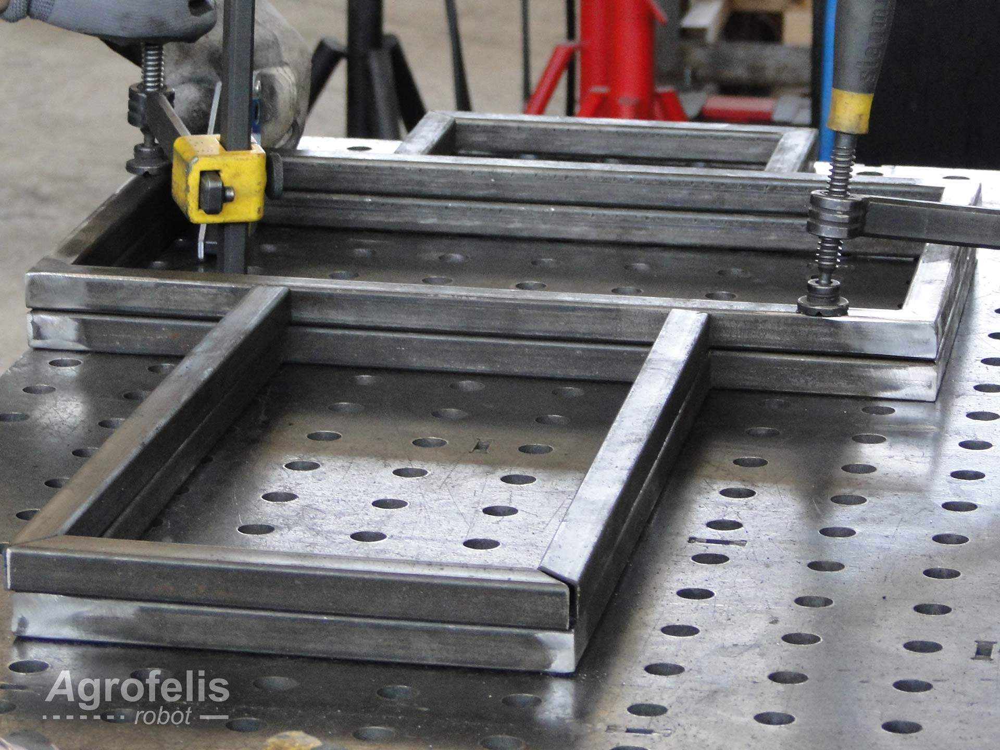

Title: Agrofelis Chassis frame Design and fabrication

# Abstract 

This document focuses on the manufacturing details of the frame of the vehicle. The frame houses and protects the 8kw power module with its lifepo4 batteries, the electronics, the sensors and actuators of the unmanned vehicle. The frame implemented using regular square iron bars of 20 mm width, establishes key placeholders for mounting the detachable wheels, the protective covers and via its grid like attachment points enables to mount anticipated tools, as well as future ones. Primary factors of the design were the footprint minimization, the protection of the batteries compartment, the rigidity of the chassis and the ease of manufacturing using low budget tools and readily available materials.

The documentation presents the frame fabrication by decomposing it, into its individual elements and fabrication steps.

# Introduction

The cross like symmetric chassis frame of the vehicle, can be decomposed into its identical bottom and top part, the middle part 
contributing to the chassis height, the front and back wheel mounting points, a fixed protective cover for the batteries and into a grid like array of mounting sockets. The following figure illustrates the schematics of the chassis from multiple view points.

Crucial dimensions of the frame and its components are annotated in the following diagram.

The frame with its components arranged in an exploded view, is presented bellow.

Within the diagram the multiple sub pars of the frame are being numbered :

1. The bottom part
2. The bottom batteries cover part
3. The middle bars
4. The top part
5. The back wheel mounting points part
6. The front wheel mounting points part

## Step wise fabrication of the frame

In this section, the chassis fabrication is decomposed into seven steps and along with the schematics, photos of the fabricated frame are provided for convenience. 

### Step 01

The first part of the chassis fabrication is the bottom part illustrated by the following projection diagram.

### Step 02

In the second step, in the bottom part of the frame, a 3 mm thick iron sheet following the battery compartment silhouette is being welded, securing the 8kw lifepo4 batteries from external forces, as illustrated by the following diagram.

### Step 03

The top part implemented in step 3 along with its bottom part are being showcased by the following diagram.

The bottom and top part of the frame as fabricated are snapshot-ed, by the following photos.

### Step 04

In step 4 of the fabrication, the middle bars are MIG welded, connecting the top and bottom parts implemented in the previous steps, as presented by the following figure.

The following photos showcase the fabricated top, bottom and middle parts of the chassis.

### Step 05

In step 05, the back wheel attachment point are being fabricated as seen by the next figure. The back wheel attachment points, enable to dismantle the related modules or to interchange the steering wheels according the the scope of the problem.

Details of the manufactured part can bee seen by the following photo.

> Although not crucial, these vertical bars can be offset-ed by 30 mm, something that is performed by the prototype frame using some additional drilled bars and washers documented in the respective dedicated document presenting the steering wheels module. 

### Step 06

In the sixth step, of the chassis fabrication the front wheel attachments, using regular T shaped iron bars of 25 mm width by 25 mm height, are being welded into the corner bars, allowing to interchange easily the front wheels of the robot and to support future wheel designs based on the problem targeting.

### Step 07

In the last step of the chassis fabrication, a plethora of nuts are being welded in all corners formed by the iron bards to allow to mount the protecting covers of the frame as well as establish multiple mounting points for tools and extensions of the Agrofelis Robot.  The grid like mounting sockets locations in the fabricated chassis, are visualised by the following figure.

Two views of the painted fabricated frame are provided by the next figure.

## Finalization steps.

As with all metallic parts of the Agrofelis robot, the frame is being painted with a 2 hand primer, followed by 2 hands of oil paint.
A 5 mm compressible foam is moreover glued to the external sides of the frame in order to provide near air-tight protection when the covers are attached, protecting the internal elements from dust and water.

## Summary

