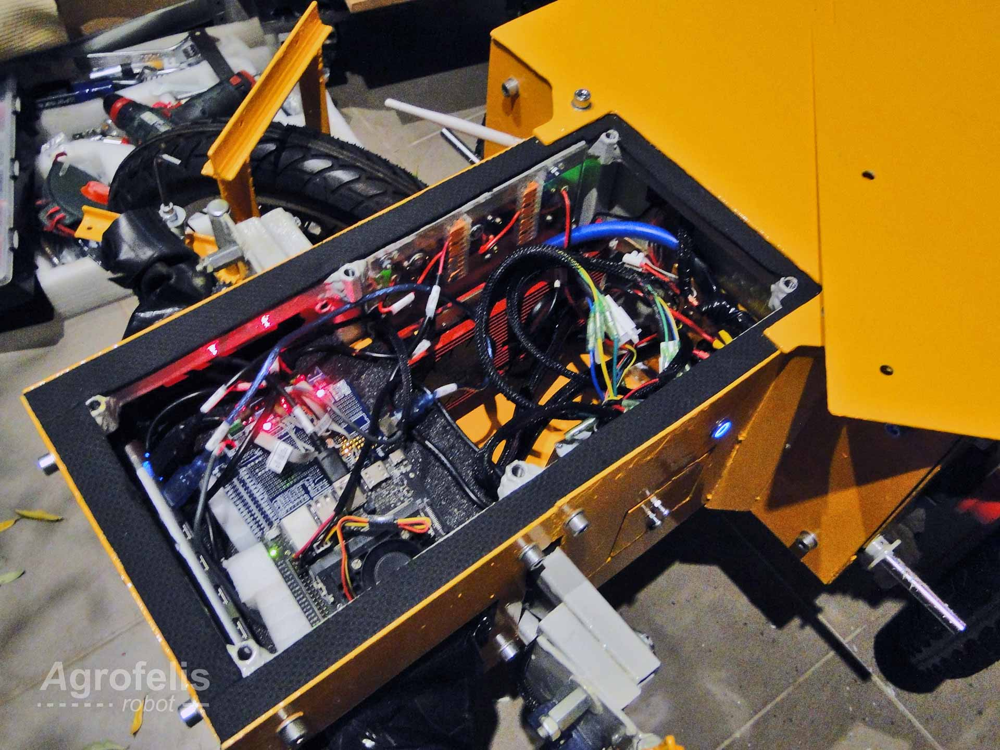

# Agrofelis Power System Design and Fabrication

# Abstract

This document delves into the power-related components that classify the Agrofelis robot as an energy-dense solution. The battery technology employed, as well as the capacity, management, monitoring, and charging options, are elaborated. The battery arrangement for minimizing the vehicle's footprint, as well as its protective enclosure and cable connectivity schematics, are all documented. In addition, the power distribution, the different voltages energizing the various electronics, along with the protective mechanisms are documented. Furthermore, the document describes the WiFi relays and how to make them more robust. The documentation also lists all the utilised components, their prices, along with indicative suppliers facilitating the reproducibility of the system.

# Introduction

The power module and its sub-elements is the most expensive module of the Agrofelis robot. A large 8 kW battery system was chosen in order to allow for an 8-hour shift under moderate energy consumption, with a work load peaking between 500 and 1000 watts. The most recent and extensively utilized form of battery employed in off-grid solar panel systems, known as LiFePO4 (Lithium Iron Phosphate), was chosen. This type of technology was chosen because of its extraordinary longevity, high discharge rate, environmental friendliness, safety features, low toxicity, steady performance at variable environmental conditions, and thermal and chemical resilience. 

A wide range of sensors were incorporated into the Agrofelis robot, which enabled the monitoring of the total discharge rate of the system as well as the power consumption of the individual components and actuators. The usage of various energy feedback sensors allows intelligent management of the system within the range of its highest efficiency, thus prolonging its lifetime and the runtime of the robot. 

Passive systems, which are commonly used in the automotive sector, as well as active systems, were installed in the energy-demanding routes of the system, protecting the rest of the electronics and modules in the event that a component failed unexpectedly. 

In the following sections, the overall energy system is being decomposed to its layers, its elements and their details.

An overview of the vehicle, its batteries and their compartment can be seen via the following schematic.

## Batteries

The battery technology chosen for the Agrofelis robot centers around Lithium Iron Phosphate (LiFePO4) battery cells[^LiFePOA]. Because of their safe operation, low toxicity and long life lifetime, LFP batteries are finding a number of roles in vehicle use, utility-scale stationary applications and backup power systems[^LiFePO]. Eight [CATL 302Ah](assets/CATL_302Ah.pdf) LiFePO4 battery cells (LEP71H3L7-01) connected in series, make up the battery stack of the vehicle. 

Each cell approximately weights 5.5 kg, possess a voltage range of 2.0V to 3.65V with a nominal voltage of 3.2V, while able to operate between -35 and 65 degrees Celsius. Their life cycle exceeds 4000 charge/discharge cycles corresponding to nearly 11 years, if the robot is operated once a day. The battery's lifespan can also be extended if the depth of charge and discharge rates are bounded to lower levels than their maximum. The batteries offer a nominal discharge rate of 0.5C and a maximum continuous rate of 1.0C. This means that the batteries can effectively deliver constantly 150 amps and peak safely up to their nominal amp power (302Ah+). 

[^LiFePOA]:https://www.anker.com/blogs/battery/lifepo4-battery-benefits-and-uses-you-should-know "Benefits and Uses You Should Know"
[^LiFePO]: https://en.wikipedia.org/wiki/Lithium_iron_phosphate_battery "Wikipedia - LiFePO4" 

The typical dimensions of a 302Ah battery cell are encoded by the following image.

## Batteries Arrangement

The following diagram illustrates the unusual battery arrangement, allowing a width reduction for the frame by about 20 cm.

The battery poles, connected with the BMS voltage sensor cables, are labeled from B0 to B8. B0 represents the negative pole of the first battery and B8 corresponds to the positive pole of the last battery in the sequence. Each battery cell is connected in series such that the positive pole of one cell meets the negative pole of the consequent cell and vice versa. Connecting the batteries in series accumulates their voltage while maintaining a constant amperage.

A photo of the batteries while drafting their arrangement is displayed below.

## Batteries Hardening and Protection

The majority of the batteries, particularly those facing the outer side of the structure, were dressed with 1.5 mm battery insulating barley paper, hardening their outer shell even further.

### Batteries Fitting and Isolation

Pieces of wood (plywood) were utilised to encase the batteries within the frame, shielding them from external temperature variations, compensating for minor accumulative dimension differences either in the batteries or in the fabrication of the frame and having a softer material than metal touching the batteries is better, as it can also serve as a subtle shock absorber.

The wood boards fit tightly and gently in order to allow compressing forces on the batteries, preventing them from expanding during their charging and discharging cycles, which prolongs even further their lifetime. Lack of compression causes cell damage, as indicated by swelling and premature battery failure[^LiFePOCompress].

[^LiFePOCompress]: https://www.currentconnected.com/learning-center/lc-stor/llfp-comp/ "LiFePO4 Cell Compression" 

The consequent figure illustrates the batteries along with their wooden separators. On the right side of the structure a route is created to pass the high-current outlet cables.

The following diagram illustrates and enumerates the ten plywood pieces that fill the designed gap created by the batteries and the frame compartment. 

The 10th piece, which is inserted last, secures the batteries when they are in place and aids in the removal of the batteries when they are removed. The backside of the battery compartment neighboring with the back compartment of the vehicle is isolated using a plexiglass piece (part 11) because of its flexibility and durability.

The enumerated wooden pieces, together with their dimensions and thickness are documented by the following schematic.

The 11th part, made out of plexiglass dimensions, is encoded by the following diagram.

A hole in the plexiglass's top center position, just under the frame bar, is drilled to pass the battery temperature sensor, the battery cells voltage regulators, as well as the power wire supplying electricity to the front section of the vehicle.

The following photograph showcases the aforementioned details of the implemented battery module.

Cables passing through part 11, including voltage sensor cables, temperature sensors, power and data cords connecting to the front section of the vehicle, as well as B8 and B0 battery poles corresponding to the positive and negative outlet of the battery pack, can be seen. Furthermore, the photo displays the painted wooden pieces enriched with a film of Kapton tape, which makes them waterproof and resistant to extreme temperatures (269 to +400 °C)[^Kapton].

[^Kapton]: https://en.wikipedia.org/wiki/Kapton "Kapton - Wikipedia" 

## Battery Management System

The following photo shows the heavy-duty Battery Management System (BMS) , which is responsible for monitoring and controlling the charging and discharging processes per battery cell in a balanced manner. Maintaining a voltage balance across the battery cells preserves and prolongs the lifetime and stability of the battery pack. The BMS can moreover detect a short circuit, identify a faulty battery cell and prevent overcharging or overdischarging of individual battery cells. The BMS thresholds can be altered and the monitoring data can be accessed either via Bluetooth or a serial interface. On the left side of the figure we can see the voltage sensing cables. On the bottom left side we can see the temperature sensor cable being next to the Bluetooth and serial interface sockets of the BMS. 

The following zoomed-out view of the BMS snapshots the UART module, the Bluetooth module as well as the voltage sensor cable connections. On the top and bottom right sides we can also see the main connection outlets of the BMS connected with the negative pole of the battery pack. The BMS intercepts the negative outlet of battery pack with the B- annotated cable (blue) and connects the rest of the circuit using the P- black annotated cable.

In order to have the B- and P- outlets facing the opposite side than their original orientation, they were unscrewed and re-mantled on their opposite side, so they now conveniently face the same direction as the BMS sensor sockets, resulting in shorter cable and less losses within the vehicle. The BMS is established using the piece of acrylic mounted on the left side frame bars of the vehicle's back compartment.

Although the *battery module* can discharge at a maximum rate of 300 to 320 amps, as the robot's intended usage is not to operate at these currents, a slightly lighter but still heavy 250 Amp BMS was chosen instead to lower the cost and space.

## High Current Components

The following diagram reflects the BMS outlet re-arrangement modification as well as the various high-current elements of the power system.

More specifically, the enumerated parts correspond to the following elements.

1. 275 Ah battery disconnect switch 
2. Circuit breaker 250A
3. Positive voltage copper bar terminal power distribution
4. Negative voltage copper bar terminal power distribution
5. Battery management system

Despite the fact that various protection mechanisms are incorporated downstream and by the BMS, the circuit breaker provides a mechanical fail safe protection mechanism at the nominal maximum levels of the energy module.

## Charging 

Charging the battery is accomplished by tapping into the positive and negative copper bar terminal power distributors. Two high-current cable are attached with the terminal and an Anderson[^Anderson] connector. The Anderson connector is conveniently located on the inner side of the door, allowing easy access to the socket for charging or connecting external implements. A moderate 40A, 29.2V LiFePO4 battery charger was chosen for its cost-effectiveness and relatively acceptable theoretical charging time of less than 6 hours. Provided a larger battery charger of 150 amps, matching the maximum charging capacity of the system, would complete a charging cycle within 1.5 hours. 

[^Anderson]: https://en.wikipedia.org/wiki/Anderson_Powerpole "Anderson Powerpole - Wikipedia" 

The following photo showcases the 40amp/29.2Volt LiFePO4 battery charger.

The charging point and how the Anderson connector is attached in the side door panel can be observed by the following figure.

## Voltage Levels

The modules of the system operate either on 5V, which is used in most of the electronics and servos, or on 12V, which is used in high current relays and fans, or on the battery pack voltage level for energizing the motors and other actuators of the robot. 

Three step-down voltage regulators are installed to power these modules. The first two are installed on the backside of the BMS's acrylic mount, and the third uses a small piece of acrylic with magnets facing the BMS. The first regulator steps down the voltage to 5V, the second to 12V and the third, dedicated for the servos actuating the disc brakes, steps down to 5V. The position of the step down regulators can be seen in the following diagram.

A power cord composed of two high-current cables (carrying battery voltage), four low-current cables (5V, 12V) as well as an 8-pin ribbon cable distributes power and establish a data link between the back and front compartment of the vehicle. To enhance its performance and safety, the composite power cord is wrapped with Copper Foil Tape to shield against electromagnetic interference (EMI) and then encased in a Flame-retardant PET tube Cable Sleeve. While wrapping the data cables with copper tape may seem somewhat excessive, the cables obtain a stronger structure and after troubleshooting the DIY plasma cutter due to EMI interference, we felt safer to employ it in the power cord which passes through the battery compartment. 

### Power Cord

A power cord composed of 2 high current cables (battery voltage), 4 low current cable (5v, 12v) as well as a an 8 pin ribbon cable distribute power and provide a data link between the back and front compartment of the vehicle. The composite power cord is wrapped with Copper Foil Tape for EMI shielding and last with a Flame-retardant PET tube Cable Sleeve. Although wrapping the data cables with a copper tape may be somewhat unnecessary, the cables obtain a stronger structure and after troubleshooting the DIY plasma cutter because of EMI interference, we felt safer to employ it in the power cord which passes through the battery compartment. 

## Switchable Power Points

Although adding more protective mechanisms increases complexity and materials, it also enables to compartmentalize the propagation of a point of failure and protect the internal components of the Agrofelis Robot. Two composite modules were designed and installed for the front and the back actuators of the vehicle.

The module employed sockets supporting burnable fuses, which are commonly used in the car industry. Fuses of almost double the maximum amperage of each actuator were chosen. The module was moreover equipped with a high-current car relay (80 Amp) that is controlled by an ESP8266 WiFi relay. Lastly, a diode was utilized to minimize the ripple back voltage effect caused by the coils of the relays when these change state. The module allows to energize connected actuators on demand. Furthermore, it permits to energize them in a staggered sequence, mitigating power spikes that might occur when all components power up simultaneously. The module enables to cut the actuator's power in case of an emergency and minimizes the power consumption while the robot is in stasis. Nevertheless, this increased agility comes with a minor trade-off, as it consumes an additional 1.5 watts of power to maintain the relay coils in an "on" state.

In the following figures the assembly of the power points module is presented. 

The following figure illustrates the key component that forms the switchable main power point module.

1. ESP8266 ESP-01/01S 5V WiFi Relay Module
2. SPDT Ucoil 80A 1.8W car relay AM3-12P 
3. 3x blade fuse holder
5. 2x 20-amp and 1x 30-amp fuse
6. 1N5819 5819 1A 40V Schottky Diode

A close-up view of the high-current car relay is captured in the following photo.

The relay is securely glued and connected with three blade fuse holders, fuses, and connectors, as shown in the following photo.

The module with the WiFi Relay Module hot glued also on the side of the relay is snapshot by the next photograph.

A side view of the completed module, attaching also a flyback[^flyback] diode in the high-current relay as well as the connection cable, can be seen in the following photo.

[^flyback]: https://resources.altium.com/p/using-flyback-diodes-relays-prevents-electrical-noise-your-circuits "Using Flyback Diodes in Relays Prevents Electrical Noise in Your Circuits" 

### WiFi Relay Module

The ESP8266 ESP-01/01S 5V WiFi Relay Module includes a problematic factor in its design. The problem is that when it is powered up, it momentarily switches its relay, causing an unintended flow of energy. The issue occurs due to the pin used by the shield to turn on the ESP8266 boot. To resolve this issue, the board route to that pin must be cut using a cutting tool or small Dremel and remapped to another pin, such as GPIO3, which does not have this inherent issue. Finally, the microcontroller must be reprogrammed to utilize the new intended pin.

The solution described here was employed: https://github.com/IOT-MCU/ESP-01S-Relay-v4.0/issues/1#issuecomment-808784642

The following folder contains the ESP8266 source code utilizing the GPIO pin 3 as well as connecting to the Agrofelis robot default Wifi network. 

- [src/ESP8266Relay/](src/ESP8266Relay/)

## Power System Components

The following table lists the individual components employed for manufacturing the Agrofelis power system. The index table includes moreover the product URLs, the indicative suppliers, as well as unit prices and sum totals.

| No. |  Product | Product URL | Supplier | Used Quantity | VAT Price (€) | Subtotal (€)  | Note |
|----|-----------------|------------|-----|---|---|---|---|
| #1 | 302A LiFePO4 CATL battery cells | [LiFePO4](https://www.alibaba.com/product-detail//Dongguan-Lightning-Grade-A-3-2V_1600863448967.html) | [Dongguan](https://shandian.en.alibaba.com/minisiteentrance.html) | 8 | 113.00 | 904.00 | - |
| #2 | Daly BMS LiFePO4 8S 250A Smart| [BMS]( https://www.aliexpress.com/item/1005003399024799.html) | [AliExpress](https://www.aliexpress.com/) | 1 |160.27 |160.27 | - |
| #3 | LiFePO4 8S 40A battery charger | [Battery Charger](https://www.aliexpress.com/item/1005002718132948.html) | [AliExpress](https://www.aliexpress.com/) | 1 | 130.43 | 130.43 | - |
| #4 | 250Ah Circuit Breaker Power | [Circuit Breaker Power](https://www.aliexpress.com/item/1005005122147376.html) | [AliExpress](https://www.aliexpress.com/) | 1 |  5.39 | 5.39 | - |
| #5 | Battery disconnect switch SLO-BDS-1 | [Battery Switch](https://aenaoshop.gr/product/battery-disconnect-switch-slo-bds-1/) | [AenaoShop](https://aenaoshop.gr) | 1 | 39.73 | 39.73 | - | 
| #6 | 80-amp relay | [80-amp relay](https://www.electronio.gr/rele-relay-autokinitou-spdt-ucoil-12v-dc-80a-1.8w-am3-12p-5-epafes.html) |[Electronio](https://www.electronio.gr) | 2 | 8.23 | 16.46 | - | 
| #7 | Row Copper Bar Terminal Power Distribution 8 Hole, With Base | [Bar Power Distribution](https://www.aliexpress.com/item/1005004769462897.html) | [AliExpress](https://www.aliexpress.com/) | 2 | 7.19 | 14.38 | - |
| #8 | 70mm 10 Meter Battery Insulation | [Battery Insulation](https://www.aliexpress.com/item/4000241950870.html) | [AliExpress](https://www.aliexpress.com/) | 1 | 14.06 | 14.06 | - |
| #9 | 80mm Kapton Thermal Insulation Adhesive Tape | [Kapton Tape](https://www.aliexpress.com/item/1005005565776871.html) | [AliExpress](https://www.aliexpress.com/) | 1 | 16.35 | 16.35 | - | 
| #10 | 50M, 8mm Insulated Braided Sleeving Data line protection | [Cable Protection](https://www.aliexpress.com/item/4000603152552.html) | [AliExpress](https://www.aliexpress.com/) | 1 | 16.16 | 16.16 | - |
| #11 | Copper tape 50mm, 20M, One roll | [Copper Tape 50mm](https://www.aliexpress.com/item/1005003122151710.html) | [AliExpress](https://www.aliexpress.com/) | 1 | 20.07 | 20.07 | - |
| #12 | LTC3780 DC-DC 5-32V to 1V-30V 10A Automatic Step Up Down | [Step Down](https://www.aliexpress.com/item/1005004908577986.html) | [AliExpress](https://www.aliexpress.com/) | 3 | 7.23 | 21.69 | - | 
| #13 | ESP8266 ESP-01/01S 5V WiFi Relay Module | [WiFi Relay](https://www.aliexpress.com/item/4000348370586.html) | [AliExpress](https://www.aliexpress.com/) | 2 | 1.00 | 2.00 | - |
| #14 | 1N5819 5819 1A 40V Schottky Diode | [Diode](https://www.hellasdigital.gr/electronics/components/diode/1n5819-5819-1a-40v-schottky-diode/) | [Hellas Digital](https://www.hellasdigital.gr)| 2 | 0.10 | 0.20 | - | 
| #15 | 1m black and red 2awg cable | [2awg cable](https://www.aliexpress.com/item/1005002911374376.html) | [AliExpress](https://www.aliexpress.com/) | 1 | 44.10 | 44.10 | - |
| #16 | 2m black, red 6awg cable | [6awg cable](https://www.aliexpress.com/item/1005002911374376.html) | [AliExpress](https://www.aliexpress.com/) | 2 | 22.10 | 44.20 | - |
| #17 | 5m black and red 10awg cable | [10awg cable](https://www.aliexpress.com/item/1005002911374376.html) | [AliExpress](https://www.aliexpress.com/) | 1 | 35.10 | 35.10 | - |
| #18 | 2pcs 50A Quick Plug Battery Charging Connector | [50A Anderson Connector](https://www.aliexpress.com/item/1005004917902305.html) | [AliExpress](https://www.aliexpress.com/) | 1 | 3.80 | 3.80 | - |
| #19 | 328pcs Heat Shrink Tube Assortment| [Heat Shrink Tube](https://www.hellasdigital.gr/electronics/prototyping/cables-pins/328pcs-heat-shrink-tube-assortment/) | [Hellas Digital](https://www.hellasdigital.gr) | 1 | 3.47 | 3.47 | Shared resource | 
| #20 | 10pcs Adhesive Hot Melt | [Hot Glue](https://www.hellasdigital.gr/electronics/tools-and-peripherals/10-pcs-7mm-x-19cm-adhesive-hot-melt-glue-sticks-for-trigger-electric-gun-hobby-craft-white/) | [Hellas Digital](https://www.hellasdigital.gr) | 1 | 4.96 | 4.96 | Shared resource |
| #21 | 100g 0.8mm Welding Line Solder Wire | [Solder](https://www.hellasdigital.gr/electronics/tools-and-peripherals/100g-0.8mm-welding-line-solder-wire/) | [Hellas Digital](https://www.hellasdigital.gr) | 1 | 5.46 | 5.46 | Shared resource |
| #22 | Wago 5 Way Electrical Wire Connector | [Wire Connector](https://www.hellasdigital.gr/electronics/components/wago-5-way-electrical-wire-connector-insulating-spring-lever-reusable-connector-pct-215/) | [Hellas Digital](https://www.hellasdigital.gr) | 4 | 1.00 | 4.00 | - |
| #23 | USB To RS232 TTL | [USB To RS232 TTL](https://www.hellasdigital.gr/electronics/prototyping/adapters/usb-to-rs232-ttl-ch340g-converter-module/) | [Hellas Digital](https://www.hellasdigital.gr) | 1 | 3.00 | 3.00 | Programs the wifi relay |
| **Total** |      |    |     |      |     |  **1,509.28**  | | 

The total cost to manufacture the Agrofelis power system, exclusive of shipping and labor cost, totals approximately **1,509** euros.

# Conclusion

The technology characteristics of LiFePO4, as well as their arrangement and wrapping within the Agrofelis frame has been presented. The subsequent components of the BMS, its connection details and charging apparatus have been described, as have the function and setup of fuses, diodes and relays.  To conclude, an image depicting the vehicle's back compartment, hosting the BMS and other electronics, is presented below.

