# Agrofelis power system

# Abstract

The document presents the Power related elements classifying the Agrofelis robot as an energy dense solution. The battery technology employed and the choice of their capacity, management, monitoring and charging is elaborated. The batteries arrangement for minimizing the vehicle's footprint, their protective enclosure and their cable connectivity schematics are documented. The power distribution, the different voltages energizing the various electronics along with the protective mechanisms are documented. Moreover the document describes the WiFi relays and how to make them more robust. The documentation also lists all the utilised components, their price along with indicative suppliers facilitating the reproducibility of the system. 

# Introduction

The power module and its sub-elements is the most expensive module of the Agrofelis robot. A hefty 8 KW battery system was chosen in order to have the ability of an 8 hour shift on a moderate energy demand with work load peaking between 500 watt and 1000 watt. The latest most widely used type of batteries employed in off the grid solar panel systems were chosen, called LiFePO4. The type of technology was chosen for their unusual lifespan, high discharge rate, environmental friendliness high safety, low toxicity, their stable performance at fluctuating environmental temperatures, and their thermal and chemical stability. 

A wide range of sensors were employed in the Agrofelis robot enabling the monitoring of the total discharge rate of the system as well as the power consumption of the individual components and actuators. Using various energy feedback sensors allows intelligent management of the system within the range of its highest efficiency thus prolonging its lifetime and the runtime of the robot. 

Passive systems usually employed in the car industry as well as active systems were installed in energy demanding routes of the system, protecting the rest of the electronics and modules in case a component fails unexpectedly. 

In the following sections the overall energy system is being decomposed to its layers, its elements and their details.

An overview of the vehicle its batteries and their compartment can be seen via the following schematic.

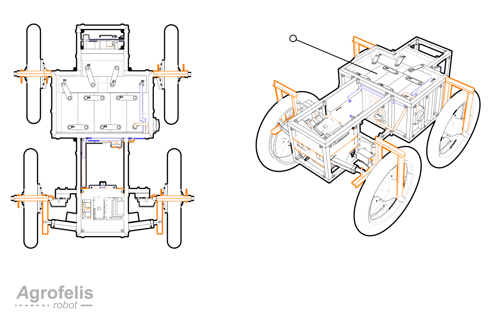

## Batteries

The battery technology chosen for the Agrofelis robot is called Lithium Iron Phosphate battery (LiFePO4 ). Because of their safe operation, low toxicity, long life span, LFP batteries are finding a number of roles in vehicle use, utility-scale stationary applications, and backup power systems [^LiFePO]. Eight [CATL 302Ah](assets/CATL_302Ah.pdf)  LiFePO 4 battery cells (LEP71H3L7-01) connected in series, make up the battery stack of the vehicle. 

Each cell approximately weights 5.5 kg, can have a voltage range between 2.0V and 3.65V with a nominal voltage of 3.2, while able to operate between -35 and 65 Celsius. Their life cycle exceeds 4000 charge/discharge cycles corresponding to nearly 11 years, if the robot is operated once a day. The battery lifespan can also be expanded if the depth of charge and discharge rates are bounded to lower levels than their maximum. The batteries nominal discharge rate is at 0.5C and the maximum continues rate is 1.0 C. This means that the batteries can effectively deliver constantly 150 amps and peak safely up to their nominal amp power (302Ah+). 

[^LiFePOA]:https://www.anker.com/blogs/battery/lifepo4-battery-benefits-and-uses-you-should-know "Benefits and Uses You Should Know"
[^LiFePO]: https://en.wikipedia.org/wiki/Lithium_iron_phosphate_battery "Wikipedia - LiFePO4" 

The typical dimensions of a 302Ah battery cell are encoded by the following image.

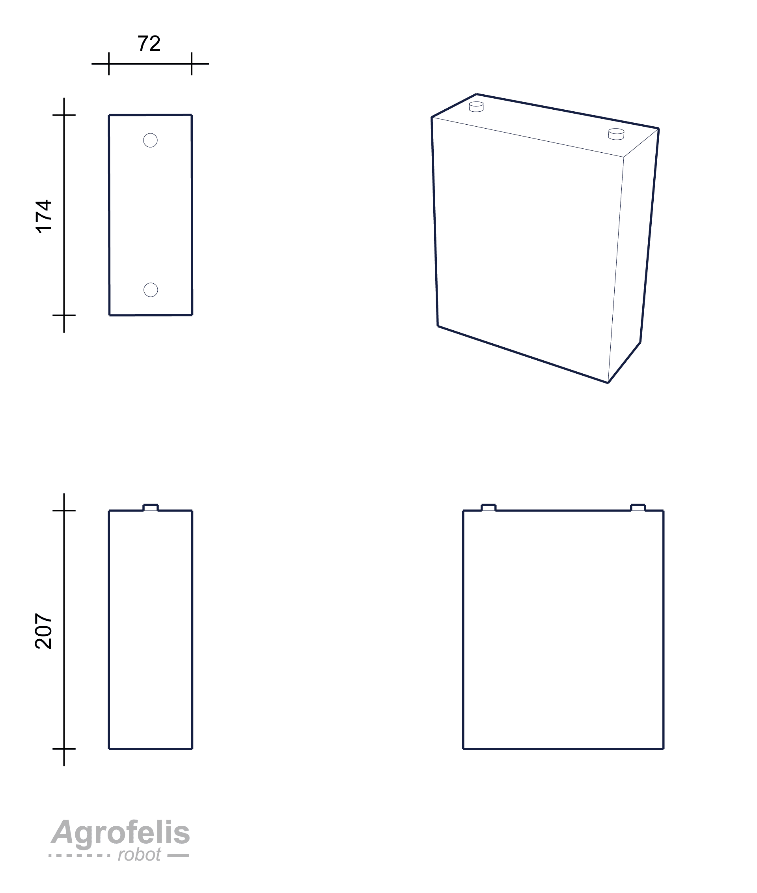

## Batteries arrangement

The following diagram illustrates the unusual battery arrangement, allowing a width reduction for the frame by approximately 20 cm.

The battery poles connected with the the BMS voltage sensor cables are numbered as B0 to B8. B0 corresponds to the negative pole of the first battery and B8 correspond to positive pole of the battery cell in the sequence. Each battery cell is connected in series where the positive pole of one cell meets the negative pole of the consequent cell and vice versa. Connecting the batteries in series, accumulates their voltage and maintains the amperage constant.

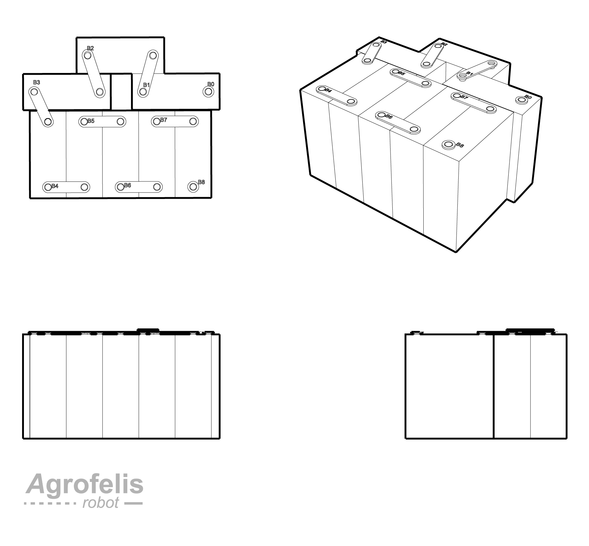

A photo of the batteries while drafting their arrangement is shown below.

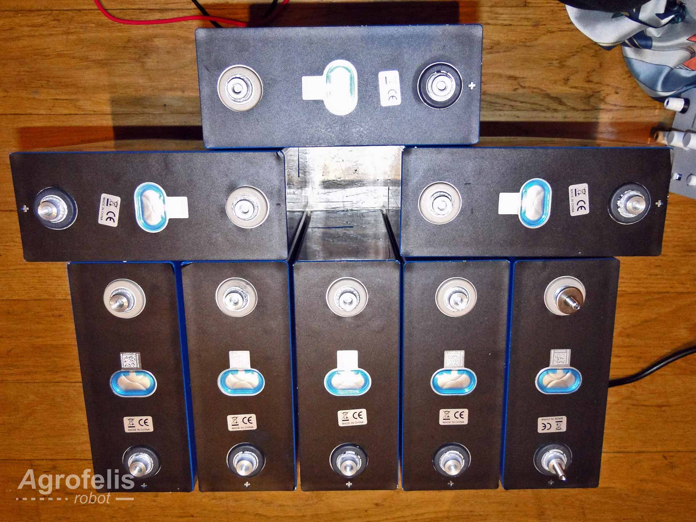

## Batteries hardening and protection

Most of the batteries especially those facing the outer side of the structure were dressed with 1.5 mm battery insulation barley paper hardening their outer shell even further.

### Batteries fitting and isolation 

Pieces of wood (plywood) were utilised to enclose the batteries within the frame, those shield the batteries from external temperature differences, compensate for minor accumulative dimension differences either in the batteries or in the fabrication of the frame and also having a softer material than metal touching the batteries is better which can also serve as a subtle shock absorber.

The wood boards fit tightly and gently so to allow compressing forces on the batteries preventing them from expanding during their charging and discharging cycles, which prolongs even further their lifetime. Lack of compression leads to damage of the cells, as indicated by swelling and premature battery failure [^LiFePOCompress].

[^LiFePOCompress]: https://www.currentconnected.com/learning-center/lc-stor/llfp-comp/ "LiFePO4 Cell Compression" 

The consequent figure illustrates the batteries along with their wooden separators. On the right side of the structure a route is created to pass the high current outlet cables.

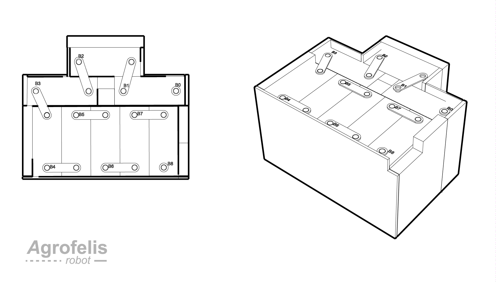

The following diagram illustrates and enumerates the 10 plywood pieces filling the designed gap created by the batteries and the frame compartment. 

The 10th piece inserted last, secures the batteries when in place and helps removing the batteries when its removed. The backside of the battery compartment neighboring with the back compartment of the vehicle is isolated using a plexiglass piece (part 11) because of its flexibility and durability.

The enumerated wooden pieces with their dimensions and thickness are documented by the following schematic.

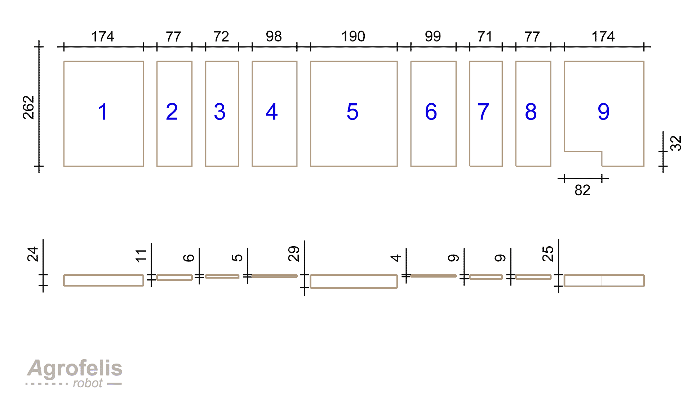

The 11th part, made out of plexiglass dimensions is encoded by the following diagram.

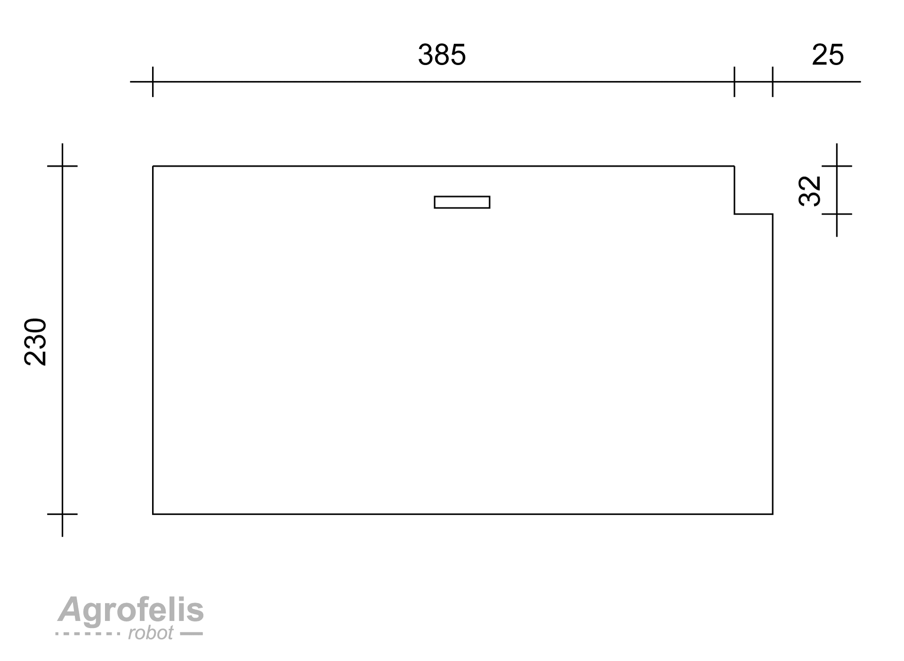

A hole in the plexiglass's top center position, just under the frame bar, is drilled to pass the battery temperature sensor, the battery cells voltage regulators, as well as the power cord transferring power to the front section of the vehicle.

The following photograph showcases the aforementioned details of the implemented battery module.

The cables passing through part 11 can be seen, the voltage sensor cables, the temperature sensor, the power and data cord connecting to the front section of the vehicle as well as the B8 and B0 battery poles corresponding to the positive and negative outlet of the battery pack. The photo moreover, shows the painted wooden pieces enriched with a film of Kapton tape making them waterproof and resistant to an extreme temperature range (−269 to +400 °C). [^Kapton].

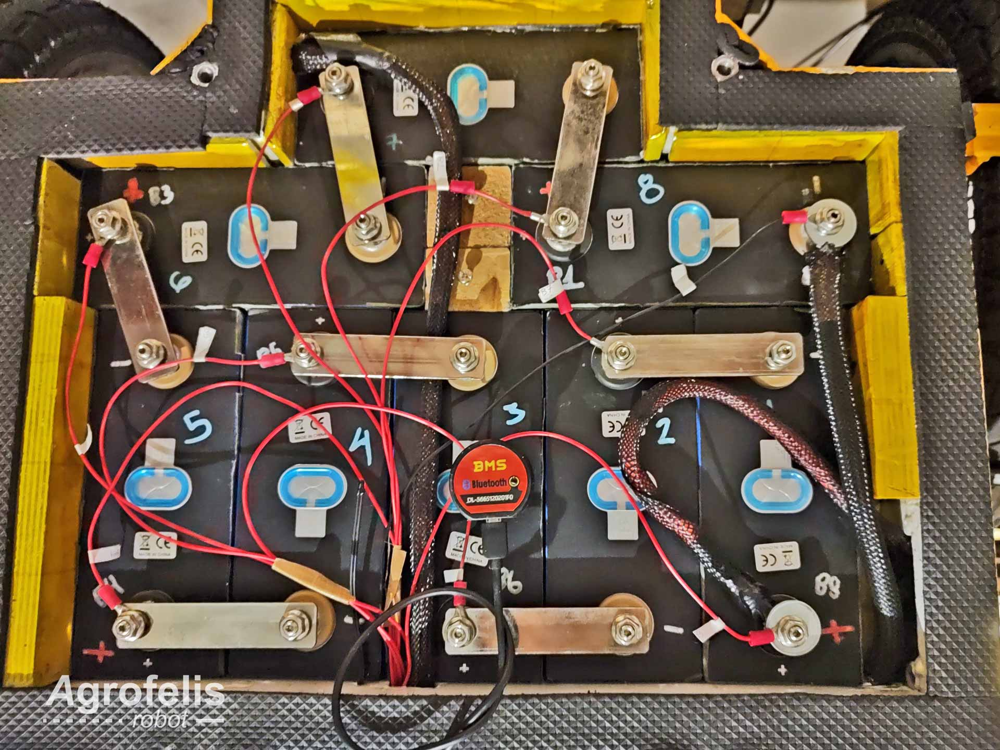

[^Kapton]: https://en.wikipedia.org/wiki/Kapton "Kapton - Wikipedia" 

## Battery Management System

The following photo shows the heavy duty Battery Management System (BMS) responsible for monitoring and controlling the charging and discharging processes per battery cell in a balanced manner. Maintaining a voltage balance across the battery cells protects and prolongs the lifetime and stability of the battery pack. The BMS can moreover detect a short circuit, detect a faulty battery cell, prevent over charging or over discharging  individual battery cells. The BMS thresholds can be altered and the monitoring data can be accessed either via Bluetooth or serial interface. On the left side of the figure we can see the voltage sensing cables. On the bottom left side we can see the temperature sensor cable being next to the Bluetooth and serial interface sockets of the BMS. 

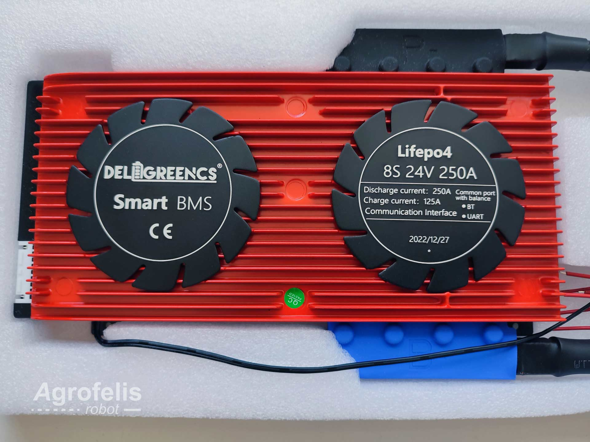

The following zoomed out view of the BMS snapshots the UART module, the Bluetooth module as well as the voltage sensor cable. On the top and bottom right side we can also see the main connection outlets of the BMS connected with the negative pole of the battery pack. The BMS intercepts the negative outlet of battery pack with the B- annotated cable (blue) and connects the rest of the circuit using the P- black annotated cable.

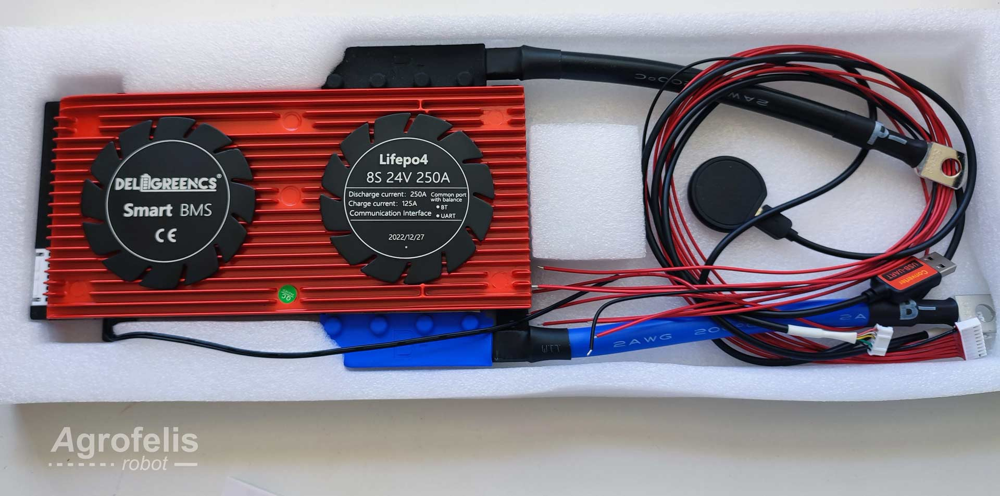

In order to have the B- and P- outlet facing the opposite side than its original orientation, they were unscrewed and re-mantled on their opposite side so now they conveniently face on the same direction as the BMS sensor sockets which leads to shorter cable and less losses within the vehicle, The BMS is established using the piece of acrylic mounted on the left side frame bars of the back compartment of the vehicle.

Although the Battery module can discharge at maximum rate between 300 and 320 amps, as the intended use of the robot is not to operate at these currents, to lower the cost and space needed by the BMS a slightly lighter though still hefty 250 Amp BMS, was chosen instead.

## High current components

The following diagram reflects the BMS outlet re-arrangement modification as well as the various high current elements of the power system.

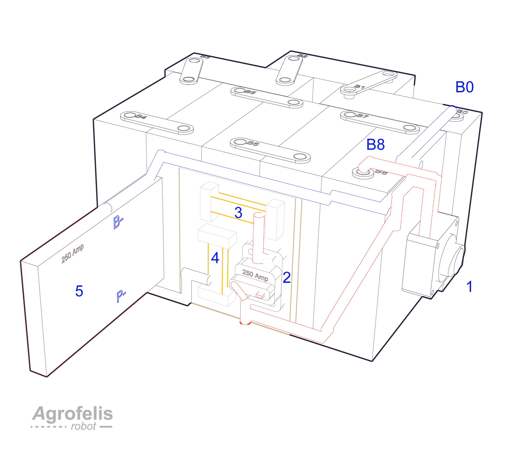

More specifically the enumerated parts correspond to the following elements.

1. 275 Ah Battery disconnect switch 
2. Circuit breaker 250A
3. Positive Voltage Copper bar terminal power distribution
4. Negative Voltage Copper bar terminal power distribution
5. Battery Management System

Although various protection mechanism are incorporated downstream and by the BMS the circuit breaker provides a mechanical fail safe protection mechanism at the nominal maximum levels of the energy module.

## Charging 

Charging the battery is accomplished by tapping into the positive and negative copper bar terminal power distributors. Two high current cable are attached with the terminal and an Anderson [^Anderson] connector. The Anderson is attached in the inner side of the door allowing easy access to the socket for charging or connecting external implements. A moderate 40A, 29.2V LiFePO4, battery charger was chosen due to its lower cost and having a relatively acceptable theoretical charging time of less than 6h. Provided a larger battery charger of 150 amp matching the maximum charging capacity of the system would complete a charging cycle within 1.5 hours. 

[^Anderson]: https://en.wikipedia.org/wiki/Anderson_Powerpole "Anderson Powerpole - wikipedia" 

The following photo showcases the 40amp/29.2Volt LiFePO4 battery charger.

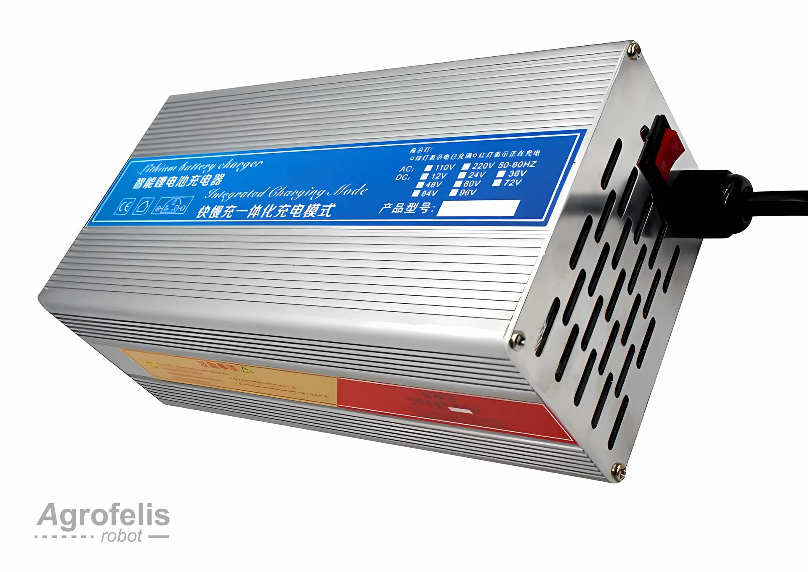

The charging point and how the Anderson connector is attached in the side door panel can be observed by the following figure.

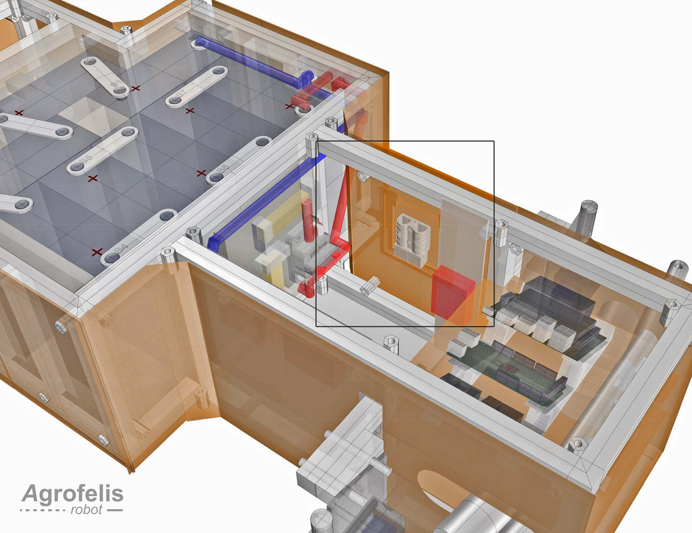

## Voltage levels

The modules of the system operate either on 5v employed on most of the electronics and servos, or on 12v used in high current relays and fans or on the battery pack voltage level, energizing the motors and other actuators of the robot. 

Three step down voltage regulators are installed to power these modules. The first two are installed on the back side of the BMS's acrylic mount and the third uses a small piece of acrylic with magnets facing the BMS. The 1st regulator steps down the voltage to 5v, the second to 12 and the 3d dedicated for the servos actuating the disc brakes to 5v. The step down regulators position can be seen in the following diagram.

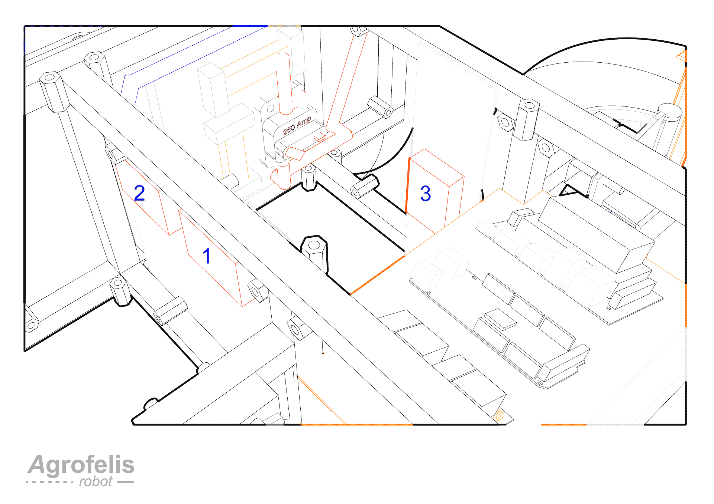

The following drawing illustrates most of the base electrical modules energized by the Agrofelis power system. More specifically the motors, the motor hub drivers, the Jetson nano, the Arduino mega, the steering driver, the USB hub, and the linear actuators are visualised. Additional components not shown in the image is the WiFi adapter, the WiFi access point, the servos, the 3d Lidar mounted in the front sensors as well as 2 degrees of freedom turntable implement mount. 

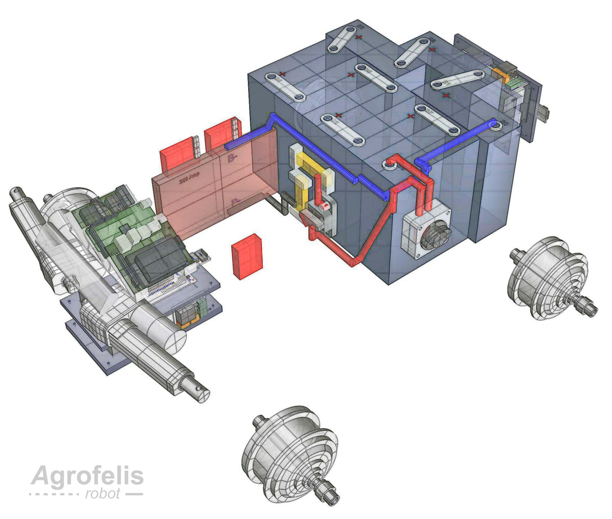

### Power cord

A power cord composed of 2 high current cables (battery voltage), 4 low current cable (5v, 12v) as well as a an 8 pin ribbon cable distribute power and provide a data link between the back and front compartment of the vehicle. The composite power cord is wrapped with Copper Foil Tape for EMI shielding and last with a Flame-retardant PET tube Cable Sleeve. Although wrapping the data cables with a copper tape may be somewhat unnecessary, the cables obtain a stronger structure and after troubleshooting the DIY plasma cutter because of EMI interference, we felt safer to employ it in the power cord which passes through the battery compartment. 

## Switchable power points

Although adding more protection mechanism adds more complexity and materials at the same time enables to compartmentalize the propagation of a point of failure and protect the internal components of the Agrofelis Robot. Two composite modules were created and installed for the front and the back actuators of the vehicle. 
The module employed sockets supporting burnable fuses employed in the car industry. Fuses were chosen of about double the maximum amperage of each actuator. The module was moreover equipped with a high current car relay (80 Amp) which is driven by an ESP8266 WiFi relay. Lastly a diode was employed to minimize the ripple back voltage effect caused by the coils of the relays when these change state. The module allows to energize connected actuators on demand. Moreover it allows to energize them in a delayed sequence and minimize the spikes created in the system when all components power up simultaneously. The module, enables to cut the actuator's power in case of an emergency and minimizes the power consumption while the robot is on stasis. The agility however comes with a small cost of consuming additionally 1.5 watts of power to keep the relays coil in "on" status.  

In the following figures the assembly of the power points module is presented. 

The following figure illustrates the key component making the switchable main power point module.

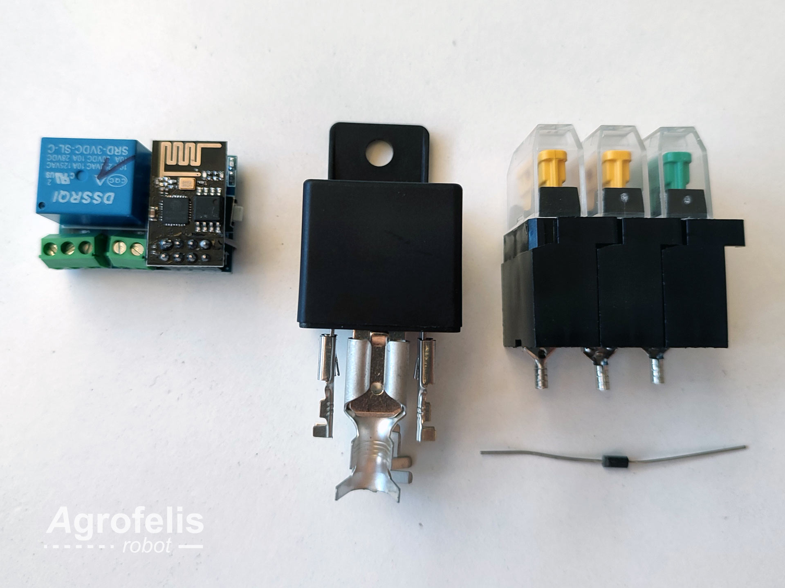

1. ESP8266 ESP-01/01S 5V WiFi Relay Module
2. SPDT Ucoil 80A 1.8W car relay AM3-12P 
3. 3x blade fuse holder
5. 2x 20amp and 1 30 amp fuse
6. 1N5819 5819 1A 40V Schottky Diode

A close up view of the high current car relay is captured by the following photo.

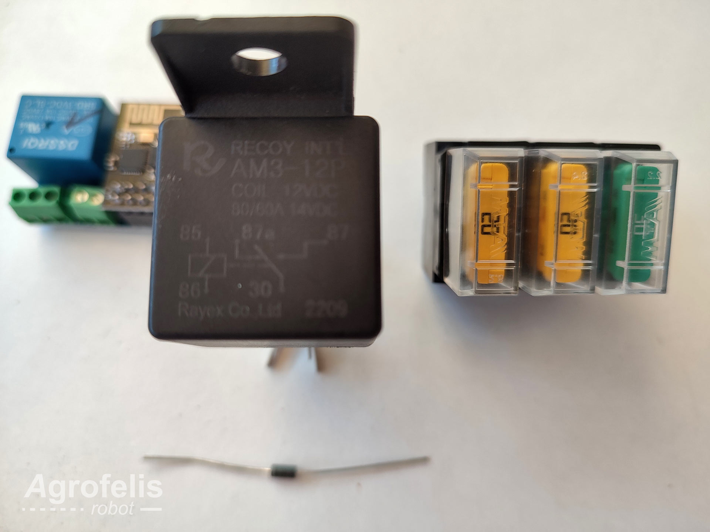

The relay glued and connected with the three blade fuse holder, their fuses and their connectors is captured by the following photo.

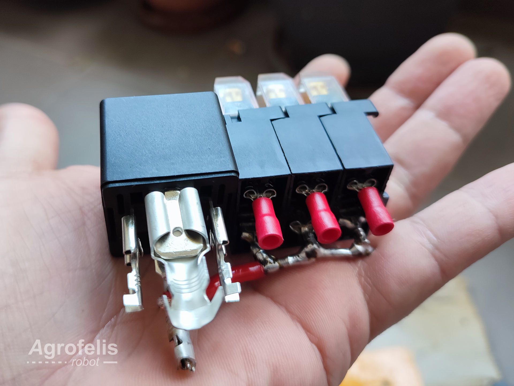

The module with the WiFi Relay Module hot glued also on the side of the relay is snapshot by the next photograph.

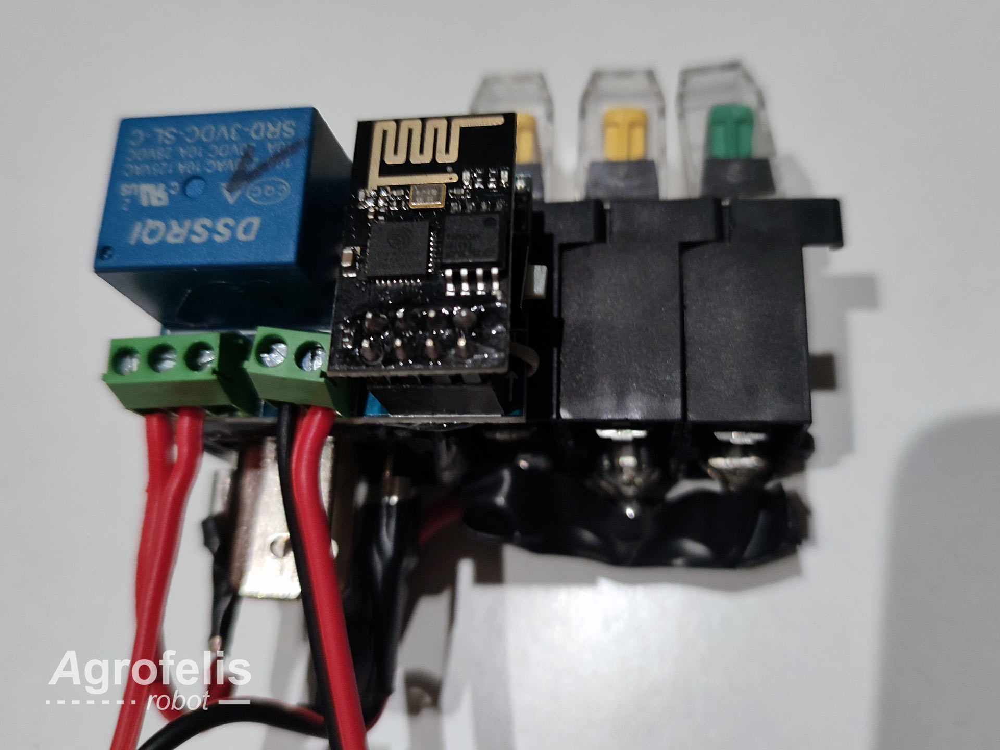

A side view of the completed module attaching also a flyback [^flyback] diode in the high current relay as well as the connection cable can be seen in the following photo.

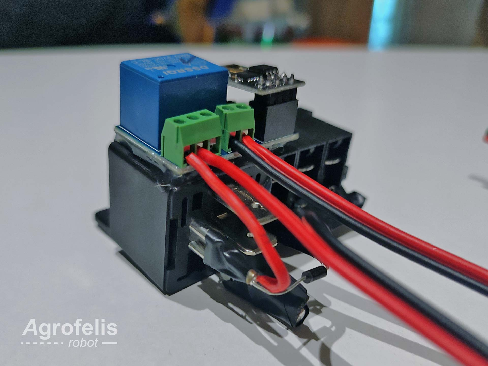

[^flyback]: https://resources.altium.com/p/using-flyback-diodes-relays-prevents-electrical-noise-your-circuits "Using Flyback Diodes in Relays Prevents Electrical Noise in Your Circuits" 

### WiFi Relay Module

The ESP8266 ESP-01/01S 5V WiFi Relay Module includes a problematic factor in its design. The problem is that when it is powered up it momentarily switches its relay creating an unintended flow of energy. The problem occurs because of the pin used by the shield which turns on ESP8266 boot. To fix this problem the board route to that pin must be cut using a cutting tool or small Dremel and remapped to another pin such as GPIO3 that doesn't have this inherent issue. Finnaly the micro controller must be reprogrammed to utilise the new pin intended. 

The following solution described here was employed https://github.com/IOT-MCU/ESP-01S-Relay-v4.0/issues/1#issuecomment-808784642

The following folder contains the ESP8266 source code utilizing the GPIO pin 3 as well as connecting to the Agrofelis robot default Wifi network. 

- [src/ESP8266Relay/](src/ESP8266Relay/)

## Power system components 

The following table lists the individual components employed for manufacturing the Agrofelis power system. The index table includes moreover the product URLs, the indicative suppliers, as well as unit prices and sum totals.

| No. |  Product | Product URL | Supplier | Used Quantity | VAT Price (€) | Subtotal (€)  | Note |
|----|-----------------|------------|-----|---|---|---|---|
| #1 | 302A LiFePO4 CATL battery cells | [LiFePO4](https://www.alibaba.com/product-detail//Dongguan-Lightning-Grade-A-3-2V_1600863448967.html) | [Dongguan](https://shandian.en.alibaba.com/minisiteentrance.html) | 8 | 113 | 904 | - |
| #2 | Daly BMS LiFePo 8S 250A Smart| [BMS]( https://www.aliexpress.com/item/1005003399024799.html) | [aliexpress](https://www.aliexpress.com/) | 1 |160.27 |160.27 | - |
| #3 | Lifepo4 8S 40A battery charger | [battery charger](https://www.aliexpress.com/item/1005002718132948.html) | [aliexpress](https://www.aliexpress.com/) | 1 | 130.43 | 130.43 | - |
| #4 | 250Ah Circuit Breaker Power | [Circuit Breaker Power](https://www.aliexpress.com/item/1005005122147376.html) | [aliexpress](https://www.aliexpress.com/) | 1 |  5.39 | 5.39 | - |
| #5 | Battery disconnect switch SLO-BDS-1 | [battery switch](https://aenaoshop.gr/product/battery-disconnect-switch-slo-bds-1/) | [aenaoshop](https://aenaoshop.gr) | 1 | 39.73 | 39.73 | - | 
| #6 | 80 amp relay | [80 amp relay](https://www.electronio.gr/rele-relay-autokinitou-spdt-ucoil-12v-dc-80a-1.8w-am3-12p-5-epafes.html) |[electronio](https://www.electronio.gr) | 2 | 8.23 | 16.46 | - | 
| #7 | Row Copper Bar Terminal Power Distribution 8 Hole, With Base | [Bar Power Distribution](https://www.aliexpress.com/item/1005004769462897.html) | [aliexpress](https://www.aliexpress.com/) | 2 | 7.19 | 14.38 | - |
| #8 | 70mm 10 Meter Battery Insulation | [Battery Insulation](https://www.aliexpress.com/item/4000241950870.html) | [aliexpress](https://www.aliexpress.com/) | 1 | 14.06 | 14.06 | - |
| #9 | 80mm Kapton Thermal Insulation Adhesive Tape | [Kapton tape](https://www.aliexpress.com/item/1005005565776871.html) | [aliexpress](https://www.aliexpress.com/) | 1 | 16.35 | 16.35 | - | 
| #10 | 50M, 8mm Insulated Braided Sleeving Data line protection | [cable protection](https://www.aliexpress.com/item/4000603152552.html) | [aliexpress](https://www.aliexpress.com/) | 1 | 16.16 | 16.16 | - |
| #11 | Copper tape 50mm, 20M, One roll | [Copper tape 50mm](https://www.aliexpress.com/item/1005003122151710.html) | [aliexpress](https://www.aliexpress.com/) | 1 | 20.07 | 20.07 | - |
| #12 | LTC3780 DC-DC 5-32V to 1V-30V 10A Automatic Step Up Down | [Step down](https://www.aliexpress.com/item/1005004908577986.html) | [aliexpress](https://www.aliexpress.com/) | 3 | 7.23 | 21.69 | - | 
| #13 | ESP8266 ESP-01/01S 5V WiFi Relay Module | [WiFi Relay](https://www.aliexpress.com/item/4000348370586.html) | [aliexpress](https://www.aliexpress.com/) | 2 | 1 | 2 | - |
| #14 | 1N5819 5819 1A 40V Schottky Diode | [Diode](https://www.hellasdigital.gr/electronics/components/diode/1n5819-5819-1a-40v-schottky-diode/) | [hellasdigital](https://www.hellasdigital.gr)| 2 | 0.10 | 0.20 | - | 
| #15 | 1m black and red 2 awg cable | [2 awg cable](https://www.aliexpress.com/item/1005002911374376.html) | [aliexpress](https://www.aliexpress.com/) | 1 | 44.10 | 44.10 | - |
| #16 | 2m black, red 6 awg cable | [6 awg cable](https://www.aliexpress.com/item/1005002911374376.html) | [aliexpress](https://www.aliexpress.com/) | 2 | 22.10 | 44.10 | - |
| #17 | 5m black and red 10 awg cable | [10 awg cable](https://www.aliexpress.com/item/1005002911374376.html) | [aliexpress](https://www.aliexpress.com/) | 1 | 35.10 | 35.10 | - |
| #18 | 2pcs 50A Quick Plug Battery Charging Connector | [aliexpress](https://www.aliexpress.com/) | [50A Anderson Connector](https://www.aliexpress.com/item/1005004917902305.html) | 1 | 3.80 | 3.80 | - |
| #19 | 328pcs Heat Shrink Tube Assortment| [Heat Shrink Tube](https://www.hellasdigital.gr/electronics/prototyping/cables-pins/328pcs-heat-shrink-tube-assortment/) | [hellasdigital](https://www.hellasdigital.gr) | 1 | 3.47 | 3.47 | Shared resource | 
| #20 | 10 pcs Adhesive Hot Melt | (Hot Glue)[https://www.hellasdigital.gr/electronics/tools-and-peripherals/10-pcs-7mm-x-19cm-adhesive-hot-melt-glue-sticks-for-trigger-electric-gun-hobby-craft-white/] | [hellasdigital](https://www.hellasdigital.gr) | 1 | 4.96 | 4.96 | Shared resource |
| #21 | 100g 0.8mm Welding Line Solder Wire | [Solder](https://www.hellasdigital.gr/electronics/tools-and-peripherals/100g-0.8mm-welding-line-solder-wire/) | [hellasdigital](https://www.hellasdigital.gr) | 1 | 5.46 | 5.46 | Shared resource |
| #22 | Wago 5 Way Electrical Wire Connector | [Wire Connector](https://www.hellasdigital.gr/electronics/components/wago-5-way-electrical-wire-connector-insulating-spring-lever-reusable-connector-pct-215/) | [hellasdigital](https://www.hellasdigital.gr) | 4 | 1 | 4 | | - |
| #23 | USB To RS232 TTL | [USB To RS232 TTL](https://www.hellasdigital.gr/electronics/prototyping/adapters/usb-to-rs232-ttl-ch340g-converter-module/) | [hellasdigital](https://www.hellasdigital.gr) | 1 | 3 | 3 | programs the wifi relay |
| **Total** |      |    |     |      |     |  **32.06**  | 39.73| 

The total cost to manufacture the Agrofelis power system, exclusive of shipping and labor cost, totals approximately **32** euros.
convert to table 

# Conclusion

The technology characteristics of LiFePO4 and their arrangement and wrapping in the Agrofelis frame has been presented. The subsequent components of the BMS and its connection details and charging apparatus have been described as well as the function and set up of Fuses, Diodes and Relays have also been showcased. To conclude, an image depicting the vehicle's back compartment hosting the BMS and other electronics is presented below.

[Close up view of the back compartment](_figures/vehicle-power-09-overview.jpg)