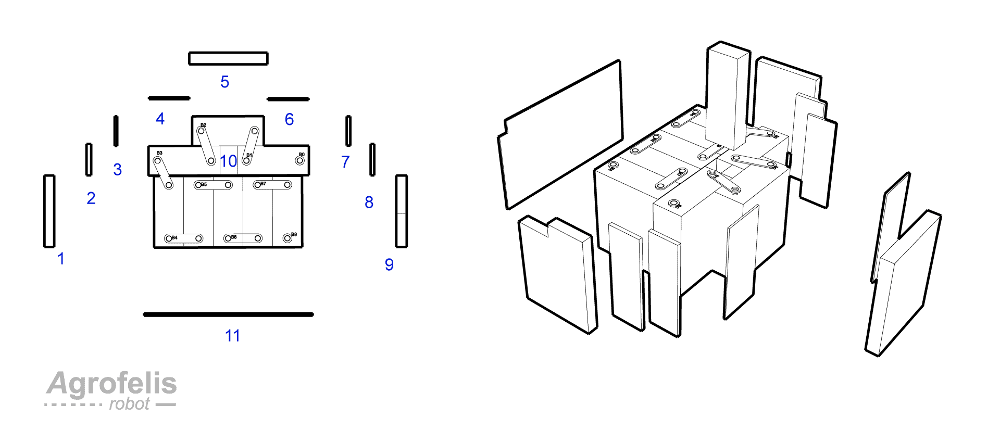

# Agrofelis power system

# Abstract

The document presents the power related elements classifying the Agrofelis robot an energy dense solution. The choice of the batteries technology employed, their magnitude, their management, monitoring and charging systems are elaborated. The batteries arrangement, designed to minimize the vehicle footprint, their protective enclosure and their cable connectivity schematics are documented. The power distribution, the different voltages energizing the various electronics along with the protective mechanisms established are documented. The document moreover describes WIFI relays employed and adaptation applied to make them more robust. The documentation moreover list all the utilised components, their price along with indicative suppliers easening the reproducibility of the system. 

# Introduction

The power module and its sub-elements is the most expensive module of the Agrofelis robot. A staggering 8 KW battery system was chosen in view of being able to perform an 8 hour shift while on a relatively moderate energy demanding work peaking between 500 watt and 1000 watt. The latest most widely used type of batteries employed in off the grid solar panels systems were chosen, called LifePo4. The type of technology was furthermore chosen for their unusual lifespan, high discharge rate, environmental friendliness high safety, low toxicity, their stable performance at fluctuating environmental temperatures, [^LiFePOA] their thermal and chemical stability characteristics. 

A wide range of sensors were established in the Agrofelis robot enabling to monitor the total discharge rate of the system as well as power consumption of the individual components and actuators. Employing various energy feedback sensors, enables of being able to discover and intelligently drive the different elements to their most efficient range prolonging their lifetime and the runtime of the robot. 

Passive systems usually employed in the car industry as well as active systems were installed in energy demanding routes of the system, protecting the rest of the electronics and modules in case a component fails unexpectedly. 

In the following sections the overall energy system is being decomposed to its layers, its elements and their details.

An overview of the vehicle its batteries and their compartment can be seen via the following schematic.

## Batteries

The battery technology chosen for the Agrofelis robot is called lithium iron phosphate battery (LiFePO 4 battery). Because of their, high safety, low toxicity, long cycle life, LFP batteries are finding a number of roles in vehicle use, utility-scale stationary applications, and backup power systems [^LiFePO]. Eight [CATL 302Ah](assets/CATL_302Ah.pdf)  LiFePO 4 battery cells (LEP71H3L7-01) connected in series, make up the battery module of the vehicle. 

Each cell approximately weights 5.5 kg, can have a voltage range between 2.0V and 3.65V with a nominal voltage of 3.2, while is able operate between -35 and 65 ℃. Their life cycle exceeds 4000 charge discharge cycles corresponding to nearly 11 years, if the robot is operated on a daily basis. The battery lifespan can also be expanded if the depth of charge and discharge rates are bounded to lower levels than their maximum. The batteries nominal discharge rate is at 0.5C and the maximum continues rate is 1.0 C. This means that the batteries can effectively deliver constantly 150 amps and peak safely up to their nominal amp power (302Ah+). 

[^LiFePO]: https://en.wikipedia.org/wiki/Lithium_iron_phosphate_battery "Wikipedia - LiFePO4" 

The typical dimensions of a 302Ah battery cell are encoded by the following image.

The following diagram illustrates the unusual battery arrangement, achieving a vehicle width footprint reduction by approximately 20 cm.

The battery poles connected with the the BMS voltage sensor cables have been number as B0 to B8. B0 corresponds to the negative pole of the first battery and B8 correspond to positive pole of the last power. 

A photo of the batteries while considering their arrangement is shown below.

In order to shield the batteries from external temperature differences, to compensate for minor accumulative dimensions differences either in the batteries or in the fabrication of the frame, to have a softer material than metal touching the batteries which can also serve as a subtle shock absorber, pieces of wood (plywood) were utilised to enclose the batteries within the frame.

The pieces of wood fit tightly and allow to gently impose compressing forces into the batteries preventing them from expanding during their charging and discharging cycles, which prolongs even further their lifetime. Lack of compression leads to damage of the cells, as indicated by swelling and premature battery failure [^LiFePOCompress].

[^LiFePOCompress]: https://www.currentconnected.com/learning-center/lc-stor/llfp-comp/ "LiFePO4 Cell Compression" 

The consequent figure illustrates the batteries along with their wooden covers.

The following diagram illustrates and enumerates the 10 plywood pieces filling the gap created by the batteries and the frame compartment. 

The 10th piece inserted last, secures the batteries when in place and helps dismantling the batteries when its removed. The backside of the battery compartment neighboring with the back compartment of the vehicle is isolated using a plexiglass piece (part 11) because of its flexibility and durability.

The enumerated wooden pieces with their dimensions and thickness are documented by the following schematic.

The 11th part, made out of plexiglass dimensions is encoded be the following diagram.

A hole in the plexiglass just under the the frame bar, is created to pass the battery temperature sensor, the battery cells voltage regulators, as well as the power cord transferring power to the front section of the vehicle.

The following photograph showcases the aforementioned details of the implemented battery module.
The cables passing through part 11 can seen as well as the voltage sensor cables, the temperature sensor, the power and data cord connecting to the front section of the vehicle as well as the B8 and B0 outlets corresponding to the positive and negative outlet of the battery. The photo moreover, shows the painted wooden pieces enriched with a film of Kapton tape making them waterproof and resistant to an extreme temperature range (−269 to +400 °C). [^Kapton].

[^Kapton]: https://en.wikipedia.org/wiki/Kapton "Kapton - Wikipedia" 

Batter management system BMS 250 ah

as packed with the voltage cable, temperature sensors and ..

Note the B- and P- outlets of the bms are re-mantled and repositioned so these face the sensors outlets as seen by fig

1 high current swicth
2 250 amp mechanical relay fuse
3 positive voltage
4 negative voltage
5 bms 

B0 - outlets
B8 + outlet

5v step down power module 
12v step down power module
5v step down power module dedicated to the brake servos

The figure depicts the related power modules, electronics and actuators 

Making the power distributor for the mobility drivers and the steering

two of these are fabricated one for the back wheels and another for the front wheels

### Arrangement

## BMS
## Charging

add changer photo 

add wifi relay fix applied

https://www.alibaba.com/product-detail/4PCS-US-STOCK-CATL-3-2V_1600209660693.html

8S 29.2V lifepo4, 40A
https://www.aliexpress.com/item/1005002718132948.html