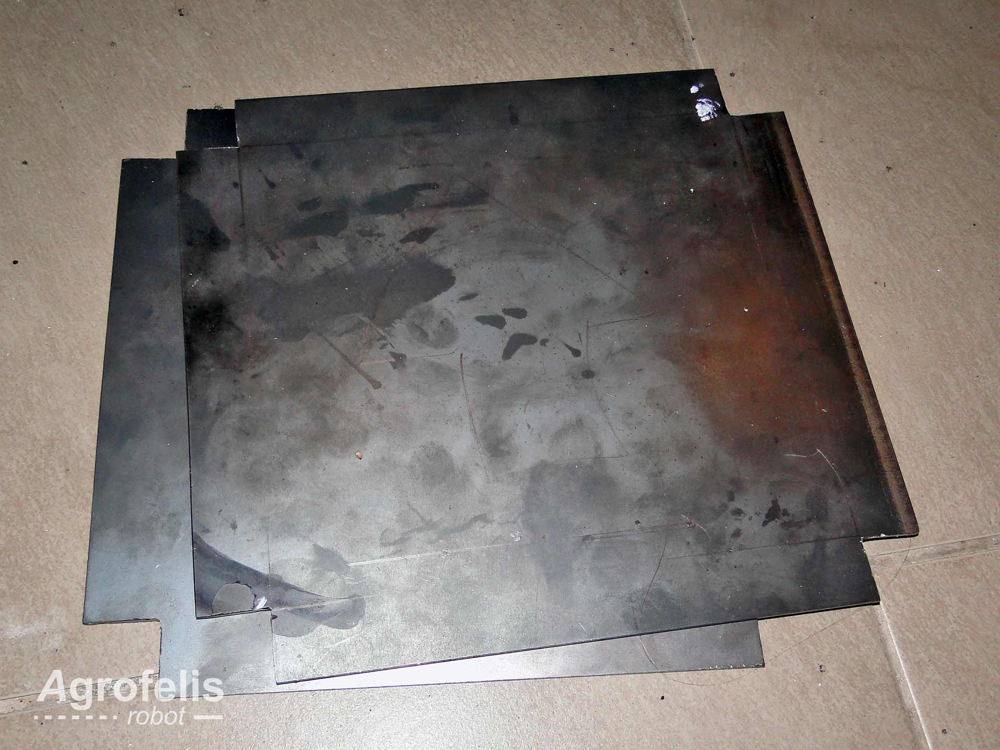
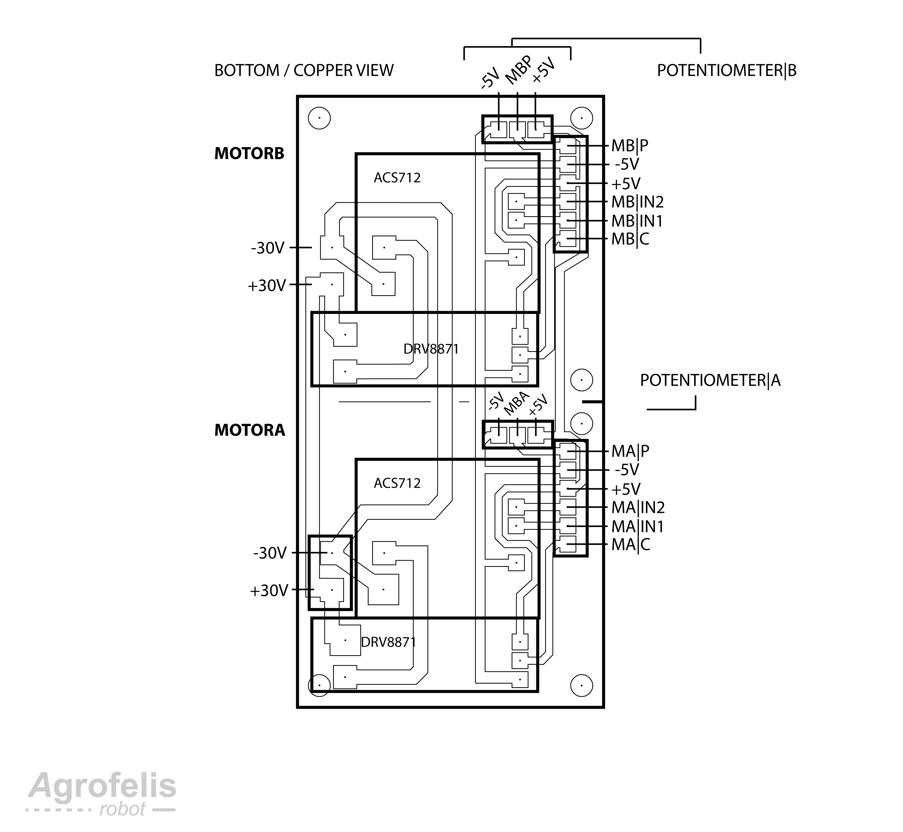

# Agrofelis Steering System Design and Fabrication

# Abstract

This document delves into the intricacies of the Agrofelis vehicle's steering system. The design rationale, structural elements, feedback mechanisms and the custom PCB board are all presented and documented in detail. The document encompasses source code files, key design metrics, schematics, 3D printed assets, laser-cut NC files and photographs, offering a view of the fabricated components and manufacturing steps in a progressive manner. The steering module of Agrofelis enables it to make a tight 1-meter turn radius and its design minimizes the overall footprint of the vehicle. The document also contains a list of components and indicative suppliers that comprise the bill and material information of the steering module. Finally, the documentation provides an overview of the implemented driver software, its classes, and their relations.

# Introduction

The key design factors of the Agrofelis vehicle's steering system were space minimization, sufficient torque to steer the wheels on uneven terrains, sufficient turning speed, feedback motion sensors for precise wheel movement and monitoring capacities to observe the current drawn by each wheel while turning. While conventional passive systems employ a mechanical solution for the [Ackerman steering geometry](https://en.wikipedia.org/wiki/Ackermann_steering_geometry), the Agrofelis steering system implements the ratios dynamically via software and two independent linear actuators. This approach, although more difficult to implement, results in a more compact footprint, promotes the modular mentality and potentially allows for a wider range of wheel alignment options worth researching.

In the following sections, the various sub-modules utilized within the Agrofelis robot's steering system, are meticulously documented. In particular, the overall schematic is presented and decomposed into the steering plates, linear actuators and their protective covers, the feedback mechanism, custom gears developed using a laser cutter, 3D printed protection covers for the feedback mechanism, the Agrofelis linear actuators steering driver PCB and its associated software.

## Steering Module

The following schematic diagram provides an overall view of the steering system.

The subsequent view diagram depicts the key sub-elements of the steering system.

More specifically, the diagram illustrates the following elements:

1. The feedback mechanism, enabling to monitor the actual position of the wheel.
2. The linear actuators mounting on the steering plate and the forks lever.
3. The steering plate that provides fixed points for the linear actuators to turn the wheels.
4. The custom PCB shield housing the actuator drivers, current sensors, and sensor inputs.
5. The Arduino Mega micro-controller responsible for processing the related signals and controlling the steering actuators.

## Steering Plates

The steering plates consist of two detachable 2 mm horizontal plates with welded nuts that are mounted onto the vehicle frame through relevant holes made in the frame. The steering plates provide sufficient headroom to enclose the two linear actuators and provide fixed push points via two 6 mm rods piercing the plates vertically. Furthermore, the steering plates create three compartments within the vehicle's frame. The bottom compartment hosting the [Agrofelis motors hub driver](https://github.com/meltoner/agrofelis/tree/main/components/mobility/motors_hub_driver), the middle one hosting the steering linear actuators and the top compartment hosting the steering micro-controller and the Jetson Nano embedded computer.

The following diagram depicts the described steering plates, annotated with key dimension metrics.

The consequent photo, snapshots the two plates just after these were cut with a grinder.

The image below illustrates the early stages of the fabrication and how the linear actuators are mounted and positioned in order to rotate the wheels during actuation.

The following image shows a close-up of the steering plates and how the linear actuators are mounted using two vertical rods. 
The vertical rods are extended farther than necessary as they are conveniently used to further secure the Motors hub driver module when the vehicle is resting at a vertical position during maintenance.

## Fork Mounting Points

The linear actuators are attached to the back forks lever using a combination of nut, bolt, washer and ball bearing to minimize friction, as shown in the photograph below.

The assembled mounting point is moreover snapshot-ed by the following photo.

## Linear Actuators Protection

Considering that the linear actuators extend from within the vehicle frame, traversing the vehicle's covers and venturing into the external environment, they, along with the frame internals, are susceptible to dust and other undesirable elements. Protective covers were fabricated by cutting and forming an outdoor stretchable waterproof cloth into a cylindrical shape using the following pattern. These covers effectively shield the linear actuators and internal frame components from the environment, while seamlessly accommodating the motion of the actuators.

The waterproof cloth was meticulously cut using a scissor according to the provided pattern, as depicted in the following photograph.

Sufficient offset has been built into the pattern, which is forgiving to imprecise manual cutting.
The cloth piece, rolled into a cylinder with its waterproof side facing outward, is glued to the vehicle's cover plates using standard black electrical tape, as seen by the following photograph.

## Feedback Mechanism

If an actuation is not verified, it is quite typical in robots operating in external environments to uncover deviations between the actual movement and the anticipated movement of a system. To address this, the steering system employs various indicator sensors to be able to ensure that movement is accurately verified and detect out-of-the-ordinary metrics, thus enabling the system to signal that something unexpected has happened. 

For the motion aspect, two custom gears were designed, one permanently attached to fork's hinge element and the other to a potentiometer attached to the fork's vehicle mounting mechanism. Notably, the feedback sensor is strategically positioned exactly at the rotation point of the fork, compared to the internal rotation point of the linear actuator in order to minimize the translation distance between the measurement and the actual rotation of the wheel.

The schematic view of the feedback mechanism is depicted in the figure below, depicting the two gears and the potentiometer secured on a small corner plate, which is attached to the vehicle's fork mounting mechanism using two screws.

The gears feedback mechanism dimension metrics are encoded by the following schematic.

Multiple gears are being fabricated from a piece of black 2 mm acrylic, chosen for increased strength, using a laser cutter. This fabrication process is captured by the following photo.

A closer view of the potentiometer gear, crafted by stacking and gluing together three 2 mm pieces, is shown in the subsequent photograph.

The gear design Scalable Vector Graphics (SVG), as well as the corresponding Numerical Control (NC) files driving a [low cost laser cutter CNC](https://eur.vevor.com/wood-engraving-machine-c_11142/3018-pro-cnc-router-3-axis-w-offline-controller-laser-engraver-machine-10000rpm-p_010521182027) are available in the following directory:

- [assets/laser-cut-feedback-gears](assets/laser-cut-feedback-gears)

The following files contain respectively the two gear SVG design patterns offset-ed by the size of the laser beam:

- [feedback-gear-A-Offset.svg](assets/laser-cut-feedback-gears/feedback-gear-A-Offset.svg)
- [feedback-gear-B-Offset.svg](assets/laser-cut-feedback-gears/feedback-gear-B-Offset.svg)

Furthermore, the associated numerical control NC files for driving the CNC machinery are included:

- [feedback-gear-A-Offset.nc](assets/laser-cut-feedback-gears/feedback-gear-A-Offset.nc)
- [feedback-gear-A-Offset.nc](assets/laser-cut-feedback-gears/feedback-gear-A-Offset.nc)

Finally, the following NC file contains both gears in a single file for convenience:

- [feedback-gear-A-and-B.nc](assets/laser-cut-feedback-gears/feedback-gear-A-and-B.nc)

## Feedback Mechanism Covers

To safeguard the feedback mechanism against potential interference from plants or other undesired elements that might obstruct the gears, a pair of symmetrical covers was designed and fabricated using a low-cost 3D printer. The protective covers securely attach and detach into the vehicle's fork mounting mechanism using neodymium magnets. The following diagram depicts the cover schematics protecting the feedback sensor.

The 3D-printed fabricated covers with the magnets incorporated in their structure, can be seen in the following image.

The subsequent image portrays the protective covers after being coated with a gray paint for added durability.

The following folder contains the left and right protective covers symmetric design stereo-lithography (STL) plans along with their Geometric Code (GCODE) derivatives, driving a 3D printer.

- [assets/3d-print-feedback-potensiometer-covers](assets/3d-print-feedback-potensiometer-covers)

In particular, the folder contains the following source files:

- [potensiometerCoversL.stl](assets/3d-print-feedback-potensiometer-covers/potensiometerCoversL.stl)
- [potensiometerCoversR.stl](assets/3d-print-feedback-potensiometer-covers/potensiometerCoversR.stl)
- [potensiometerCoversL.gcode](assets/3d-print-feedback-potensiometer-covers/potensiometerCoversL.gcode)
- [potensiometerCoversR.gcode](assets/3d-print-feedback-potensiometer-covers/potensiometerCoversR.gcode)
 
The end mechanism without the protective covers is showcased by the following photo.

The end mechanism with the protective covers can be compared via the following image.

## Steering PCB Driver

Facilitating the operation of linear actuators, assessing how much they have moved in relation to the applied voltage and friction of the wheel with the ground, as well as monitoring current consumption to detect high or no resistance, a customized board was devised. This board serves the dual purpose of organizing the various electronic components and tidying the cables per actuator and sensor. The shield was designed to be independent of the microcontroller, allowing for example instead of an Arduino Mega an Arduino Mega Pro or an ESP32. Remarkably, the PCB was designed in such a way that it can be cut in half, enabling it to drive two separate linear actuators or similar components within the system.

The designed PCB, outlining the hosted components, input and output pins and their respective functions, is presented below.

The PCB board scalable vector graphic design plan is located in the following directory:

- [driver-board/laser-cut-nc/linear_trails.svg](driver-board/laser-cut-nc/linear_trails.svg)

Its Numerical Control (NC) derivative intended for driving a CNC router, is provided below:

- [driver-board/laser-cut-nc/linear_trails.nc](driver-board/laser-cut-nc/linear_trails.nc)

The following figure, encodes the PCB board input/output connected into the Arduino Mega board pins.

The following figure snapshots the underside (copper side) of the manufactured PCB board.

The consequent figure snapshots the top side of the manufactured PCB board with its components.

It is noteworthy that although later stages of the project revealed better ways for fabricating PCBs, this particular board was produced using a method involving spray-painting the copper surface of the board, burning the designed pattern using a laser engraver and etching the board in acid. Other PCBs found in the Agrofelis project, have improved this process by curving the board and drilling the holes in a completely computerized manner.

The following figure illustrates a supportive file prepared for cable management and more specifically by printing the related labels, cutting them and gluing them using transparent tape, denoting the cables functionality and/or voltage level.

The editable vector file can be accessed here:

- [driver-board/STEERING_DRIVER_CABLES_LABELS.pdf](driver-board/STEERING_DRIVER_CABLES_LABELS.pdf)

The following image highlights the positioning of the PCB shield next to its microcontroller, on the upper side of the steering plate, on the back side of the Agrofelis vehicle frame.

## Steering PCB Components

The following table lists the individual components employed for manufacturing the Agrofelis steering controller. The index table includes moreover the product URLs, the indicative suppliers, as well as unit prices and sum totals.

| No. |  Product | Product URL | Supplier | Used Quantity | VAT Price (€) | Subtotal (€)  | Note |
|----|--------------|------------|-----|---|---|---|---|
| #1 | Copper board |      [PCB board](https://grobotronics.com/prototyping-copper-board-420x297mm-2-layer.html)   | [GRobotronics](https://grobotronics.com/)    |    0.25  | 9.90 | 2.48 | Shared Resource |
| #2 | H-Bridge Brushed DC Motor Driver | [Motor Driver](https://www.cableworks.gr/ilektronika/arduino-and-microcontrollers/motors/drivers/drv8871-h-bridge-brushed-dc-motor-driver-breakout-board-for-arduino/) | [Cableworks](https://www.cableworks.gr) | 2 | 6.00 | 12.00 | - |
| #3 | Linear Potentiometer B10K Ohm | [Metal potentiometer](https://www.hellasdigital.gr/electronics/components/potentiometer/rotary-potentiometer-10k-ohm-linear-com-09939/) | [Hellas Digital](https://www.hellasdigital.gr) | 2 | 1.24 | 2.48 | - |
| #4 | ACS712 5A Range Hall Current Sensor Module | [5A Current sensor](https://www.aliexpress.com/item/32348760733.html) | [Ali Express](https://www.aliexpress.com) | 2 | 1.10 | 2.20 | - |
| #5 |6-wire ribbon cable 120 mm  | [Ribbon cable 28AWG](https://grobotronics.com/ribbon-cable-28awg-0.081mm2-20-wire.html)   | [GRobotronics](https://grobotronics.com/) | 0.25  | 1.00 | 0.30 | Shared Resource |
| #6 | 3 wire cable 350 mm connecting the potentiometer | [3 wire cable](https://www.hellasdigital.gr/computers/cables/sound-cables/roline-3-5mm-audio-cable-m-m-2m-11-09-4502/) | [Hellas Digital](https://www.hellasdigital.gr) | 1 | 2.60 | 2.60 | - |
| #7 | 6-pin header female  | [Female Pin Header Kit](https://www.nettop.gr/index.php?option=com_virtuemart&view=productdetails&virtuemart_product_id=1592)   | [Nettop](https://www.nettop.gr/)  | 0 | 9.90 | 0.00 | Shared Resource |
| #8 | 3-pin header female  | [Female Pin Header Kit](https://www.nettop.gr/index.php?option=com_virtuemart&view=productdetails&virtuemart_product_id=1592)   | [Nettop](https://www.nettop.gr/)  | 0 | 9.90 | 0.00 | Shared Resource |
| #9 | 3-pin header male  | [Male Pin Header Kit](https://www.nettop.gr/index.php?option=com_virtuemart&view=productdetails&virtuemart_product_id=1592)   | [Nettop](https://www.nettop.gr/)  | 0 | 9.90 | 0.00 | Shared Resource |
| #10 | 3-pin header male  | [Male Pin Header Kit](https://www.nettop.gr/index.php?option=com_virtuemart&view=productdetails&virtuemart_product_id=1592)   | [Nettop](https://www.nettop.gr/)  | 0 | 9.90 | 0.00 | Shared Resource |
| #11 | Arduino Mega | [Arduino Mega](https://www.aliexpress.com/item/32823481047.html) | [Ali Express](https://www.aliexpress.com) | 1 | 10.00 | 10.00 | - |
| **Total** |      |    |     |      |     |  **32.06**  | | 

The total cost to manufacture the Agrofelis steering driver shield, exclusive of shipping and labor cost, totals approximately **32** euros.

## Steering Actuators and Structural Components

The following table enumerates the components utilized in the fabrication of Agrofelis steering structural elements. The index table encompasses the product URLs, indicative suppliers, as well as unit prices and sum totals.

| No. |  Product | Product URL | Supplier | Used Quantity | VAT Price (€) | Subtotal (€)  | Note |
|----|--------------|------------|-----|---|---|---|---|
| #1 | Black iron metal sheet 1000x2000x2mm  | [2mm metal sheet](https://www.e-metalshop.gr/sidera/lamarynes/lamarina-sidhroy-mayrh-1000x2000x2mm) | [QOOP Metalworks](https://www.qoop.gr)  | 0.25 | 49.23 | 12.30 | - |
| #2 | 8 Nuts 5mm | [Nut 5mm](https://www.kantarzoglou.gr/pegasus/products01/show00.php) |  [QOOP Metalworks](https://www.qoop.gr) | 8 | 0.10 | 0.80 | - |
| #3 | 10 Allen bolts 5mm  | [Bolt 8mm](https://ironhorses.gr/product/m5-x-40mm-allen-bolt-25-pack/) | [QOOP Metalworks](https://www.qoop.gr) | 10 | 0.20 | 2.00 | - |
| #4 | Mini Plane Axial Thrust Ball Bearing  F7-17M 7 x 17 x 6mm | [Ball bearing](https://www.aliexpress.com/item/1005005502256552.html) | [Ali Express](https://www.aliexpress.com) | 2 | 1.31 | 2.62 | - |
| #5 | Linear actuator 24V 500N 20mm/s, Stroke 100mm | [Linear Actuator](https://www.aliexpress.com/item/1005003897869232.html) | [Ali Express](https://www.aliexpress.com) | 2 | 36.70 | 73.40 | - |
| #6 | Powerful Round Magnets 5x3mm | [Round Magnets](https://www.hellasdigital.gr/electronics/magnets/powerful-round-magnets-5x3mm/) | [Hellas Digital](https://www.hellasdigital.gr) | 4 | 0.10 | 0.40 | - |
| #7 | Powerful Magnets Block 20X5X3mm | [Block magnet](https://www.hellasdigital.gr/electronics/magnets/powerful-magnets-block-20x5x3mm/)  | [Hellas Digital](https://www.hellasdigital.gr) | 2 | 0.15 | 0.30 | - |
| #8 | Waterproof fabric 1 sqm | [Waterproof fabric](https://www.yfasmatakesidis.gr/adiavroxo-sea-150cm-mayro-p-4905.html) | [Yfasmatakesidis](https://www.yfasmatakesidis.gr/) | 1 | 5.00 | 5.00 | - |
| #9 | 6 mm rod | [6 mm rod](https://www.amazon.co.uk/Glarks-Stainless-Straight-Helicopter-Airplane/dp/B07KJ4NWNG/) | [QOOP Metalworks](https://www.qoop.gr)  | 2 | 2.00 | 4.00 | - |
| **Total** |      |    |     |      |     |  **100.82**  | | 

The total cost to manufacture the Agrofelis steering structural and actuators components, excluding shipping and labor cost, amounts to approximately **101** euros.

The combined total cost for fabricating the Agrofelis steering structural, actuators, and electronics components is approximately **132** euros.

## Steering Driver Software

The Agrofelis software source code developed, which manages the steering system via its actuators and sensors running on an Arduino Mega, containing 23 source code files and 3 supportive files, is referenced in the following directory:

- [src/linearSteer](src/linearSteer)

The source code incorporates an INO file that initializes the application, along with a series of H and CPP files encoding the declarations and implementations of the classes of the application.

The project uses an Arduino Mega and a handful of components to sense and control two linear actuators, establishing the steering system.
The module utilizes the serial interface to share the internal state of the components, as well as to control them.

The module consists of a custom PCB that hosts two current sensors, two motor drivers and two inlets for two potentiometers that are used as feedback sensors to read out the steering angle of the wheels. The software enables individual as well as synchronized control of each linear actuator based on the Ackerman geometry and the physical orientation of the vehicle. The valid ratios of the wheels are measured in fine steps and persisted in an interpolated association map.

The module status facilitates remote configuration, so the linear actuators are driven to reach the minimum and maximal points in order to dynamically derive the center and the bounds of applicable movement. Furthermore, the minimum voltage required to achieve a movement can be derived, as the lowest applicable speed.

The module provides an interface to make both linear actuators seek and reach the desired position. The application implements the functionality so that the linear actuators are operated asynchronously, moving the motors at varying speeds to meet Ackerman geometry based on the observed resistance and the required distance to cover respectively.

Additionally, the software establishes the braking system of the vehicle by driving two servos linked to the disc brakes.

### Application Structure

This Agrofelis steering and braking software adheres to a common baseline pattern that has been established in nearly all Agrofelis modules. This baseline establishes a context class that is passed to practically all classes as a common ground, enabling instances to exchange information when necessary. The second baseline pattern established refers to the frequency of execution, providing the facilities to trigger functionalities at the desired intervals. A gyroscope, for example, may need to be triggered far more frequently than a GPS or potentiometer sensor. As a bootstrap template, the software provide 6 different frequencies ranging from 50 milliseconds to 5 second intervals. Using this approach, delays blocking the execution are avoided and the different calls can be organized based on their responsiveness requirements.

The software encodes easy to follow concrete implementations such as current sensors and brake(s), resulting in a one-to-one mapping between the physical element and its respective software counterpart.

The following table indexes and summarizes the implemented classes of the Agrofelis steering and braking controller.

| Class | Description | 
|----|------------------|
|linearSteer.ino | Boots the application, initialises the top classes and encodes the triggering frequencies of various functional elements. |
|Context | Provides a common ground for sharing information and encodes the triggering frequencies, helpful functions and a unique identifier of the model. |
|Invoker | Tracks the execution frequencies so these are called at the right time. |
|Brake | Object representing a wheel brake actuating a servo motor. The object can be initialised with a limited target range, as much as to lift the brake. The class was used with a *TIANKONGRC RDS-8120 20KG ROBOT DIGITAL SERVO*. The class can be instantiated by providing the connected GPIO, the desired range to actuate from the applicable (0-180), which is then mapped to a convenient range of 0 to 100. |
|Brakes | The class can drive two or more brakes objects simultaneously. |
|Sensor | Base class wrapping the functions conveying a sensor. The class reads an analogue port when the apply function is being triggered. The class maintains a gated smoothing read out of the sensor by comparing the previous mean with the current read value. Moreover, when a movement is detected based on the absolute difference of the first derivative, a boolean flag is maintained. Lastly, it prints out the object's internal state on print(), reflecting the sensor's port, smoothed value,  un-smoothed sensor value and whether or not the sensor is detecting a movement. |
|SensorCurrent | Class extending the *Sensor class* implementing the specialties of a current sensor. The class translates raw sensor values to amperage. Moreover, because the current sensor reads rapid current spikes that can be missed, the class maintains a decaying max read value that is renewed based on the maximum observed value within a time window. |
|LinearActuator | The class implements an object to control a linear actuator via a [DRV8871 H-Bridge Brushed DC Motor Driver] component. The class is instantiated with the board port mappings, enabling its re-usability. The first two constructor parameters map the control pins for the direction and the speed of the [DRV8871 H-Bridge Brushed DC Motor Driver] using two pulse width modulation (PWM) ports. Next, the GPIO of the analogue [LinearActuator Potentiometer B10K Ohm] and the analogue [ACS712 5A Range Hall Current Sensor Module] sensors are provided. The module operates based on eight states dictating its function, starting with state zero. In states one and two, the minimum and maximum potentiometer bounds are identified. In state three, the minimum throttle leading to a movement is derived. State four is entered when the module reaches its objective position. In state five, the object seeks to reach the target requested position. States six and seven correspond to erroneous states, such when an actuation is expected but not detected or when the sensor value reads values close to its physical limits. Furthermore, the applicable bounds can be persisted, so these do not have to be re-resolved when booting the Agrofelis vehicle. |
|Interpolate | Class for interpolating a value based on an input/output mapping pair of values. The interpolation object enables to map an input non-linearly across an input range and linearly within its sub-bounds. The class is employed by initializing it with measurement mapping references such that the Ackerman geometry is followed based on the physical orientation, and raw potentiometer values are recorded by performing incremental movement to both wheels of the vehicle. |
|SteeringDriver | The class contains the linear actuator references, their Ackerman mapping steps and the means to interpolate their ratios from a -100 to 100 positioning range. The object enables to change the state of the system to seek its movement bounds and minimum voltage leading to a movement. Furthermore, the class can dynamically derive and apply more voltage if the expected movement has not been observed, as well as fade in or fade out the voltage depending on the elapsed time, the progress of the distance requested to accomplish and its difference with its counterpart actuator. |
|SerialCommandParser | Base class for monitoring and parsing the serial interface data. The class defines the function parsing compact commands of the form &lt;1&#124;1&gt;, where the first parameter corresponds to the applicable action number and the second is an integer value used by the related action. |
|SteeringController | The *steeringController* extends the *SerialCommandParser* and defines the applicable commands that drive the actuators. Furthermore, the class reflects the internal state of the brakes, the linear actuators and their sensors, so that other nodes in the system are aware of their status. |

Furthermore, the repository includes supporting files that were used while measuring and adjusting the left and right linear actuators to achieve an end-to-end Ackerman geometry. The process studies and accounts for the non-linearity characteristics of potentiometers, digital-to-analog converters (DAC), linear actuators and subtle construction accumulative variations in the following directory:

- [src/linearSteer/data.modeling](src/linearSteer/data.modeling)

The file *data.modeling.R* was developed in the R language to study and reflect the end-to-end differences between the left and right sensors and actuators.

The following plot visualizes the raw sensor value differences that must be applied between the left and right sensors in order to physically match the Ackerman geometry when steering from hard left to hard right in constant steps.

The steering application runtime information and its modules can also be accessed and controlled via the Agrofelis Unificator software, which is able to unify multiple Agrofelis modules connected from different interfaces (Serial, WiFi, Websockets, USB). Lightweight single page web applications can easily map, bind and monitor the internal state of the steering actuators and their sensors, as seen by the following screenshot.

The [Agrofelis Unificator](https://github.com/meltoner/agrofelis/tree/main/components/connectivity) software is documented in the related chapter of the Agrofelis documentation.

# Summary 

The details of this important mobility module of the Agrofelis robot have been documented. All source code files, schematics, numerical control files and patterns involved in the fabrication have been presented, along with photographic material demonstrating the manufacturing progress. The list of components, raw materials, indicative suppliers and cost information that will aid in the reproducibility of the overall steering system has been provided in an organized manner. References to the Agrofelis steering system application source code running on the microcontroller, have been referenced with descriptive information per class, offering a quick overview of the implemented functionality's location. Approaches for bridging the theoretical perfect and the actual were introduced, using practical means such as recording, data visualization and statistics. The documentation concludes by hinting how the steering module fits in the overall design from a software point of view, how it can be accessed and how all modules can communicate, extended and appended on demand.

