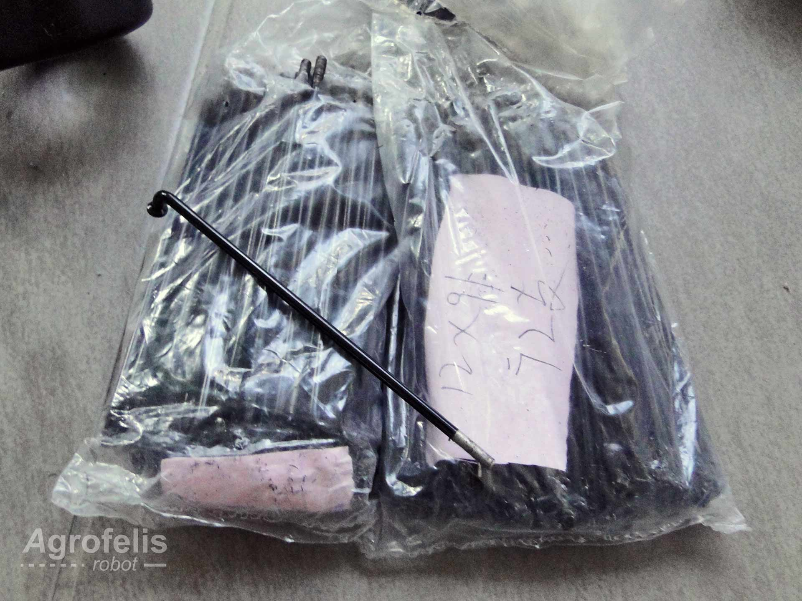

# Agrofelis Robot wheels fabrication

# Abstract

This document describes the details of manufacturing the active 4 wheel drive system equipping the Agrofelis robotic vehicle. The  requirements specifications set are being documented followed with the end fabricated solution. The design plans, compilation procedures, assistive assets and photographs taken during the development, are being presented following a stepwise progression. The sub components composing four Agrofelis wheels are being indexed along with their unit price, their total cost along with references to indicative suppliers.

# Introduction

Finding an elegant solution for the mobility requirements of a low speed robotic vehicle such as the Agrofelis robot, proved to be a time consuming research process. 

After researching various solutions and vendors, for the uncommon case of low rpm, high torque, small footprint and low cost, we concluded that a solution composed of geared in-wheel motor hubs, equipped with hall sensors, providing at least 120 total NM, operable at 24v with less than 1000 watt total power consumption, tolerance to withstand 350 kilos of weight, as well as fit within a 16 inch wheel, would be the necessary characteristics of the needed solution. A four wheel drive active system instead for example of a 2WD drive was concluded necessary, in order to maximize the traction and distribute the load of the vehicle. In the following sections the details of the active wheels, their components and the indicative suppliers to purchase the sub-components, are documented.

## The Agrofelis wheels

The market research concluded to the most optimal solution overly, would be to employ four geared in-wheel hub motors of 250 watt each delivering 38 NM each, summing to 152 NM of total torque power, matching all requirements set for the Agrofelis robot. The wheel is assembled from individual parts allowing to variate according the problem focusing on. In the following sections the particular composition evaluated and employed is presented.

Bellow, the wheel with its motor, the spokes, the spokes lacing pattern and the 16 inch rim, are photographed.

The wheel decomposed to its sub-components, is illustrated by the following figure.

Key dimensions of the individual components forming the prototyped wheel, are documented by the following diagram.

The four wheels supporting the vehicle, are arranged into a near square arrangement, as show by the following diagram.

### Wheels compilation

To minimize costs and although it was quite laborious, the motor hubs were purchased without their rims so these could reserve less volume, approximately 1/4, leading to significantly lower shipping costs. Along with the motors, their respective motor drivers, the wheel spokes, the disc brakes and the fork brakes, were purchased from a foreign supplier. The 16 inch aluminum rims, the inner tubes and tires, were purchased from local suppliers. 

The approach of purchasing the wheels un-assembled provides the option to decrease or increase the wheel size subject that the spokes length are adapted accordingly. The wheels spokes, connecting the motors with the rim, were knitted and aligned manually. 

Four wheel modules were developed with disc brakes, inflatable tubes and fat tires to maximize the traction, for this kind of wheel size. The sub-components utilised are showcased in further detail in consequent sections.

The following picture showcases the 250w, 24v in-wheel brush-less motor hub.

After communicating with various suppliers and evaluating the applicability of their products, the SR250D 250W brush-less hub motor  from Suringmax were chosen because of their geared feature (1:4.4), their waterproof IP54 IP grade, their max torque power at 38 Nm, their compatibility with a wide range of rim sizes including a 16 inch rim and their compatibility with a 24v system. The provider was also able to manufacture and provide custom spokes, according to the requested length such that they fit a 16 inch rim, something that played an important role for selecting them. Depending on the problem the Agrofelis robot is aimed to address, larger motors and / or rims / tires can be selected by following the equivalent procedure presented in this document.

The in-wheel motor hubs, were equipped with disc brakes as shown in the following photo.

Each of the motors supports 36 spokes summing to 144 spokes for four wheels, as shown below.

A close up view of the spokes along with their securing nuts (nipples), can be seen in the following photo.

In order to match number of spokes supported by the motors (36) and the usual number of spokes provided by low cost rims of this size (16), additional holes had to be annotated and drilled. A repeating pattern, printable in regular size printer paper was designed. The PDF asset file encoding the related pattern, is referenced below.

- [36 drilling pattern for 16 inch rims](assets/36holes-16-inch-pattern.pdf)

The pattern is being printed 4 times and connected using transparent tape on the annotated remark line. Consequently the pattern is cut and glued within the inner top surface of the rim. On the annotated positions, the rims are drilled to make up the appropriate connection points for the spokes.

The following figure showcases the printed pattern, depicting the locations where the related rim should be drilled.

A photo, showcasing the rim adaptation is provided.

The following photo compares the difference between the standard rim holes (16) and the new ones drilled (36).

The printed pattern moreover, hides the previous invalid holes, assisting the assembling procedure.

It should be noted that 16 inch wheels with 36 holes exist in the market at approximately twice the cost.

The following photo shows the four assembled wheels, without their tube and tires.

The four fully completed wheels are snapshot-ed by the following photograph.

The motor hubs are connected with their motor drivers via a cable supplied with motors. Consequently, the active wheels of the vehicle interface with the [Agrofelis Motors hub driver](https://github.com/meltoner/agrofelis/tree/main/components/mobility/motors_hub_driver) modules, which enhances their functionality by enabling to digitally monitor and control the motors to perform precise and adaptive coordinated movements at near constant low RPM, independent of the ground slope.

## The wheels components and indicative suppliers
 
The following table lists the individual components employed for manufacturing four Agrofelis wheels, along with their unit price,  an indicative supplier link and indicative total cost.

| No.|  Product | Product URL | Supplier | Quantity | VAT Price (€) | Amount (€)  |
|----|--------------|------------|-----|---|---|---|
| #1 | SR250D Suringmax Motor | [Motor Hub](http://www.suringmax.com/index.php?m=home&c=View&a=index&aid=97) | [Suringmax](http://www.suringmax.com/) | 4 | 70 | 280 |
| #2 | 36 spokes to fit the inner dimensions of the rims with inner diameter of 28 cm |  | [Suringmax](http://www.suringmax.com/) | 4 | 3 | 12 |
| #3 | Disk brakes |  | [Suringmax](http://www.suringmax.com/) | 20 | 5 |
| #4 | Motor drivers at 24v with forward and reverse driving and no display connection | [Motor driver](http://www.suringmax.com/index.php?m=home&c=View&a=index&aid=139) | [Suringmax](http://www.suringmax.com/) | 4 | 15 |  60 |
| #5 | Viper tires 16 X 3.00 |  [Fat tire](https://podilatada.gr/product/viper-elastiko-16x3-00-gia-e-bike-e-scooter/) | [Podilatada](https://podilatada.gr) | 4 | 26 | 104 | 
| #6 | SHINKO Tube 16X2.50/3.0 | [Tire tube](https://podilatada.gr/product/shinko-16x2-50-3-0-aerothalamos-ilektrikou-podilatou-valvida-tr87-stravi/) | [Podilatada](https://podilatada.gr) | 4 | 10 | 40 | 
| #7 | 16 inch aluminum rims | [Rim](https://www.podilatis.gr/troxos-podilatou-asimi-alouminiou-0-016-175.html) | [Podilatis](https://www.podilatis.gr) | 4 | 15 | 60 |

The total cost to manufacture four wheels excluding shipping and assembly work costs, sums to approximately **576** euros.

# Summary

The Agrofelis active wheels design details were presented. The manufacturing procedures employed allowing to reproduce the particular wheels prototyped as well implement derivative variations, were documented. Approaches employed to minimize the shipping costs as well as provide flexibility, were showcased. Images following the individual steps performed to reproduce the Agrofelis wheels and information to acquire the related sub-components, were documented.